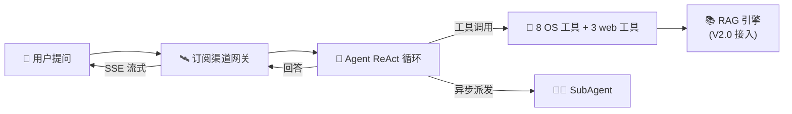
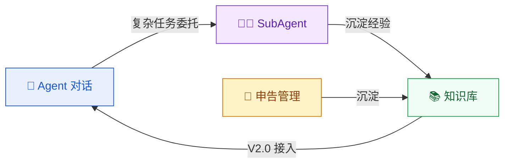
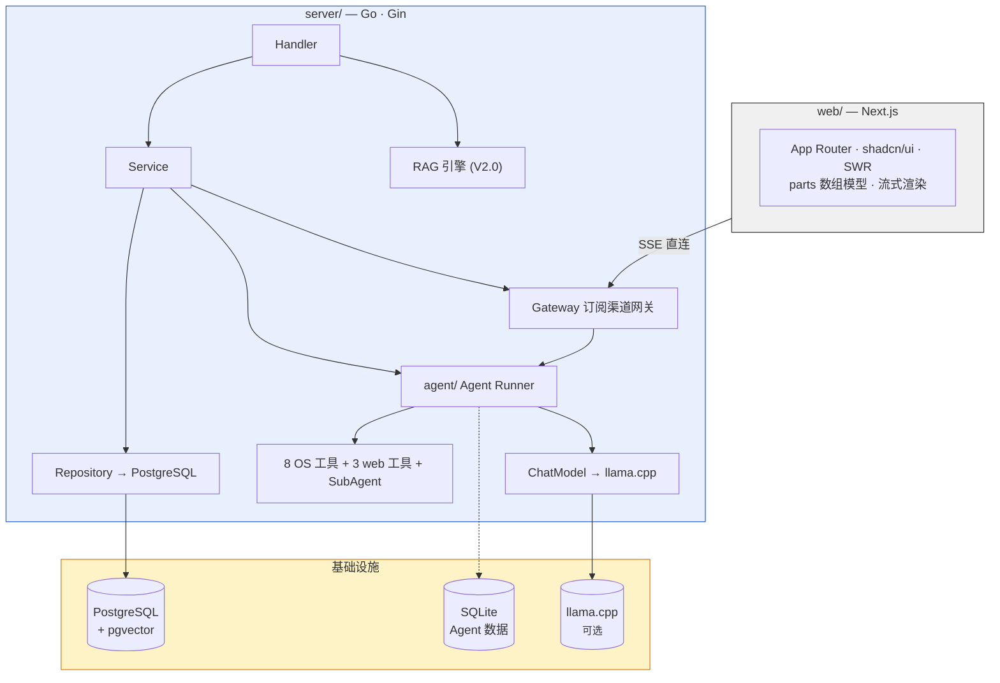
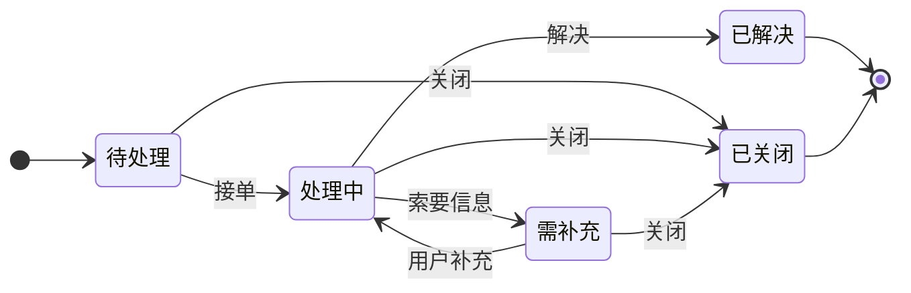

<p align="center">
  
</p>

<h1 align="center">OpsMind</h1>

<p align="center"><strong>私有部署的 AI 运维数字员工</strong><br>让每家企业拥有自己的智能运维助手</p>

<p align="center">
  <a href="https://github.com/int2t05/OpsMind/releases"></a>
  <a href="LICENSE"></a>
  
  
  
</p>

---

## 这是什么？

企业运维团队每天被重复性咨询淹没——密码重置、权限申请、系统报障。这些工作消耗运维人员 40% 以上的时间，却无法沉淀为可复用的知识。

OpsMind 不是另一个 ChatGPT 套壳。它是一个**从 Agent 循环到业务流程都自建**的运维数字员工系统：

- **Agent Loop** — 自建 ReAct 循环，自主调用工具、多步推理、子 Agent 异步派发
- **订阅渠道网关** — 生产者与交付渠道解耦，SSE 断线重连、多订阅者、背压不丢事件
- **数据不出域** — 业务库 PostgreSQL，Agent 数据 SQLite 隔离，支持本地 llama.cpp 推理



## 核心能力



| 🤖 Agent 对话 | 🔧 内置工具 | 🎫 申告管理 | 🔐 权限看板 |
|:---|:---|:---|:---|
| 自建 ReAct 循环 + token 级 SSE 流式 | bash / read_file / write_file / edit_file | 完整状态机流转 | JWT 双令牌 + RBAC |
| reasoning + tool_call + tool_result 全事件渲染 | list_dir / glob / grep / mkdir | 站内消息实时通知 | 4 个预设角色，菜单动态渲染 |
| SubAgent 异步派发（research / coder / deep_research） | web_search / web_fetch / generate_article | 7 天无操作自动关闭 | 实时统计卡片 + 趋势图 |
| SQLite 增量写入 + 中断可恢复 | workDir sandbox + timeout + 截断 | 处理记录 → 知识候选 | 敏感操作全量审计日志 |

## 架构



> 生产者（AgentRunner）与交付渠道（Gateway）解耦：runner 只产出事件，chat 层订阅并 Publish 到网关。对齐 LangGraph Server / Mastra Durable / OpenAI background 的订阅渠道制。

## 快速开始

**前置条件：** Docker + Docker Compose · 8 GB 内存 · 10 GB 磁盘

```bash
git clone https://github.com/int2t05/OpsMind.git && cd OpsMind
cp .env.example .env
# 编辑 .env：设置 JWT_SECRET（必填）和 LLM 配置
docker compose up -d --build
```

启动后：

| 服务 | 地址 |
|------|------|
| 前端 | http://localhost:3000 |
| 后端 API | http://localhost:8080 |


### 本地 AI（可选）

```bash
# 下载 GGUF 模型到 ./models/ 目录（魔塔 ModelScope，~3 GB）
pip install modelscope
python -c "from modelscope import snapshot_download; snapshot_download('Qwen/Qwen3-4B-GGUF', allow_patterns='*Q4_K_M*', local_dir='./models')"
python -c "from modelscope import snapshot_download; snapshot_download('Qwen/Qwen3-Embedding-0.6B-GGUF', allow_patterns='*Q8_0*', local_dir='./models')"
docker compose --profile ai-local up -d --build
```

| 模型 | 用途 | 大小 |
|------|------|------|
| Qwen3-4B-Q4_K_M | 对话（LLM） | ~2.4 GB |
| Qwen3-Embedding-0.6B-Q8_0 | 向量（Embedding） | ~0.6 GB |


初始化数据库并加载种子数据：

```bash
docker compose exec -T postgres psql -U opsmind -d opsmind < server/migrations/seed_essential.sql  # 角色 + 用户 + LLM 配置
```

预置账号：

| 账号 | 密码 | 角色 |
|------|------|------|
| `admin` | `Admin@123` | 系统管理员 |
| `operator1` | `Operator@123` | 运维人员 |
| `knowledge` | `Knowledge@123` | 知识库管理员 |
| `reporter1` | `Reporter@123` | 报障人 |

> 也支持 OpenAI / DeepSeek 等任何 OpenAI-compatible API。LLM 与 Embedding 可独立配置不同服务商，热替换即时生效。

## 申告状态机



## 项目结构

```
OpsMind/
├── server/                      # Go 后端（Gin + GORM）
│   ├── internal/
│   │   ├── agent/               # Agent 基座（自建 ReAct Loop + 统一工具接口 + SubAgent + SQLite store）
│   │   ├── domain/              # 业务领域（chat / knowledge / ticket / user / system）
│   │   ├── infra/               # 基础设施（adapter / config / database / runtime / storage）
│   │   ├── rag/                 # 自建 RAG 引擎（V2.0 接入 Agent）
│   │   ├── parser/              # 文档解析（MinerU / 本地降级）
│   │   ├── router/              # 路由注册
│   │   └── shared/              # 共享类型（dto / model / pkg）
│   ├── cmd/main.go              # 入口
│   ├── migrations/              # DDL + 种子数据
│   ├── test/                    # 集成测试（外部包，-tags=integration）
│   └── rerank_server.py         # Python cross-encoder 重排序
├── web/                         # Next.js 前端
│   └── src/
│       ├── app/                 # App Router + globals.css
│       ├── components/          # shadcn/ui + chat parts 组件
│       ├── contexts/            # ChatStreamProvider（SSE 流式）
│       ├── hooks/               # 自定义 Hooks
│       └── lib/                 # API client + reducer + types
├── docs/                        # PRD / TECH / API / FLOW / ROADMAP
├── deploy/                      # Docker 部署
└── Makefile                     # 开发命令入口
```

## 文档

| 文档 | 说明 |
|------|------|
| [路线图](docs/ROADMAP.md) | 战略方向、里程碑、技术决策记录 |
| [PRD](docs/PRD.md) | 产品需求 — 功能定义、业务规则 |
| [TECH](docs/TECH.md) | 技术架构 — 分层设计、DDL、ADR |
| [V1.4 PRD](docs/v1.4/prd.md) | V1.4 版本级需求 — 深度搜索工具 |
| [V1.4 TECH](docs/v1.4/tech.md) | V1.4 版本级架构 — 自建 Loop、SubAgent 异步、搜索降级链 |
| [API](docs/API/README.md) | 接口文档，覆盖全部端点 |
| [测试流程](test/README.md) | 验收测试场景与步骤 |

## 路线图

| 版本 | 主题 | 状态 |
|------|------|------|
| V1.0 | 固定管道 RAG | ✅ 已交付 |
| V1.2 | 业务完善 | ✅ 已交付 |
| V1.3 | Agent 基座 | ✅ 已交付 |
| V1.4 | 深度搜索 + Agent 重构 | ✅ 已交付 |
| V2.0 | Agentic RAG | 📋 规划中 |

详见 [`docs/ROADMAP.md`](docs/ROADMAP.md)。技术债务清单见 [`docs/TODO.md`](docs/TODO.md)。

## 贡献

欢迎提交 Issue 和 PR。详见 [`CONTRIBUTING.md`](CONTRIBUTING.md)。

1. 确保通过现有测试
2. 遵循项目代码风格和注释规范
3. API 变更同步更新 `docs/API/`

## 许可证

[MIT](LICENSE)
