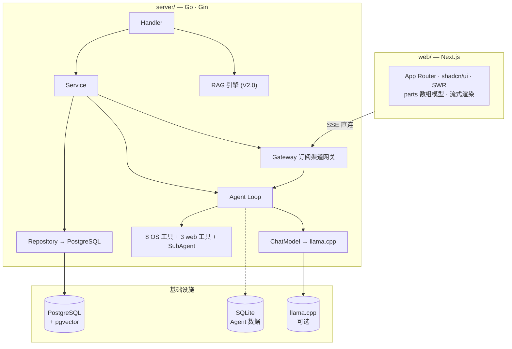
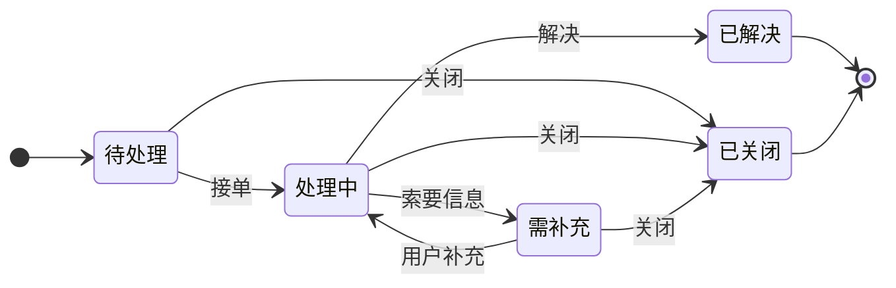

<p align="center">
  
</p>

<h1 align="center">Cognos</h1>

<p align="center">私有部署的知识管理平台</p>

<p align="center">
  <a href="https://github.com/int2t05/Cognos/releases"></a>
  <a href="LICENSE"></a>
</p>

---

## 这是什么

企业团队每天被重复性咨询淹没——密码重置、权限申请、系统报障。Cognos 把这些工作交给一个能自主调用工具、多步推理的 Agent，让运维经验沉淀为可复用的知识。

Cognos 从 Agent 循环到业务流程全部自建，支持本地 llama.cpp 推理，数据不出域。

## 核心能力

| 模块 | 能力 |
|------|------|
| **Agent 对话** | 自建 ReAct 循环，SubAgent 异步派发（research / coder / deep_research），reasoning + tool_call + tool_result 全事件流式渲染 |
| **深度搜索** | web_search（Exa→Tavily→DuckDuckGo 降级链）+ web_fetch（Firecrawl→本地）+ generate_article 写入知识库 |
| **申告管理** | 完整状态机（待处理→处理中→需补充→已解决/已关闭），7 天自动关闭，CAS 并发控制 |
| **知识库** | 统一文章模型，文档上传异步处理（解析→分块→向量→pgvector），BM25 索引自动重建 |
| **权限** | JWT 双令牌 + RBAC，4 个预设角色，菜单动态渲染 |

## 架构



生产者（AgentRunner）与交付渠道（Gateway）解耦：runner 只产出事件，chat 层订阅并 Publish 到网关，客户端断开生成继续跑完落库。

## 快速开始

**前置条件：** Docker + Docker Compose · 8 GB 内存 · 10 GB 磁盘

```bash
git clone https://github.com/int2t05/Cognos.git && cd Cognos
cp .env.example .env
# 编辑 .env：设置 JWT_SECRET（必填）和 LLM 配置
docker compose up -d --build
```

| 服务 | 地址 |
|------|------|
| 前端 | http://localhost:3000 |
| 后端 API | http://localhost:8080 |

### 本地 AI（可选）

```bash
# 下载 GGUF 模型到 ./models/（魔塔 ModelScope，~3 GB）
pip install modelscope
python -c "from modelscope import snapshot_download; snapshot_download('Qwen/Qwen3-4B-GGUF', allow_patterns='*Q4_K_M*', local_dir='./models')"
python -c "from modelscope import snapshot_download; snapshot_download('Qwen/Qwen3-Embedding-0.6B-GGUF', allow_patterns='*Q8_0*', local_dir='./models')"
docker compose --profile ai-local up -d --build
```

| 模型 | 用途 | 大小 |
|------|------|------|
| Qwen3-4B-Q4_K_M | 对话 | ~2.4 GB |
| Qwen3-Embedding-0.6B-Q8_0 | 向量 | ~0.6 GB |

初始化数据库并加载种子数据：

```bash
docker compose exec -T postgres psql -U cognos -d cognos < server/migrations/seed_essential.sql
```

预置账号：

| 账号 | 密码 | 角色 |
|------|------|------|
| `admin` | `Admin@123` | 系统管理员 |
| `operator1` | `Operator@123` | 团队成员 |
| `knowledge` | `Knowledge@123` | 知识库管理员 |
| `reporter1` | `Reporter@123` | 报障人 |

也支持 OpenAI / DeepSeek 等任何 OpenAI-compatible API。LLM 与 Embedding 可独立配置不同服务商，热替换即时生效。

## 申告状态机



## 项目结构

```
Cognos/
├── server/                      # Go 后端（Gin + GORM）
│   ├── internal/
│   │   ├── agent/               # 自建 ReAct Loop + 统一工具接口 + SubAgent + SQLite store
│   │   ├── domain/              # 业务领域（chat / knowledge / ticket / user / system）
│   │   ├── infra/               # adapter / config / database / runtime / storage
│   │   ├── rag/                 # 自建 RAG 引擎（V2.0 接入 Agent）
│   │   ├── parser/              # 文档解析（MinerU / 本地降级）
│   │   ├── router/              # 路由注册
│   │   └── shared/              # dto / model / pkg
│   ├── cmd/main.go              # 入口
│   ├── migrations/              # DDL + 种子数据
│   ├── test/                    # 集成测试
│   └── rerank_server.py         # cross-encoder 重排序
├── web/                         # Next.js 前端
│   └── src/
│       ├── app/                 # App Router + globals.css
│       ├── components/          # shadcn/ui + chat parts
│       ├── contexts/            # ChatStreamProvider（SSE 流式）
│       ├── hooks/               # 自定义 Hooks
│       └── lib/                 # API client + reducer + types
├── docs/                        # PRD / TECH / API / FLOW / ROADMAP
├── deploy/                      # Docker 部署
└── Makefile                     # 开发命令入口
```

## 文档

| 文档 | 说明 |
|------|------|
| [路线图](docs/ROADMAP.md) | 战略方向、里程碑、技术决策 |
| [PRD](docs/PRD.md) | 产品需求 |
| [TECH](docs/TECH.md) | 技术架构 — 分层、DDL、ADR |
| [V1.4 PRD](docs/v1.4/prd.md) | 深度搜索工具需求 |
| [V1.4 TECH](docs/v1.4/tech.md) | 自建 Loop、SubAgent 异步、搜索降级链 |
| [API](docs/API/README.md) | 接口文档 |
| [测试流程](test/README.md) | 验收测试场景 |

## 路线图

| 版本 | 主题 | 状态 |
|------|------|------|
| V1.0 | 固定管道 RAG | ✅ 已交付 |
| V1.2 | 业务完善 | ✅ 已交付 |
| V1.3 | Agent 基座 | ✅ 已交付 |
| V1.4 | 深度搜索 + Agent 重构 | ✅ 已交付 |
| V2.0 | Agentic RAG | 规划中 |

详见 [`docs/ROADMAP.md`](docs/ROADMAP.md)。

## 贡献

欢迎提交 Issue 和 PR。详见 [`CONTRIBUTING.md`](CONTRIBUTING.md)。

1. 确保通过现有测试
2. 遵循项目代码风格和注释规范
3. API 变更同步更新 `docs/API/`

## 许可证

[MIT](LICENSE)
