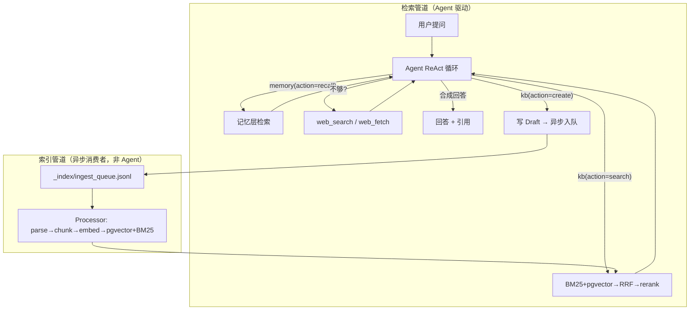
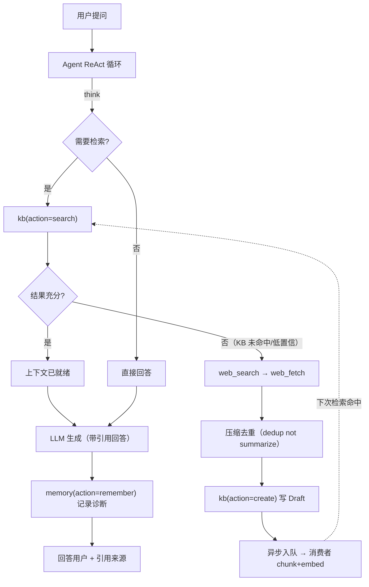
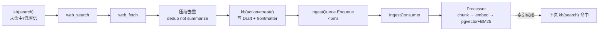
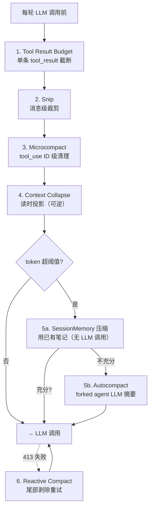
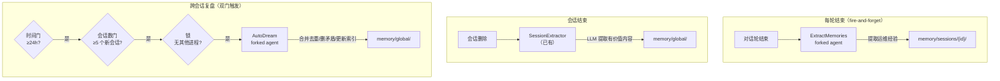
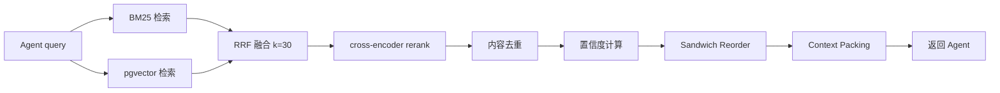

# OpsMind Agentic RAG 架构设计

> 基于 `docs/research/`（25 篇研究）+ `reference/`（133 参考仓库）+ 实现代码产出。Agentic RAG 自主决策为核心，检索/记忆/搜索/写入均为 Agent 工具。

---

## 1. 核心架构

固定线性管道 → Agent ReAct 循环自主决策。Agent 决定何时检索、检索什么、结果是否充分、是否补充搜索、是否写入知识库。



### 两条管道解耦

| 管道 | 执行者 | 职责 | 耗时 |
|------|--------|------|------|
| 索引管道 | 异步消费者（IngestQueue + Processor） | parse → chunk → embed → pgvector + BM25 | 秒级 |
| 检索管道 | Agent ReAct | 决策检索 → 评估充分性 → 补充搜索 → 合成回答 | 毫秒级 |

Agent 的角色是**检索和触发写入**，不是索引。Agent 调 `kb(action=create)` 写 draft + 入队 <5ms 即返回，消费者异步处理 embed。参考 Dify(Celery) / RAGFlow(Redis Stream) / RustyRAG(同步)——全部是独立消费者队列，Agent 不参与嵌入。

---

## 2. 文档组织架构

```
storage/
├── kb/                                    # 知识库（对外资产，审核后可引用）
│   └── {kb_slug}/                         # 知识库分区
│       ├── INDEX.md                        # 页目录（脚本自动重建）
│       ├── log.jsonl                       # 审计日志（append-only）
│       ├── draft/{slug}.md                 # 草稿（未审核，不进 RAG）
│       └── published/{slug}.md             # 已发布（进 RAG 索引）
├── memory/                                # 记忆（Agent 自用，参考 Claude Code）
│   ├── global/                             # 全局记忆（跨会话）
│   │   ├── MEMORY.md                        # 索引（启动加载，≤200 行）
│   │   └── {name}.md
│   └── sessions/{session_id}/              # 会话记忆（单会话）
│       ├── MEMORY.md
│       └── {name}.md
└── _index/                                # 派生索引（可重建，gitignored）
    ├── pgvector/                           # 向量索引（从 md 重建）
    ├── bm25/                               # BM25 索引（从 md 重建）
    └── ingest_queue.jsonl                  # 异步处理队列
```

文件即真相：MD 文件 = 真相源，pgvector/BM25 = 派生索引（删除可从文件重建）。图片统一 `image/{hash}.{ext}` 目录（内容寻址去重）。

---

## 3. Agent 工具体系

两个领域工具 + 两个 web 工具 + 一个 SubAgent，`action` 参数区分操作。

### `kb` — 知识库文章工具

```
kb(action, kb_id, ...)
```

| action | 语义 | RAG |
|--------|------|:---:|
| `search` | 检索文章（BM25+pgvector→RRF→rerank，返回 chunks） | ✅ |
| `get` | 读完整文章 + frontmatter | — |
| `list` | 列出文章标题列表 | — |
| `create` | 新建 Draft 文章（质量门 + frontmatter 生成 + 入队索引） | 否 |
| `update` | 更新文章（增量 re-index） | 视变更 |
| `delete` | 删文章 + 清理索引 | — |

`kb(action=search)` 封装**纯检索原语**：BM25 + pgvector → RRF → cross-encoder rerank → 置信度计算。不含 query 改写 / multi-route——Agent ReAct 自行改写查询、多角度检索（CRAG 模式）。

### `memory` — 记忆工具

```
memory(action, scope, ...)
```

| action | 语义 | scope |
|--------|------|-------|
| `remember` | 写入记忆 | session / global |
| `recall` | 检索记忆（BM25 / 子串匹配） | session / global |
| `forget` | 标记失效（frontmatter `status: disabled`） | session / global |
| `update` | 更新已有记忆（同 key 覆盖） | session / global |
| `list` | 列出某 scope 所有记忆条目 | session / global |

### web 工具 + SubAgent

| 工具 | 用途 | 降级链 |
|------|------|--------|
| `web_search` | 网络搜索 | Exa → Tavily → DuckDuckGo |
| `web_fetch` | 页面提取 | Firecrawl → 本地 http.Get |
| `deep_research` SubAgent | 深度调研（web_search + web_fetch + kb(create)） | 委托模式 |

---

## 4. 端到端业务流程

用户问 "PostgreSQL CPU 一直 90% 怎么排查？"，Agent 自主决策如何获取上下文并回答。

### 4.1 流程图



### 4.2 CRAG 评估 + Adaptive RAG 路由

Agent 评估检索结果质量，决定是否补充检索（Corrective RAG 模式）。复杂度路由（Adaptive RAG）：

| 查询复杂度 | Agent 行为 | 工具链 |
|-----------|-----------|--------|
| 零跳（简单问候） | 直接回答 | 无 |
| 单跳（事实查找） | KB 检索一次 | `kb(search)` |
| 多跳（关联推理） | 迭代检索 | `kb(search)` × N |
| 时效性（最新信息） | web 搜索 | `web_search` + `web_fetch` |
| KB-miss fallback | KB 未命中 → web 搜索 → 写回 KB | `kb(search)` → `web_*` → `kb(create)` |

参考 RAGFlow `agentic_rag_graph.py` 的 SCA（Sufficient Context Agent）——评估检索充分性，不足则重写查询再搜。

### 4.3 检索优先级

```
memory(action=recall, scope=session)   ← 最快，先查当前会话
    ↓ 未命中
memory(action=recall, scope=global)     ← 次快，查跨会话经验
    ↓ 未命中或需补充
kb(action=search)                       ← 最全，查知识库
    ↓ 未命中/低置信
web_search → web_fetch → kb(create)     ← 补充搜索 + 写回 KB
```

先记忆后知识库——记忆层是会话/全局（快），知识库是 Storage（慢但全）。KB-miss 时 fallback 到 web 搜索，结果写回 KB 形成闭环。

### 4.4 引用追踪

回答中的引用可追溯到具体文件：

```
PostgreSQL CPU 高的排查步骤[1]：
1. 检查 pg_stat_activity 慢查询[1]
2. 检查 vacuum 状态[2]

引用：
[1] kb/{kb_slug}/published/postgres-high-cpu.md
[2] memory/global/pg-cluster-vacuum-pattern.md
```

---

## 5. 搜索→知识库闭环

KB 未命中时，Agent 搜索网络 → 合成文章 → 写入知识库 → 异步索引 → 下次检索命中。

### 5.1 闭环流程



### 5.2 设计要点

| 维度 | 设计 | 参考 |
|------|------|------|
| Agent 写入 | Agent 调 `kb(action=create)` 写 markdown + frontmatter | SurfSense `build_note_document()` |
| 异步索引 | 写 Draft 后入队 <5ms 返回，消费者异步 chunk+embed | SurfSense Celery / OpsMind IngestQueue |
| 去重 | content-hash 去重（搜索同一主题不重复创建） | SurfSense `content_hash` + `unique_identifier_hash` |
| 压缩节点 | 多源搜索结果去重（dedup not summarize，保留原始信息） | open_deep_research `compress_research` |
| 审核门控 | Draft → 人工审核 → Published（deep_research 文章可配置自动发布） | OpsMind 状态机 |

### 5.3 缺口（待补）

1. `kb(action=create)` 缺 content-hash 去重（当前只有 title 去重）
2. 缺搜索结果压缩节点（多源去重）
3. CreateArticle 不触发索引（只有 Publish 触发 processor.Submit）——需评估 deep_research 文章自动发布通道

---

## 6. 嵌入/索引管道

嵌入是消费者队列，不是 Agent 执行。Agent 只负责检索和触发写入。

### 6.1 索引管道（异步消费者）

```
Agent 写 draft.md → IngestQueue.Enqueue() <5ms
                      ↓ 5s 轮询
                IngestConsumer（lease 60s + 崩溃恢复）
                      ↓
                Processor worker（goroutine pool, 2 workers）
                      ↓
                parse → chunk（Markdown-aware）→ embed（BGE-M3 batch）→ pgvector
                      ↓
                BM25 重建（onKBChanged 回调）
                      ↓
                INDEX.md 刷新
```

| 机制 | 实现 | 参考 |
|------|------|------|
| 队列 | `_index/ingest_queue.jsonl`（append-only，<5ms enqueue） | OpsMind IngestQueue |
| 消费者 | 定时轮询（5s）+ lease（60s TTL）+ 崩溃恢复（processing→pending） | Dify Celery / RAGFlow Redis Stream |
| 处理 | goroutine pool（2 workers）+ 增量 diff（chunk hash 复用未变 embedding） | OpsMind Processor |
| 索引 | pgvector halfvec(1024) + HNSW + BM25（gse 分词） | 已有 |

### 6.2 检索管道（Agent 驱动）

```
用户问题 → Agent ReAct → kb(action=search)
                      ↓
                BM25 + pgvector 并行检索 → RRF 融合(k=30)
                      ↓
                cross-encoder rerank → 去重 → 置信度
                      ↓
                Agent 评估充分性（CRAG）→ 充分则生成回答，否则 web_search
```

| 步骤 | 实现 | 备注 |
|------|------|------|
| BM25 检索 | `rag.BM25Retriever.Retrieve()` | gse 分词, k1=1.5, b=0.75, 内存索引 30min TTL |
| 向量检索 | `rag.VectorRetriever.Retrieve()` | pgvector cosine, BGE-M3 embedding |
| RRF 融合 | `rag.HybridFuse()` | k=30（可配置） |
| rerank | `rag.Rerank()` | cross-encoder subprocess |
| 置信度 | `computeConfidence()` | 分层：cosine → +BM25(0.4) → +rerank(0.6) |

---

## 7. 记忆系统与复盘流程

### 7.1 记忆层级

| 层级 | 物理存储 | 索引 | 检索方式 | 生命周期 |
|------|---------|------|---------|---------|
| L1 上下文窗口 | Agent 内存 | — | — | 当前会话 |
| L3 会话记忆 | `memory/sessions/{id}/*.md` | `MEMORY.md` | BM25 / 子串 | 单会话 |
| L4 全局记忆 | `memory/global/*.md` | `MEMORY.md` | BM25 | 跨会话 |

参考 Claude Code `~/.claude/memories/`：可检查、可编辑、无数据库。`MEMORY.md` ≤200 行，超出合并旧条目。

### 7.2 上下文压缩（五级管线）

参考 Claude Code 的五级压缩管道——从最便宜/最无损到最贵/最有损逐级递进，每级检查上一级是否已充分降量。上下文窗口是 L1 cache，不是 RAM——O(n²) 注意力导致窗口越大性能越差。



| 级别 | 触发 | 操作 | 有损 | 来源 |
|------|------|------|:---:|------|
| 1. Tool Result Budget | 每轮 | 单条 tool_result 内容超限时替换为截断/占位 | 是 | Claude Code `toolResultStorage.ts` |
| 2. Snip | 每轮 | 消息级裁剪——丢弃最旧的对话段 | 是 | Claude Code `snipCompact.ts` |
| 3. Microcompact | 每轮 / 时间间隔 60min | 按 tool_use ID 清理旧 tool_result（保留 tool_use 记录） | 是 | Claude Code `microCompact.ts` |
| 4. Context Collapse | 读时 | 消息跨度折叠为摘要投影（原始消息保留在存储，可逆） | 否（可逆） | Claude Code `contextCollapse/` |
| 5a. SessionMemory 压缩 | token 超阈值 | 用已有会话笔记裁剪（无 LLM 调用） | 是 | Claude Code `sessionMemoryCompact.ts` |
| 5b. Autocompact | 5a 不充分 | forked agent LLM 摘要整个历史 | 是 | Claude Code `autoCompact.ts` |
| 6. Reactive Compact | API 返回 413 | 尾部剥除消息重试（最后手段） | 是 | Claude Code `reactiveCompact.ts` |

#### 设计要点

| 机制 | 设计 | Claude Code 参考 |
|------|------|-----------------|
| 逐级递进 | 每级检查上一级是否已降量到阈值以下，充分则跳过后续 | `query.ts:379-467` 顺序执行 |
| 级 1-3 无损优先 | 保留 tool_use 记录，只清 tool_result 内容——模型知道调过什么 | `microCompact.ts` 保留 tool_use |
| 级 4 可逆投影 | 折叠视图存储在独立 collapse store，原始消息不删 | `contextCollapse/operations.ts` |
| 级 5a 无 LLM 调用 | 用后台 SessionMemory 已提取的笔记裁剪，避免 LLM 摘要成本 | `sessionMemoryCompact.ts` |
| 级 5b forked agent | 摘要用 forked subagent（共享父 prompt cache），输出 compact_boundary + preservedSegment | `compact.ts:387-763` |
| 熔断器 | 连续 3 次 autocompact 失败后停止重试，避免烧 token | `autoCompact.ts:70` `MAX_CONSECUTIVE_AUTOCOMPACT_FAILURES=3` |
| 恢复 | `--resume` 时读 compact_boundary，沿 preservedSegment.tailUuid 回溯恢复 | `compact.ts:349-367` |

#### 可压缩工具白名单

Microcompact 只清理低价值工具结果，保留关键工具完整：

| 可压缩 | 不可压缩 |
|--------|---------|
| FileRead / Bash / Grep / Glob / WebSearch / WebFetch / FileEdit / FileWrite | kb(search) / memory(recall) / dispatch_subagent |

参考 Claude Code `microCompact.ts:41-50`——可压缩的是"看一眼就够"的工具；不可压缩的是"决策依据"工具（检索结果、记忆、子 Agent 产出）。

#### 阈值设计

```
autocompact 阈值 = effectiveContextWindow - 13000
effectiveContextWindow = contextWindow - min(maxOutputTokens, 20000)
```

token 计数用 rune 近似（CJK 1 rune ≈ 1 token，ASCII 4 char ≈ 1 token），无需引入 tokenizer 依赖。

### 7.3 复盘流程（后台 forked agent，复用 Claude Code 思想）

三个后台 agent，均以 forked agent 模式运行（独立上下文窗口，不污染主对话）：



| 后台 agent | 触发 | 做什么 | 参考 |
|-----------|------|--------|------|
| ExtractMemories | 每轮结束（fire-and-forget） | forked agent 从对话记录提取运维经验，4 类型分类，游标追踪只处理新消息 | Claude Code `extractMemories.ts` |
| SessionExtractor | 会话结束（已有） | session 记忆 → LLM 提取 → 写入 global | Claude Code SessionMemory |
| AutoDream | 双门（24h + 5 会话 + 锁） | forked agent 跨会话合并去重、删除矛盾、更新 MEMORY.md 索引 | Claude Code `autoDream.ts` |

### 7.4 AutoDream 复盘设计

**双门触发**（最便宜的先检查）：
1. 时间门：`hoursSince(lastConsolidatedAt) >= 24h`——1 次 stat（锁文件 mtime）
2. 会话数门：`新会话数 >= 5`——1 次目录扫描（10min 节流）
3. 锁：无其他进程在复盘——1 次文件写（PID）

**forked agent 4 阶段 prompt**（参考 Claude Code `consolidationPrompt.ts`）：
1. **Orient**：ls 记忆目录，读 MEMORY.md，浏览现有记忆条目
2. **Gather**：收集新增记忆 + 检测矛盾（现有记忆 vs 新增）
3. **Consolidate**：合并重复（而非创建近似副本），转换相对日期为绝对日期，删除矛盾事实
4. **Prune**：更新 MEMORY.md 保持 ≤200 行，移除过时指针

**游标追踪**：记录 `lastConsolidatedAt`，失败时游标不前进（下次重试）。锁文件 mtime 即游标。锁 60min 过期（PID 复用保护）。

**工具权限**：forked agent 限制为 read-only + 仅写记忆目录（参考 Claude Code `createAutoMemCanUseTool`）。

---

## 8. 检索质量优化

### P0（零 LLM 成本，立即提升）

| 项 | 改动 | 效果 | 来源 |
|----|------|------|------|
| Sandwich Reorder | ~15 行 | Lost in the Middle 缓解 | Dify `reorder.py` |
| BM25 Enriched Texts | ~30 行 | 关键词召回率提升（title×2 + tags + content） | Open WebUI |
| RRF k=30 | 1 行配置 | rerank 候选质量提升 | RustyRAG k=20 |

### P1（显著提升）

| 项 | 改动 | 效果 | 来源 |
|----|------|------|------|
| Contextual Retrieval | ~100 行 | 失败率降低 49-67%（索引时 LLM 生成上下文摘要 prepend） | Anthropic 2024.09 |
| Token-based Chunking | ~20 行 | chunk 大小一致性（rune → token） | RAGFlow |
| Metadata 预过滤 | ~50 行 | 搜索空间缩小（frontmatter type/tags 过滤） | Dify |
| Context Packing | ~50 行 | token 预算内贪心填充 | typegraph.ai |

### 8.1 Contextual Retrieval（最大优化机会）

对每个 chunk，索引时 LLM 生成 1-2 句上下文摘要 prepend 到 chunk 前，然后同时做 embedding 和 BM25 索引。

```
原始 chunk: "检查 pg_stat_activity 中的慢查询"
contextualized: "<context>PostgreSQL 高 CPU 排障手册，第二章排查步骤</context>
                  检查 pg_stat_activity 中的慢查询"
```

Anthropic 实证：基线失败率 5.7% → +Contextual 2.9% → +Rerank **1.9%**（-67%）。

### 8.2 检索数据流



---

## 9. GraphRAG 延迟决策

当前不需要。运维查询多为单跳事实查找，BM25 + 向量混合已足够。

| 查询类型 | 向量 RAG | GraphRAG |
|---------|:---------:|:--------:|
| 简单事实查找 | 72% | 62% |
| 多跳关系查询 | 43-51% | 80-91% |

触发条件：>15% 查询需关联 2+ 篇文章才能回答时，评估 HippoRAG（PageRank 适合运维关联推理）或 LightRAG。`reference/` 已克隆 5 个 GraphRAG 仓库备用。

---

## 10. 与现有架构映射

| 组件 | 角色 | 状态 |
|------|----------|------|
| Agent ReAct Loop（`loop.go`） | 核心决策循环 | 已有 |
| kb 工具（6 action） | 知识库 CRUD + 检索 | 已有 |
| memory 工具（5 action） | 记忆 CRUD + 检索 | 已有 |
| web_search / web_fetch | 网络搜索 + 页面提取 | 已有 |
| deep_research SubAgent | 深度调研委托 | 已有 |
| Compressor（三级） | 上下文压缩 | 已有 |
| IngestQueue + Processor | 异步索引管道（非 Agent） | 已有 |
| SessionExtractor | 会话结束提取 | 已有 |
| INDEX.md 重建 | 页目录自动重建 | 已有 |
| Markdown-aware chunker | 结构正确性分块 | 已有 |
| VectorRetriever + BM25 + RRF + rerank | 纯检索原语 | 已有 |
| ExtractMemories（每轮 forked agent） | 运维经验提取 | 待实现 |
| AutoDream（跨会话复盘 forked agent） | 记忆合并去重 | 待实现 |
| Sandwich Reorder + BM25 Enriched + RRF k | P0 检索优化 | 待实现 |
| Contextual Retrieval + Token Chunking + Metadata + Packing | P1 检索优化 | 待实现 |
| content-hash 去重 + 压缩节点 | 搜索闭环去重 | 待实现 |

---

## 关联文档

| 文档 | 用途 |
|------|------|
| [`research/v2-agentic-rag/`](research/v2-agentic-rag/) | Agentic RAG 模式 + 架构缺口（6 篇） |
| [`research/unified-memory/`](research/unified-memory/) | 记忆系统 + 检索优化（10 篇） |
| [`research/agent-memory/`](research/agent-memory/) | Claude Code 记忆机制（4 篇） |
| [`research/knowledge-organization/`](research/knowledge-organization/) | 知识库组织（6 篇） |
| [`research/knowledge-framework-synthesis.md`](research/knowledge-framework-synthesis.md) | 综合裁决 |
| [`ROADMAP.md`](ROADMAP.md) §9 | V1.6 检索优化（7 项） |
| [`ROADMAP.md`](ROADMAP.md) §10 | V2.0 Agentic RAG |
