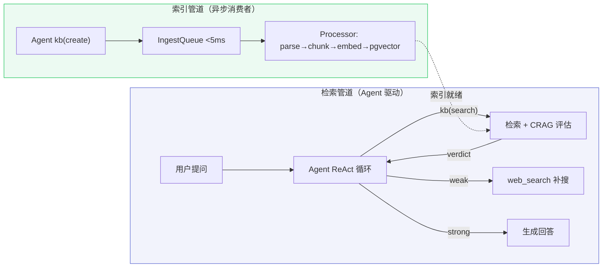
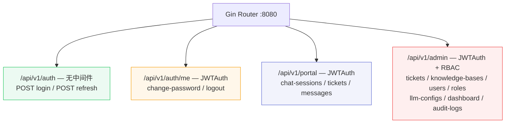

# 业务流程文档

> 覆盖 Cognos 全部业务模块的端到端数据流与引擎内部设计，含 Mermaid 流程图与详细调用链。

## Agentic RAG 架构总览

两条管道解耦：索引管道异步消费（秒级），检索管道 Agent ReAct 驱动（毫秒级）。

| 管道 | 执行者 | 职责 | 耗时 |
|------|--------|------|------|
| 索引管道 | 异步消费者 | parse → chunk → embed → pgvector + BM25 | 秒级 |
| 检索管道 | Agent ReAct | 决策检索 → 评估充分性 → 补搜 → 回答 | 毫秒级 |

## 路由总览

## 文档索引

### 引擎与架构设计

| 文档 | 主题 | 核心内容 |
|------|------|---------|
| [retrieval-crag-flow.md](retrieval-crag-flow.md) | 检索管道 + CRAG | 并行检索 → RRF → rerank → CRAG 评估 → 充分性 verdict |
| [indexing-pipeline-flow.md](indexing-pipeline-flow.md) | 索引管道 | IngestQueue 异步消费 → chunk → embed → pgvector + BM25 |
| [memory-compression-flow.md](memory-compression-flow.md) | 记忆 + 压缩 | 两层记忆 + 六级上下文压缩 + 后台经验提取 |
| [search-kb-loop-flow.md](search-kb-loop-flow.md) | 搜索闭环 | KB-miss → web_search → kb(create) → 异步索引 → 下次命中 |

### API 端点流程

| 文档 | 业务模块 | 核心调用链 |
|------|---------|-----------|
| [auth-flow.md](auth-flow.md) | 认证与中间件 | Login → JWT 双令牌 → Refresh → RBAC 中间件链 |
| [chat-rag-sse-flow.md](chat-rag-sse-flow.md) | 智能问答 | StreamChat → Agent ReAct + 工具调用 → SSE 流式 → 持久化 |
| [knowledge-publish-flow.md](knowledge-publish-flow.md) | 知识管理 | KB CRUD → 文章状态机 → 文档上传 → 异步处理 → 发布管道 |
| [ticket-lifecycle-flow.md](ticket-lifecycle-flow.md) | 申告管理 | CreateTicket → UpdateStatus 状态机 → Supplement → AutoClose |
| [user-rbac-flow.md](user-rbac-flow.md) | 用户与权限 | 用户 CRUD → 角色管理 → 菜单树 → 权限校验 |
| [llm-config-hot-reload-flow.md](llm-config-hot-reload-flow.md) | LLM 配置 | CRUD → atomic.Value 热替换 → 连接测试 |
| [admin-ops-flow.md](admin-ops-flow.md) | 看板与审计 | Dashboard 统计 → 趋势分析 → 审计日志 → 系统配置 |
