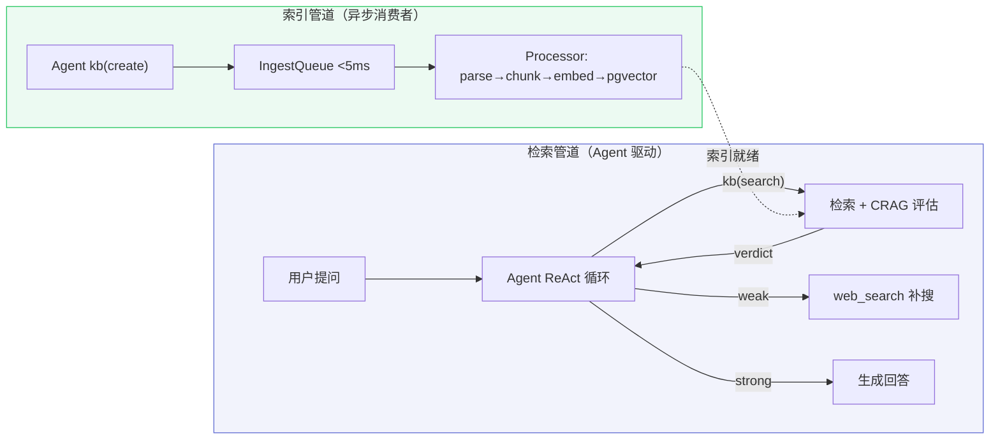
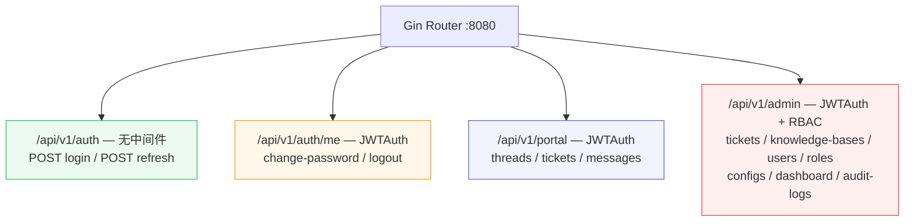

# 业务流程文档

> 覆盖 Cognik 全部业务模块的端到端数据流与引擎内部设计，含 Mermaid 流程图与详细调用链。

## Agentic RAG 架构总览

两条管道解耦：索引管道异步消费（秒级），检索管道 Agent ReAct 驱动（毫秒级）。

| 管道 | 执行者 | 职责 | 耗时 |
|------|--------|------|------|
| 索引管道 | 异步消费者 | parse → chunk → embed → pgvector + BM25 | 秒级 |
| 检索管道 | Agent ReAct | 决策检索 → 评估充分性 → 补搜 → 回答 | 毫秒级 |

## 路由总览

## 文档索引（按业务域）

### 用户与权限（user/）

| 文档 | 核心调用链 |
|------|-----------|
| [auth-flow.md](user/auth-flow.md) | Login → JWT 双令牌 → Refresh → RBAC 中间件链 |
| [user-rbac-flow.md](user/user-rbac-flow.md) | 用户 CRUD → 角色管理 → 菜单树 → 权限校验 |

### 知识库（knowledge/）

| 文档 | 核心调用链 |
|------|-----------|
| [knowledge-publish-flow.md](knowledge/knowledge-publish-flow.md) | KB CRUD → 文章状态机 → 文档上传 → 异步处理 → 发布管道 → Agent 自迭代闭环 |
| [indexing-pipeline-flow.md](knowledge/indexing-pipeline-flow.md) | IngestQueue 异步消费 → chunk → embed → pgvector + BM25 |
| [search-kb-loop-flow.md](knowledge/search-kb-loop-flow.md) | KB-miss → web_search → kb(create) → 自动发布 → 下次命中 |

### 对话与检索（chat/）

| 文档 | 核心调用链 |
|------|-----------|
| [chat-rag-sse-flow.md](chat/chat-rag-sse-flow.md) | StreamChat → Agent ReAct + 工具调用 → SSE 流式 → 持久化 |
| [retrieval-crag-flow.md](chat/retrieval-crag-flow.md) | 并行检索 → RRF → rerank → CRAG 评估 → 充分性 verdict |
| [memory-compression-flow.md](chat/memory-compression-flow.md) | 两层记忆 + 六级上下文压缩 + 后台经验提取 |

### 工单（ticket/）

| 文档 | 核心调用链 |
|------|-----------|
| [ticket-lifecycle-flow.md](ticket/ticket-lifecycle-flow.md) | CreateTicket → 系统工单(source=3) → UpdateStatus 状态机 → Supplement → AutoClose |

### 系统管理（system/）

| 文档 | 核心调用链 |
|------|-----------|
| [admin-ops-flow.md](system/admin-ops-flow.md) | Dashboard 统计 → 趋势分析 → 审计日志 → 系统配置（.env 热加载） |
