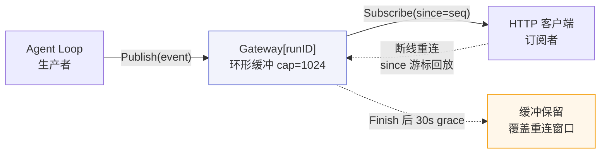

# Chat RAG SSE 数据流 — 每个 API 端点

> 涉及代码：`domain/chat/session/handler.go`、`domain/chat/session/service.go`、`agent/loop.go`、`agent/runner.go`、`agent/tools/kb_store_impl.go`、`agent/tools/kb.go`、`rag/crag.go`、`infra/runtime/gateway.go`

> 问答由 Agent ReAct 循环驱动。Agent 自主决策检索时机、检索内容、结果是否充分、是否补搜。检索是 Agent 工具（kb(action=search)），非固定线性管道。

---

## POST /api/v1/portal/threads &emsp; 创建会话容器

**输入** `{"kb_id":1, "title":"VPN问题"}`

```
1. ChatHandler.CreateChatSession (domain/chat/session/handler.go)

2. ChatService.CreateSession (domain/chat/session/service.go)
   ├─ KnowledgeRepo.FindKBByID → SELECT * FROM knowledge_bases WHERE id = ?
   └─ ChatRepo.Create → INSERT INTO chat_sessions (user_id, kb_id, question)
```

**输出** `{session_id, kb_id, question, created_at}`

---

## POST /api/v1/portal/threads/:id/stream &emsp; SSE 流式对话

**输入** `{"question":"数据库超时怎么排查"}`

### 阶段 1 — Handler: SSE 连接建立

```
ChatHandler.StreamChatMessage (domain/chat/session/handler.go)
  ├─ strconv.ParseInt(idStr) → sessionID
  ├─ c.ShouldBindJSON → request.SendMessageRequest
  ├─ getCurrentUserID → userID
  ├─ c.Writer.(http.Flusher) → 校验 SSE 支持
  ├─ 写 SSE 响应头: Content-Type text/event-stream, Cache-Control no-cache
  └─ ChatService.StreamChat → 获取 <-chan StreamEvent
      └─ for evt := range eventCh { writeSSEEvent → Flush → SetWriteDeadline(30s) }
```

### 阶段 2 — ChatService: 会话校验 + 历史加载

```
ChatService.StreamChat (domain/chat/session/service.go)
  ├─ ChatRepo.FindByID → SELECT * FROM chat_sessions WHERE id = ?
  │   → session.UserID != userID → ErrForbidden
  ├─ ChatRepo.FindMessagesBySession → SELECT * FROM chat_messages WHERE session_id=? ORDER BY created_at ASC LIMIT 50
  │   → 失败 → slog.Warn 降级为单轮对话
  └─ agentRunner.Stream(gctx, input) → 代理 goroutine:
        done 事件时:
          ├─ ChatRepo.UpdateSession → UPDATE chat_sessions SET answer,sources,confidence,duration_ms
          └─ ChatRepo.CreateBatch → INSERT INTO chat_messages (user + assistant)
```

### 阶段 3 — Agent ReAct 循环 + 工具调用

```
AgentRunner.Stream → Loop.Run (agent/loop.go)
  ├─ SystemMessage(BuildSystemPrompt) 注入：静态原则 + KB 摘要 + 全局记忆 + CRAG 指引
  ├─ 循环（maxStep=20）:
  │   ├─ ChatModel.Stream → 流式生成（含 tool_calls）
  │   ├─ 检测 msg.ToolCalls → 分发工具
  │   │   ├─ kb(action=search) → KBStoreImpl.Search（见检索管道文档）
  │   │   │   └─ 返回 SearchOutcome{Entries, Verdict}，文本含 [sufficiency: level]
  │   │   ├─ memory(action=recall) → FileMemoryStore（BM25 / 子串匹配）
  │   │   ├─ web_search → SearchChain（Exa → Tavily → DuckDuckGo）  ← weak verdict 时触发
  │   │   └─ kb(action=create) → 写 Draft（不直接索引，需发布）
  │   ├─ tool_result → ToolMessage 注入历史（Microcompact 清理低价值结果）
  │   └─ 无 tool_calls 或达 maxStep → 生成最终回答
  └─ Gateway 分发 SSE 事件
```

### 阶段 4 — 事件类型与降级

| 事件 | 触发 | 内容 |
|------|------|------|
| `reasoning` | Agent 思考 | `{content:"需要检索知识库..."}` |
| `tool_call` | 工具调用 | `{name:"kb", input:{action:"search",...}}` |
| `tool_result` | 工具返回 | `{name:"kb", output:"[sufficiency: strong]..."}` |
| `token` | LLM 逐 token | `{content:"数据库超时"}` |
| `done` | 流结束 | `{answer, sources, confidence}` |
| `error` | Agent 异常 | `{error:"..."}` |

降级策略（非核心步骤失败不阻塞）:
- 向量检索失败 → BM25-only 降级；双路全失败 → 返回空结果
- rerank 失败 → 原序返回（日志化）
- CRAG LLM 评估失败 → 降级阈值
- LLM 不可用 → 返回错误

### 阶段 5 — SSE Gateway 架构

Agent 运行（生产者）与 HTTP 客户端（订阅者）经 Gateway 解耦。对齐 LangGraph Server / Mastra Durable / OpenAI Responses 的 channel+cursor 模式。



| 机制 | 实现 | 作用 |
|------|------|------|
| 环形缓冲 | `eventStore[E]` cap=1024，环形覆盖最旧 | 防长生成内存膨胀；seq 单调增长 |
| 游标重放 | `Subscribe(since=seq)` 先回放 buffer[since:] 再接实时 | 断线重连不丢事件 |
| 30s grace | `Finish` 后保留缓冲 30s | 覆盖完成瞬间断线的客户端重连 |
| 非阻塞 fan-out | `select/default` 写满即丢 | 慢订阅者不阻塞生成；凭 since 重连补回 |
| 一问一答 | `ErrRunInProgress` | 同一 runID 已有进行中生成时拒绝新请求 |
| Cancel | `Cancel(runID)` | 触发 run 取消，立即标记 finished |

---

## 其它会话操作

### GET /api/v1/portal/threads &emsp; 会话列表

```
ChatHandler.ListSessions → ChatService.ListSessions
  ├─ ChatRepo.ListByUser → SELECT ... WHERE user_id=? ORDER BY created_at DESC
  └─ ChatRepo.CountMessagesBySessions → SELECT session_id, COUNT(*) ... GROUP BY session_id（批量，消除 N+1）
```

### GET /api/v1/portal/threads/:id &emsp; 会话详情

```
ChatHandler.GetChatDetail → ChatService.GetChatDetail
  ├─ ChatRepo.FindByID → 归属校验（session.UserID != userID → 403）
  ├─ json.Unmarshal(session.Sources) → []SourceItem
  └─ ChatRepo.FindMessagesBySession → 最多 50 条
```

### DELETE /api/v1/portal/threads/:id &emsp; 删除会话

```
ChatHandler.DeleteSession → ChatService.DeleteSession
  └─ ChatRepo.DeleteSession → DELETE chat_messages + DELETE chat_sessions（级联，含 user_id 校验）
```
