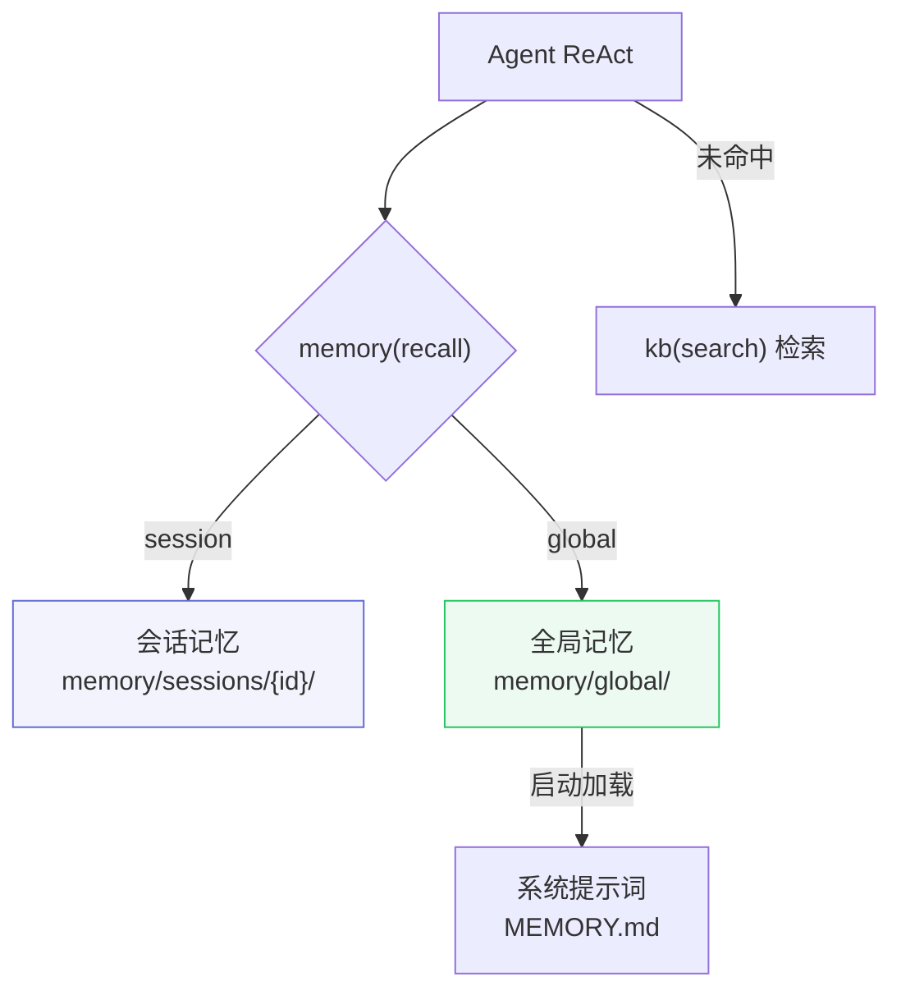
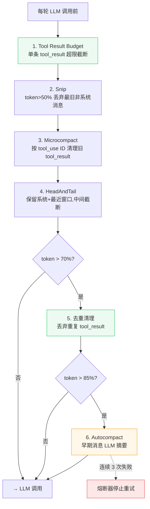
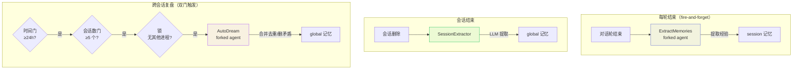

# 记忆系统与上下文压缩

> Agent 跨会话记忆 + 上下文窗口六级压缩 + 后台经验提取。
> 涉及代码：`agent/compressor.go`、`agent/extract_memories.go`、`agent/auto_dream.go`、`agent/session_lifecycle.go`、`agent/tools/memory.go`、`agent/tools/kb_store_impl.go`

---

## 1. 概述

### 能拿它满足什么需求

知识管理场景中，同一领域的经验应跨会话复用。Agent 需要记忆（上次检索结论、领域特定知识）而非每次从零检索。同时对话变长后上下文窗口会满，需压缩避免 token 超限。本系统提供两层记忆（会话/全局）+ 六级压缩管线 + 后台经验提取。

| 维度 | 现状 | 说明 |
|------|------|------|
| 能不能用 | 能 | memory 工具（remember/recall/forget/update/list） |
| 记什么 | 会话内 + 全局 | 会话结束提取有价值内容到 global |
| 怎么压缩 | 六级递进 | 无损优先，有损最后 |
| 多智能 | 自动 | 每轮 fire-and-forget 提取 + 跨会话复盘 |

### 核心术语

| 术语 | 通俗解释 |
|------|---------|
| 会话记忆 | 当前对话的记忆，会话结束提取后丢弃原始 |
| 全局记忆 | 跨会话复用的经验，启动时加载索引到系统提示词 |
| MEMORY.md | 记忆索引文件。≤200 行，启动加载，超出合并旧条目 |
| microcompact | 微压缩。清理旧工具结果（保留调用记录），不动检索/记忆结果 |
| autocompact | 自动压缩。token 超阈值时用 LLM 摘要早期消息 |
| forked agent | 分叉子代理。独立上下文窗口做后台任务，不污染主对话 |
| AutoDream | 跨会话复盘。双门触发，合并去重全局记忆 |

---

## 2. 关系

记忆与检索是 Agent 的两个独立工具，检索优先级在记忆之后。



### 检索优先级

```
memory(recall, session)  ← 最快，当前会话
    ↓ 未命中
memory(recall, global)   ← 次快，跨会话经验
    ↓ 未命中或需补充
kb(search)               ← 最全，知识库
    ↓ 未命中/低置信
web_search → kb(create)  ← 补搜 + 写回
```

---

## 3. 实现

### 3.1 记忆层级

| 层级 | 物理存储 | 索引 | 检索方式 | 生命周期 |
|------|---------|------|---------|---------|
| L1 上下文窗口 | Agent 内存 | — | — | 当前会话 |
| 会话记忆 | `memory/sessions/{id}/*.md` | `MEMORY.md` | BM25 / 子串 | 单会话 |
| 全局记忆 | `memory/global/*.md` | `MEMORY.md` | BM25 | 跨会话 |

参考 Claude Code `~/.claude/memories/`：可检查、可编辑、无数据库。

### 3.2 上下文压缩管线

每步 LLM 调用前执行，从最便宜/最无损到最贵/最有损逐级递进，每级检查上一级是否已降量。



| 级别 | 触发 | 操作 | 有损 |
|------|------|------|:----:|
| 1. Tool Result Budget | 每轮 | 单条 tool_result > 2000 字符截断 | 是 |
| 2. Snip | token > 50% | 丢弃最旧非系统消息 | 是 |
| 3. Microcompact | 每轮 | 按 tool_use ID 清理旧 tool_result（保留调用记录） | 是 |
| 4. HeadAndTail | 每轮 | 保留系统 + 最近 10 条，中间截断 | 否 |
| 5. 去重清理 | token > 70% | 丢弃重复 tool_result | 否 |
| 6. Autocompact | token > 85% | 早期消息 LLM 摘要（熔断 3 次失败停止） | 是 |

### 3.3 可压缩工具白名单

Microcompact 只清理低价值工具结果，保留决策依据工具完整。

| 可压缩 | 不可压缩 |
|--------|---------|
| read_file / bash / grep / glob | kb(search) |
| list_dir / web_search / web_fetch | memory(recall) |
| write_file / edit_file | dispatch_subagent |

依据：可压缩的是"看一眼就够"的工具；不可压缩的是"决策依据"工具。

### 3.4 后台经验提取

三个后台 forked agent，均独立上下文窗口，不污染主对话。



| 后台 agent | 触发 | 做什么 |
|-----------|------|--------|
| ExtractMemories | 每轮结束 | forked agent 从对话提取经验，6 类型分类（system/pattern/decision/reference/learning/workflow） |
| SessionExtractor | 会话结束 | session 记忆 → LLM 提取 → 写入 global |
| AutoDream | 双门（24h + 5 会话 + 锁） | 跨会话合并去重、删矛盾、更新 MEMORY.md |

### 3.5 AutoDream 双门触发

最便宜的先检查，避免无谓开销。

| 门 | 检查 | 成本 |
|----|------|------|
| 时间门 | `hoursSince(lastConsolidatedAt) >= 24h` | 1 次 stat |
| 会话数门 | 新会话数 >= 5 | 1 次目录扫描（10min 节流） |
| 锁 | 无其他进程在复盘 | 1 次文件写（PID） |

锁 60min 过期（PID 复用保护）。游标追踪：失败时游标不前进，下次重试。

---

## 4. 能力

### 4.1 memory 工具

| action | 语义 | scope |
|--------|------|-------|
| remember | 写入记忆 | session / global |
| recall | 检索记忆（BM25 / 子串） | session / global |
| forget | 标记失效（frontmatter `status: disabled`） | session / global |
| update | 更新已有记忆（同 key 覆盖） | session / global |
| list | 列出某 scope 所有条目 | session / global |

### 4.2 MEMORY.md 索引

全局记忆启动时加载 `memory/global/MEMORY.md`（≤200 行）注入系统提示词。超出上限时 AutoDream 合并旧条目。

### 4.3 配置项

| 配置 | 默认 | 作用 |
|------|------|------|
| `Memory.MemoryMaxLines` | 200 | MEMORY.md 最大行数 |
| `Memory.CompressDedup` | 0.70 | 去重清理触发阈值 |
| `Memory.CompressCompact` | 0.85 | Autocompact 触发阈值 |
| `Compressor.toolResultLimit` | 2000 | 单条 tool_result 截断字符 |
| `Compressor.maxCompactFails` | 3 | 熔断器连续失败上限 |

---

## 5. 局限

| 限制 | 说明 |
|------|------|
| 单机记忆 | memory/ 本地文件，不支持多实例共享 |
| 摘要成本 | autocompact 每次一次 LLM 调用 |
| 提取延迟 | ExtractMemories fire-and-forget，当轮不阻塞但经验下轮才可用 |
| AutoDream 周期 | 双门触发，非实时（最快 24h 一次） |

---

## 6. 评估

| 指标 | 衡量 |
|------|------|
| 压缩命中率 | 各级触发频率（级别 4/5 触发说明对话长） |
| 记忆复用率 | recall 命中后是否避免重新检索 |
| 熔断频率 | autocompact 连续失败次数 |
| 提取质量 | ExtractMemories 产出被后续 recall 命中的比例 |

---

## 7. 索引

### 7.1 关键函数

- `Compressor.Compress` — 六级压缩入口
- `FileMemoryStore.Recall` — 记忆检索
- `ExtractMemories.Extract` — 每轮经验提取
- `SessionExtractor.Extract` — 会话结束提取
- `AutoDream.MaybeConsolidate` — 跨会话复盘

### 7.2 关联文档

- [retrieval-crag-flow.md](retrieval-crag-flow.md) — 检索管道
- [chat-rag-sse-flow.md](chat-rag-sse-flow.md) — 智能问答端到端
- [TECH.md](../TECH.md) §2.2 RAG 引擎
