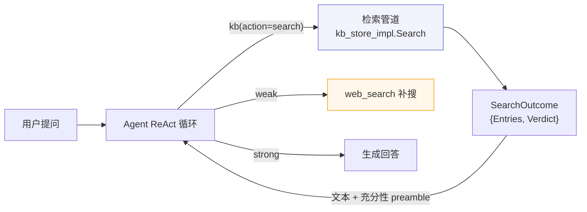
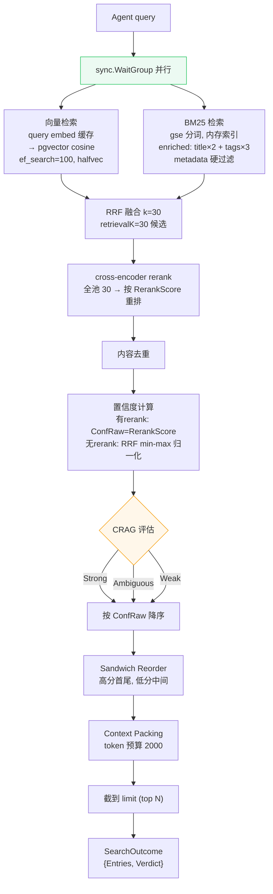
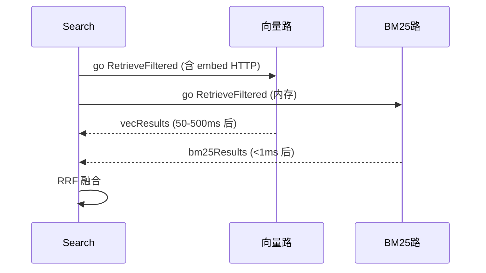
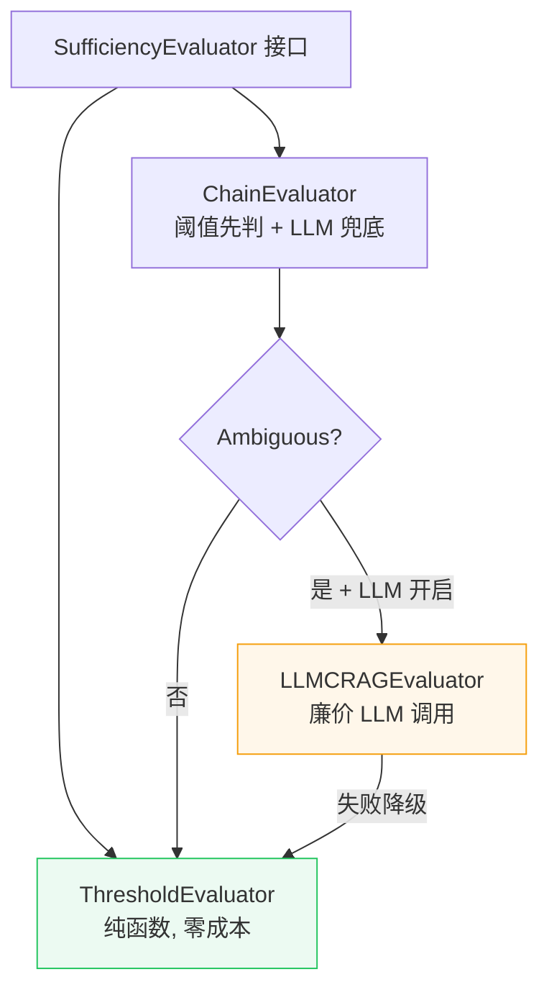

# 检索管道与 CRAG 充分性评估

> 用户提问 → Agent ReAct → 检索 → 评估是否够用 → 够则答、不够则补搜。
> 涉及代码：`agent/tools/kb_store_impl.go`、`agent/tools/kb.go`、`rag/crag.go`、`rag/hybrid.go`、`rag/bm25.go`、`rag/rerank.go`、`rag/retriever.go`、`rag/embedder.go`、`rag/sandwich.go`、`rag/packing.go`、`infra/adapter/vector_store.go`

---

## 1. 概述

### 能拿它满足什么需求

团队向知识库提问，系统从已发布文章中检索相关片段，交给大模型生成带引用的回答。检索不准则回答跑偏，检索太慢则体验差。本文档描述检索如何又快又准，以及在检索不足时如何自动识别并补救。

| 维度 | 现状 | 说明 |
|------|------|------|
| 能不能用 | 能 | 已发布文章（status=4）进索引，kb(action=search) 可检索 |
| 准不准 | 较准 | 两阶段检索 + cross-encoder rerank + CRAG 评估 |
| 快不快 | 较快 | 并行检索 + embedding 缓存 + HNSW ef_search 调优 |
| 不够怎么办 | 自动识别 | CRAG 评估产出 strong/ambiguous/weak，weak 时 Agent 触发 web_search |

### 核心术语

| 术语 | 通俗解释 |
|------|---------|
| RAG | 检索增强生成。先从知识库找相关内容，再让大模型基于这些内容回答，而非凭空生成 |
| BM25 | 关键词检索算法。按词频和文档长度打分，擅长精确匹配（错误码、配置项名） |
| 向量检索 | 语义检索。把文本转成向量，按距离找相似，擅长理解意思（同义改写、概念） |
| RRF | 倒数排名融合。不混合两路分数（量纲不同），只看排名位置合并结果 |
| cross-encoder rerank | 精排。把 query 和每个候选片段一起喂给模型打相关性分，比向量检索更准但更慢 |
| retrievalK | 候选池大小。先粗召回 30 条，精排后取 top N，比直接精排少量更准 |
| CRAG | 纠正式 RAG。检索后评估结果是否够用，不够则触发补搜，避免用差结果硬答 |
| ef_search | HNSW 图搜索的候选数。越大召回越高、越慢，必须 ≥ 返回数量 |

---

## 2. 关系

检索管道是 Agent ReAct 循环调用的一个工具，不直接接触 HTTP 层。



### 依赖关系

| 组件 | 角色 | 文件 |
|------|------|------|
| kb_store_impl | 检索编排 | `agent/tools/kb_store_impl.go` |
| VectorRetriever | 向量检索入口 | `rag/retriever.go` |
| BM25Retriever | 关键词检索入口 | `rag/bm25.go` |
| HybridFuse | RRF 融合 | `rag/hybrid.go` |
| Rerank | cross-encoder 精排 | `rag/rerank.go` |
| SufficiencyEvaluator | CRAG 评估 | `rag/crag.go` |
| Embedder | 文本向量化 | `rag/embedder.go` |
| PgvectorStore | pgvector 存储 | `infra/adapter/vector_store.go` |

---

## 3. 实现

### 3.1 检索数据流



### 3.2 调用链

```
kb_store_impl.Search (agent/tools/kb_store_impl.go:57)
  ├─ pool = max(retrievalK, limit)            // 候选池 ≥ limit
  ├─ metaFilter = {ArticleType, Tags}          // metadata 硬过滤
  ├─ WaitGroup 并行:
  │   ├─ vectorRetriever.RetrieveFiltered     // 向量路（含 embedding HTTP）
  │   └─ bm25Retriever.RetrieveFiltered        // BM25 路（内存 <1ms）
  │       └─ normalizeBm25                     // BM25 分归一化
  ├─ rag.HybridFuse(vec, bm25, pool)           // RRF 融合，不早截
  ├─ rag.Rerank(ctx, reranker, query, fused)   // cross-encoder 全池精排
  ├─ dedupByContent(reranked)                  // 内容去重
  ├─ computeConfidence(deduped, rerankRan)     // 置信度
  ├─ sortByConfRawDesc(deduped)                // 置信度降序
  ├─ evaluator.Evaluate(ctx, query, deduped)   // CRAG 评估 → Verdict
  ├─ rag.SandwichReorder(deduped)               // 首尾重排
  ├─ rag.PackContext(deduped, 2000)             // token 预算填充
  ├─ deduped[:limit]                           // 截到 top N
  └─ return SearchOutcome{Entries, Verdict}
```

### 3.3 两阶段检索

| 阶段 | 动作 | 数量 | 目的 |
|------|------|------|------|
| 粗召回 | 向量 + BM25 并行，RRF 融合 | retrievalK=30 | 广撒网，保证召回率 |
| 精排 | cross-encoder 对 30 条逐一打分 | 全池 | 提升精度 |
| 截断 | 取 top limit | limit=5 | 控制上下文长度 |

为什么不能直接精排少量？cross-encoder 只能重排已有候选，无法自己找文档。候选太少则漏召回，太多则精排慢。30 是召回与延迟的平衡点。

### 3.4 并行检索

向量检索需要一次 embedding HTTP 调用（50-500ms）加一次 DB 查询。BM25 是纯内存操作（<1ms）。两者用 `sync.WaitGroup` 并发执行，BM25 的时间被向量检索完全吸收。



单路失败的降级策略见 §5。

---

## 4. 能力

### 4.1 CRAG 充分性评估

检索后由评估器产出 `Verdict`，判断结果是否够用。

| Verdict | 条件 | Agent 行为 |
|---------|------|-----------|
| strong | top-1 置信度 ≥ high(0.70) | 直接基于检索片段回答 |
| ambiguous | low(0.40) ≤ 置信度 < high | 可选 LLM 二次判定，或改写查询重搜 |
| weak | 置信度 < low(0.40) | 分解 query → web_search → 精炼合并 → 答 |

Verdict 以文本 preamble 返回 Agent（Agent 以文本消费工具结果）：

```
[sufficiency: weak | confidence=0.31] 结果可能不足，建议改写查询或调用 web_search 补充后再回答。

[1] score=0.310
    <chunk 内容>
    来源: kb/1/published/article-42.md
```

### 4.2 评估器层级



| 评估器 | 触发 | 成本 | 失败处理 |
|--------|------|------|---------|
| ThresholdEvaluator | 默认，每次 | 零（纯函数） | 不会失败 |
| LLMCRAGEvaluator | 仅 ambiguous + `COGNIK_AI_CRAG_LLM_EVAL=true` | 一次 LLM 调用 | 降级阈值结果 |

### 4.3 置信度计算

精度阶段信号优先，不混合量纲不同的召回信号。

| 场景 | 公式 | 依据 |
|------|------|------|
| 有 rerank | ConfRaw = RerankScore | cross-encoder sigmoid ∈[0,1]，直接相关性概率 |
| 无 rerank | ConfRaw = RRF 分 min-max 归一化 | rank-based 召回阶段信号 |

废弃旧混合法（0.4×BM25 + 0.6×Rerank 混入 cosine）：召回信号（cosine/BM25）与精度信号（rerank）量纲不同，混合无原则依据。

### 4.4 metadata 过滤

检索时按文章类型和标签硬过滤，缩小搜索空间。

| 过滤项 | 向量路 | BM25 路 |
|--------|--------|---------|
| article_type | SQL `WHERE ka.article_type = $X` | 评分后排除不匹配文档 |
| tags | SQL `WHERE ka.tags ?\| $tags`（JSONB 任一匹配） | 评分后排除 |

索引支撑：`knowledge_articles` 的 GIN(tags) + B-tree(article_type)。

### 4.5 配置项

| 环境变量 | 默认 | 作用 |
|---------|------|------|
| `COGNIK_AI_EF_SEARCH` | 100 | HNSW 查询时 ef_search，≥ limit |
| `COGNIK_AI_RETRIEVAL_K` | 30 | 两阶段候选池大小 |
| `COGNIK_AI_RRF_K` | 30 | RRF 融合常数，可调 |
| `COGNIK_AI_CRAG_LLM_EVAL` | false | 启用 LLM CRAG 评估器（仅 ambiguous） |
| `COGNIK_AI_QUERY_EMBED_CACHE_TTL` | 10m | 查询 embedding 缓存 TTL |
| `COGNIK_AI_QUERY_EMBED_CACHE_MAX` | 1000 | 查询 embedding 缓存上限 |
| `COGNIK_AI_EMBED_BATCH` | 20 | 索引侧 embedding batch |

---

## 5. 局限

### 5.1 降级矩阵

非核心步骤失败不阻塞，单路降级。

| 失败点 | 降级动作 | 错误码 |
|--------|---------|--------|
| 向量检索失败 | Warn 日志，BM25-only 继续 | 双路全失败返回 20002 |
| BM25 检索失败 | Warn 日志，向量-only 继续 | — |
| rerank 失败 | Warn 日志，RRF 排序结果继续 | — |
| CRAG LLM 评估失败 | 降级阈值结果 | 永不阻塞检索返回 |
| embedding 失败 | 向量路失败，BM25 继续 | — |

### 5.2 已知限制

| 限制 | 说明 |
|------|------|
| HNSW 不支持 pre-filter | metadata WHERE 在取 topK 候选后应用，选择性过滤可能返回少于 topK |
| BM25 内存索引 | 30min TTL 刷新，发布后最多 30min 才完全生效（OnKBChanged 触发即时重建） |
| CRAG web fallback 非引擎内 | web_search 由 Agent 经 verdict 触发，RAG 引擎不触 web（保持 HTTP 无关） |
| 无 query 改写管道 | query 直接送检索器，改写由 Agent ReAct 循环处理（每轮一次 LLM 往返） |

---

## 6. 评估

### 6.1 检索质量指标

| 指标 | 衡量 | 如何测 |
|------|------|--------|
| recall@5 | 前 5 条是否含正确片段 | 标定集离线评估 |
| 置信度准确率 | strong 是否真够、weak 是否真不够 | 对比人工标注 |
| fallback 触发率 | weak 占比 | 约 5% 为健康（CRAG 论文基准） |

### 6.2 调参建议

| 参数 | 调优方向 | 依据 |
|------|---------|------|
| ef_search | 先调此（查询时，无需重建）。100 达 95%+ recall | pgvector benchmark |
| RRF k | 30 偏重头部，60 是生产标准。需 eval 验证再改 | Cormack SIGIR 2009 |
| retrievalK | 30 是平衡点。增大提升召回但增 rerank 延迟 | cross-encoder 成对打分 |
| 阈值 low/high | 用 ComputeThresholds 从历史 confidence_raw 算 P30/P70 | 动态优于固定 |

---

## 7. 索引

### 7.1 关键函数

- `kb_store_impl.Search` — 检索编排入口
- `VectorRetriever.RetrieveFiltered` — 向量检索 + metadata 过滤
- `BM25Retriever.RetrieveFiltered` — BM25 检索 + metadata 硬过滤
- `rag.HybridFuse` — RRF 融合
- `rag.Rerank` — cross-encoder 精排
- `ThresholdEvaluator.Evaluate` — CRAG 阈值评估
- `ChainEvaluator.Evaluate` — 阈值 + LLM 链式评估
- `LLMCRAGEvaluator.Evaluate` — LLM 充分性评估
- `computeConfidence` — 置信度计算
- `rag.SandwichReorder` — 首尾重排
- `rag.PackContext` — token 预算填充

### 7.2 关联文档

- [TECH.md](../TECH.md) §2.2 RAG 引擎、§4.2 pgvector 配置、§5 可靠性
- [chat-rag-sse-flow.md](chat-rag-sse-flow.md) — 智能问答端到端流程
- [knowledge-publish-flow.md](../knowledge/knowledge-publish-flow.md) — 发布管道（索引侧）
- [ROADMAP.md](../ROADMAP.md) §9 V1.6 检索优化、§10 V2.0 Agentic RAG
