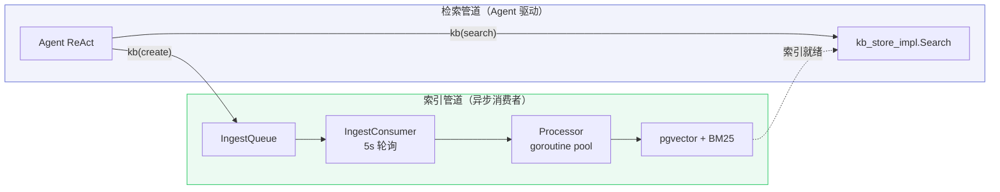
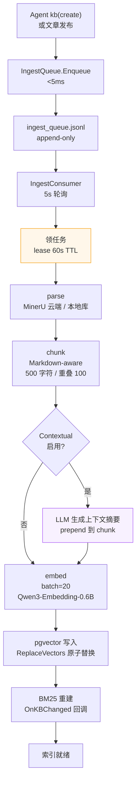
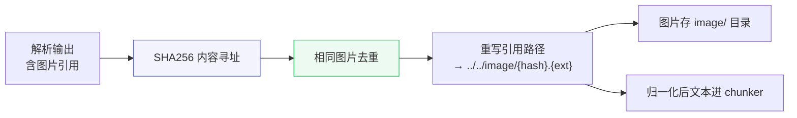
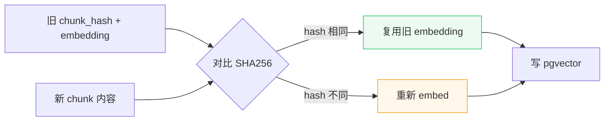

# 索引管道与异步处理

> Agent 写入文章 → 入队 → 消费者异步分块向量化 → pgvector + BM25 索引就绪。
> 涉及代码：`rag/processor.go`、`rag/ingest_queue.go`、`rag/chunker.go`、`rag/contextual.go`、`rag/embedder.go`、`infra/adapter/vector_store.go`

---

## 1. 概述

### 能拿它满足什么需求

知识库文章发布后，需拆成片段、转成向量、写入 pgvector，才能被检索命中。这一过程耗时（解析+分块+向量化需秒级），不能阻塞 Agent 回答。本系统将索引拆为异步消费者，Agent 写入后入队即返回（<5ms），消费者后台处理。

| 维度 | 现状 | 说明 |
|------|------|------|
| 能不能用 | 能 | 发布文章触发处理；Agent kb(create) 入队 |
| 多快入队 | <5ms | append-only JSONL 文件队列 |
| 多久可用 | 秒级 | 消费者轮询 5s + 处理秒级 |
| 失败怎么办 | 可恢复 | lease TTL + 崩溃恢复 + 增量复用 |

### 核心术语

| 术语 | 通俗解释 |
|------|---------|
| IngestQueue | 待处理任务队列。文件式（JSONL），append-only，写入 <5ms |
| IngestConsumer | 消费者。定时轮询队列，领任务处理 |
| lease | 租约。消费者领任务后获得 60s 独占权，超时自动释放给他人重试 |
| chunk | 文本片段。把长文章切成小块，每块独立向量化，检索时按块返回 |
| Contextual Retrieval | 上下文检索。索引时为每块生成上下文摘要 prepend，提升检索准确率（失败率 -67%） |
| chunk hash | 内容指纹。文章更新时只重新向量化内容变化的块，未变的复用旧向量 |

---

## 2. 关系

索引管道与检索管道解耦：Agent 只负责触发写入和检索，不参与索引。



### 两条管道对比

| 管道 | 执行者 | 职责 | 耗时 |
|------|--------|------|------|
| 索引管道 | 异步消费者 | parse → chunk → embed → pgvector + BM25 | 秒级 |
| 检索管道 | Agent ReAct | 决策检索 → 评估充分性 → 补搜 → 回答 | 毫秒级 |

---

## 3. 实现

### 3.1 索引流程



### 3.2 调用链

```
IngestConsumer.Start (rag/ingest_queue.go)
  └─ 5s 轮询: Claim → ProcessTask → Ack/Requeue
     └─ Processor.ProcessTask (rag/processor.go)
        ├─ 解析: parser.Parse（MinerU 优先，本地降级）
        ├─ 图片归一化: normalizeImagePaths（内容寻址去重 + 引用重写）
        ├─ 分块: chunker.Chunk（Markdown 标题感知，500/100）
        ├─ Contextual（可选）: GenerateContextualPrefixes（LLM 摘要 prepend）
        ├─ 增量: GetChunkSnapshots → 算 SHA256 → 仅 re-embed 变更块
        ├─ 向量化: embedder.Embed（batch=20，3 次重试）
        └─ 写入: store.ReplaceVectors（事务内先删旧后写新）
           └─ OnKBChanged 回调 → RebuildBM25ForKB
```

### 3.3 图片归一化

MinerU 与本地解析器输出的图片路径格式不同，`normalizeImagePaths`（parser.go:108-185）统一处理：

| 机制 | 实现 | 作用 |
|------|------|------|
| 内容寻址 | SHA256(图片内容) → 文件名 | 相同图片自动去重，不重复存储 |
| 引用重写 | Markdown `` + HTML `` | 统一为 `../../image/{hash}.{ext}` |
| 前缀对齐 | `imageRelPrefix = "../../image/"` | chunk 内引用可跨目录解析 |



### 3.4 增量复用

文章更新时不必全部重新向量化。



### 3.5 分块策略

| 项 | 值 | 说明 |
|----|-----|------|
| 大小 | 500 字符 | rune 计数 |
| 重叠 | 100 字符 | 前块尾部 + 后块头部 |
| 策略 | 递归字符分割 | 分隔符优先级：\n\n → \n → 。→ ！→ ？→ . → 空格 |
| 结构感知 | Markdown 标题 | 按 #/##/### 拆分，每块 prepend 父标题路径 |
| 代码块 | 保留完整 | fence 内不压缩空白 |

---

## 4. 能力

### 4.1 崩溃恢复

| 机制 | 实现 | 说明 |
|------|------|------|
| lease TTL | 60s | 超时自动释放任务给其他消费者 |
| 状态机 | processing → pending | 消费者崩溃后，processing 状态任务超时回退 pending |
| 幂等 Stop | stopped 原子标志 + closeOnce | 多次 Stop 不 panic |

### 4.2 Contextual Retrieval

索引时为每块生成 1-2 句上下文摘要 prepend，提升检索准确率。

| 项 | 值 |
|----|-----|
| 模型 | agent ChatModel（同 LLM） |
| 触发 | `COGNOS_AI_CONTEXTUAL_ENABLED=true` |
| 成本 | LLM 调用（每块一次），默认关闭 |
| 效果 | 检索失败率 -49~67%（Anthropic 实证） |
| 失败 | 单块失败跳过，不影响其他块 |

### 4.3 配置项

| 环境变量 | 默认 | 作用 |
|---------|------|------|
| `COGNOS_AI_PROCESSOR_WORKERS` | 5 | goroutine pool 大小 |
| `COGNOS_AI_EMBED_BATCH` | 20 | embedding 批大小 |
| `COGNOS_AI_CONTEXTUAL_ENABLED` | false | Contextual Retrieval |
| `COGNOS_AI_BM25_REBUILD_MINUTES` | 30 | BM25 索引 TTL |

---

## 5. 局限

| 限制 | 说明 |
|------|------|
| 发布后延迟 | BM25 最多 30min TTL 才完全生效（OnKBChanged 触发即时重建，但 TTL 刷新见旧数据） |
| 单机队列 | ingest_queue.jsonl 单文件，不支持多实例（单容器部署假设） |
| MinerU 依赖 | 云端解析需 API Key，空值降级本地库（精度下降） |
| Contextual 成本 | 启用后每块一次 LLM 调用，大库索引慢 |

---

## 6. 评估

| 指标 | 衡量 |
|------|------|
| 入队延迟 | <5ms（append-only 文件写） |
| 处理吞吐 | workers × (1/embed 耗时) |
| 增量命中率 | 文章更新时复用旧 embedding 的比例 |
| 索引可用时延 | 发布到可检索的间隔 |

---

## 7. 索引

### 7.1 关键函数

- `IngestQueue.Enqueue` — 入队（<5ms）
- `IngestConsumer.Start` — 消费者轮询
- `Processor.ProcessTask` — 单文档处理
- `Chunker.Chunk` — Markdown-aware 分块
- `GenerateContextualPrefixes` — Contextual 上下文生成
- `PgvectorStore.ReplaceVectors` — 原子替换向量
- `RebuildBM25ForKB` — BM25 索引重建

### 7.2 关联文档

- [retrieval-crag-flow.md](../chat/retrieval-crag-flow.md) — 检索管道（消费侧）
- [knowledge-publish-flow.md](knowledge-publish-flow.md) — 文章发布流程
- [TECH.md](../TECH.md) §2.2 RAG 引擎、§4.2 pgvector 配置
