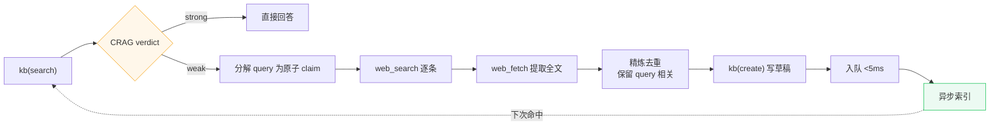
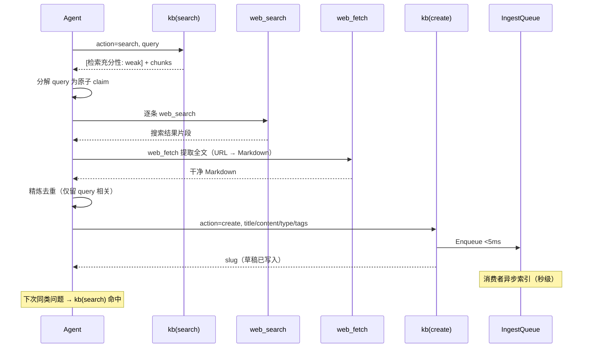

# 搜索→知识库闭环

> KB 未命中或检索不足 → Agent 补搜网络 → 写回知识库 → 异步索引 → 下次命中。
> 涉及代码：`agent/tools/kb.go`、`agent/tools/kb_store_impl.go`、`agent/tools/web_search.go`、`agent/tools/web_fetch.go`、`rag/ingest_queue.go`、`agent/system_prompt.go`

---

## 1. 概述

### 能拿它满足什么需求

知识库不可能预先覆盖所有问题。当检索结果不足（CRAG 评估为 weak），Agent 不应硬答，而应补搜网络证据，整理后写回知识库。下次同类问题即可命中，知识库自进化。

| 维度 | 现状 | 说明 |
|------|------|------|
| 能不能用 | 能 | weak verdict → Agent 自主 web_search → kb(create) |
| 写回什么 | 草稿文章 | frontmatter + 正文，含来源引用 |
| 何时可检索 | 异步索引后 | 入队 <5ms，消费者秒级处理 |
| 谁触发 | Agent 经 verdict | RAG 引擎不触 web，保持 HTTP 无关 |

### 核心术语

| 术语 | 通俗解释 |
|------|---------|
| CRAG weak | 检索置信度低于阈值，结果不足以回答 |
| decompose | 分解。把复杂 query 拆成原子 claim，逐条搜索 |
| refine | 精炼。只保留 query 相关片段，丢弃噪声 |
| kb(create) | 写草稿文章 + 入队索引，不直接发布 |
| 闭环 | 搜到的知识写回 KB，下次检索命中，无需再搜 |

---

## 2. 关系

闭环是 Agent ReAct 循环的自主决策路径，由 CRAG verdict 触发。



### 信号流转

CRAG verdict 以文本 preamble 返回 Agent（Agent 以文本消费工具结果）。Agent 读到 `[检索充分性: weak]` 后，按系统提示词指引执行 decompose→web_search→refine→create。

---

## 3. 实现

### 3.1 闭环流程



### 3.2 调用链

```
kb.go:doCreate (agent/tools/kb.go:268)
  ├─ 校验: title / content / type 非空
  └─ store.Create (kb_store_impl.go:Create)
     ├─ formatArticleFrontmatter（8 字段 frontmatter）
     ├─ articleSvc.CreateArticle（写 DB + 文件，状态 draft）
     └─ 返回 slug（未入队索引——草稿不进 RAG）
```

注意：kb(create) 写入的是草稿，不直接进 RAG 索引。需审核发布后才触发索引。deep_research SubAgent 产出的文章可配置自动发布通道。

### 3.3 frontmatter 格式

草稿文章生成完整 frontmatter：

| 字段 | 必填 | 说明 |
|------|:----:|------|
| title | 是 | 标题 |
| type | 是 | guide/reference/procedure/analysis/note/faq/snippet |
| status | 是 | 固定 draft |
| created | 是 | 创建时间（RFC3339） |
| updated | 是 | 更新时间 |
| tags | 否 | 标签列表 |
| source_type | 否 | 固定 deep_research |
| sources | 否 | 来源 URL + 标题列表（引用追踪） |
| system | 否 | 关联系统 |
| severity | 否 | 严重级别 |

---

## 4. 能力

### 4.1 CRAG 触发判定

| verdict | 置信度 | Agent 行为 |
|---------|--------|-----------|
| strong | ≥ 0.70 | 直接基于检索片段答，不补搜 |
| ambiguous | 0.40 ~ 0.70 | 可改写查询重搜，或 LLM 二次判定 |
| weak | < 0.40 | 触发 web_search 闭环 |

阈值动态更新：`ComputeThresholds` 从近 N 天 chat_messages.confidence_raw 算 P30/P70 分位数。

### 4.2 系统提示词指引

system_prompt.go 含 CRAG 指引块：

- `[检索充分性: strong]` → 直接基于检索片段答
- `[检索充分性: weak]` → 分解 query → web_search → 精炼 → 合并 → 答；可选 kb(create) 写回
- 不在 strong 时调 web_search（避免过度触发成本）

### 4.3 web 工具降级链

| 工具 | 降级链 |
|------|--------|
| web_search | Exa → Tavily → DuckDuckGo |
| web_fetch | Firecrawl → 本地 http.Get |

---

## 5. 局限

### 5.1 已知缺口

| 缺口 | 现状 | 影响 |
|------|------|------|
| content-hash 去重 | 仅 title 去重 | 同主题搜索可能重复创建草稿 |
| 搜索结果压缩节点 | 无 | 多源结果未去重即写入 |
| 草稿→发布 | 需人工审核 | deep_research 文章自动发布通道待评估 |

### 5.2 架构约束

| 约束 | 理由 |
|------|------|
| RAG 引擎不触 web | 保持 HTTP 无关，web fallback 由 Agent 经 verdict 触发 |
| 草稿不进 RAG | 未审核内容不应被检索引用 |
| web 证据需精炼 | 原始网页片段含噪声，不精炼会污染生成 prompt |

---

## 6. 评估

| 指标 | 衡量 |
|------|------|
| 闭环触发率 | weak verdict 占比（约 5% 为健康） |
| 写回命中率 | kb(create) 文章发布后被检索命中的比例 |
| 重复创建率 | 同主题重复建草稿的频率 |
| 审核通过率 | 草稿→发布的转化率 |

---

## 7. 索引

### 7.1 关键函数

- `kb_store_impl.Search` — 返回含 verdict 的检索结果
- `KBTool.doCreate` — 草稿创建入口
- `kb_store_impl.Create` — 写草稿 + frontmatter
- `formatArticleFrontmatter` — frontmatter 生成
- `IngestQueue.Enqueue` — 异步入队

### 7.2 关联文档

- [retrieval-crag-flow.md](retrieval-crag-flow.md) — CRAG 评估（触发侧）
- [indexing-pipeline-flow.md](indexing-pipeline-flow.md) — 异步索引（消费侧）
- [chat-rag-sse-flow.md](chat-rag-sse-flow.md) — 端到端问答流程
