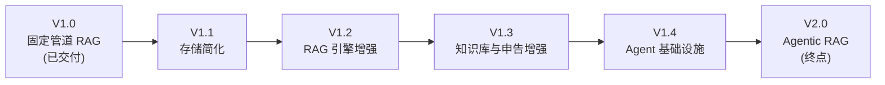
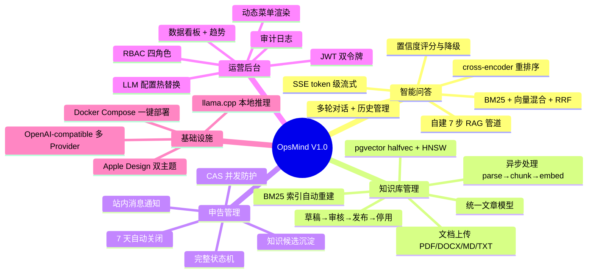
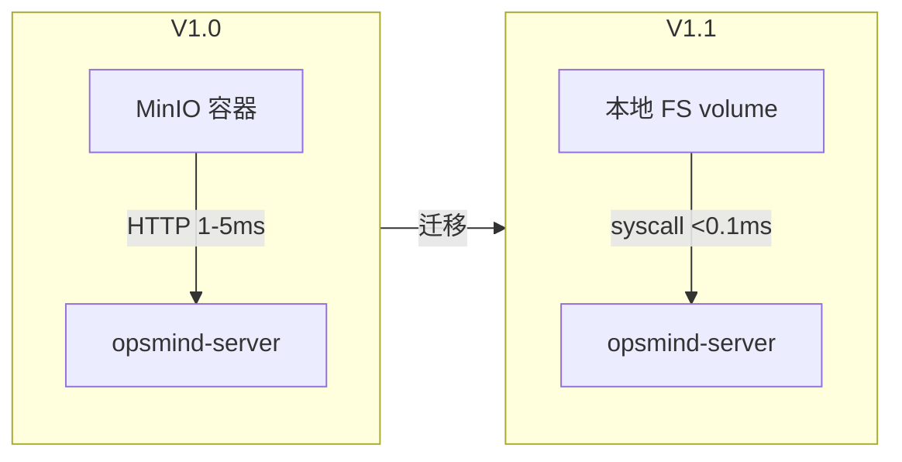
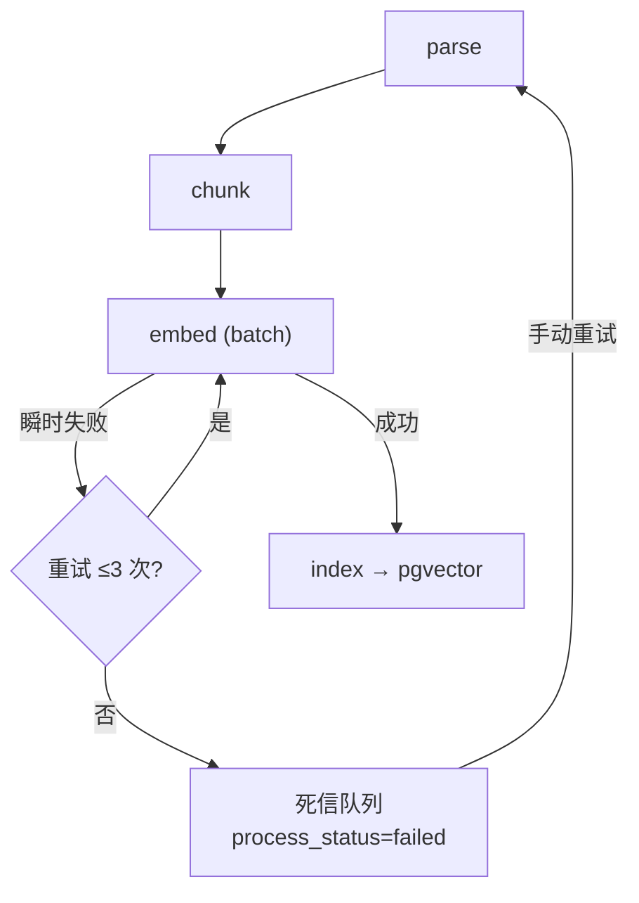
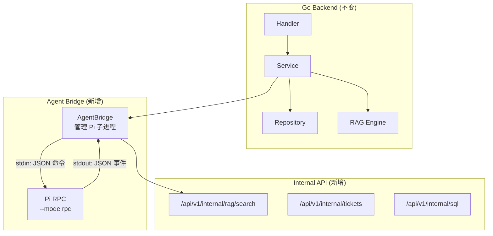
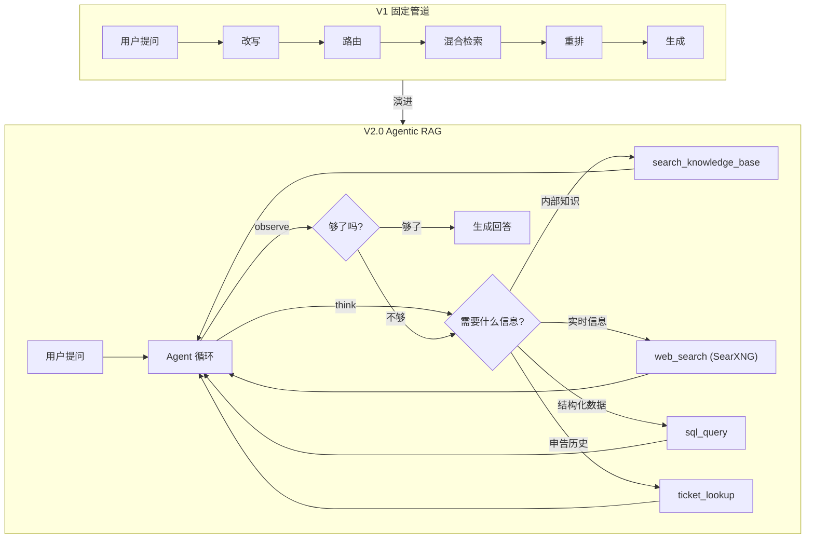
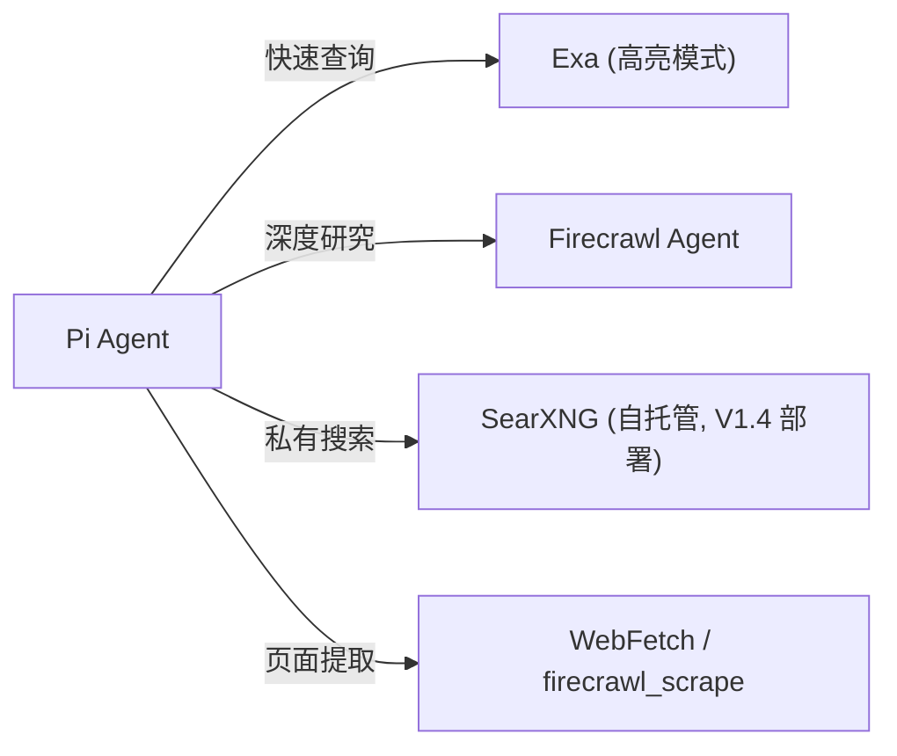
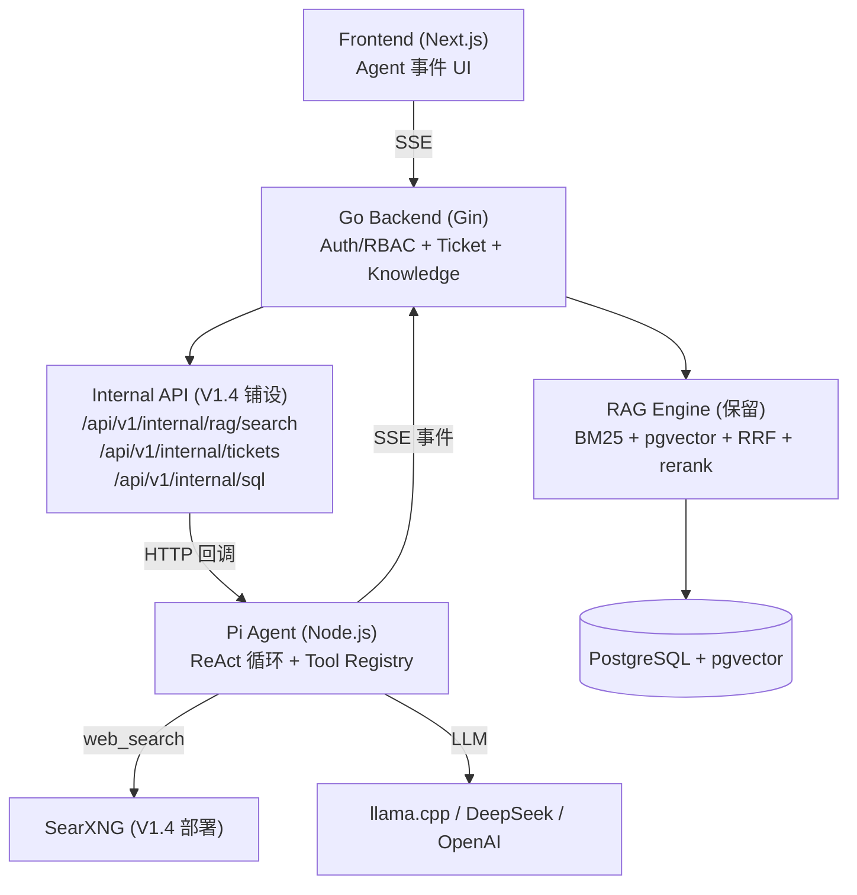
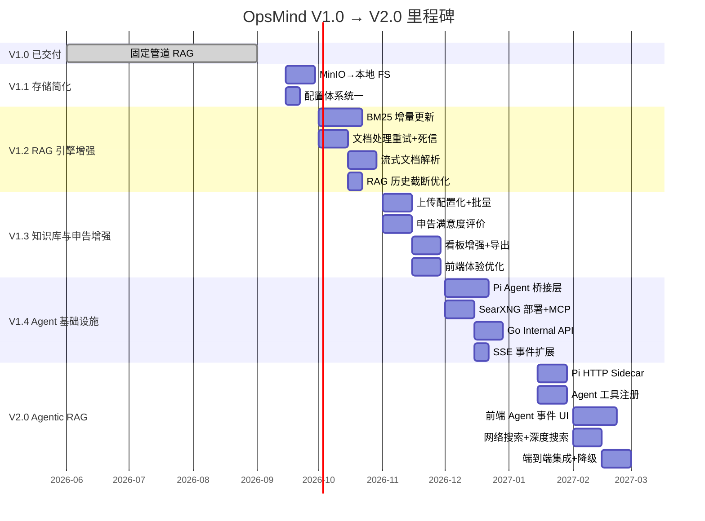

# OpsMind 产品技术路线图

> 从 V1.0 到 V2.0 的版本规划。代码级改进清单见 [`TODO.md`](TODO.md)，技术架构详见 [`TECH.md`](TECH.md)。

## 1. 项目愿景

OpsMind 是面向企业 IT 运维的**私有部署 AI 数字员工系统**。核心目标：让运维团队从重复性咨询中解放，让知识沉淀为可复用资产，让 AI 成为运维流程的第一响应者。

**设计原则**：私有部署优先（数据不出域）、自建 RAG 引擎（全链路可控可审计）、单体分层架构（简洁可维护）。

---

## 2. 版本总览

| 版本 | 主题 | 核心交付 | 状态 |
|------|------|---------|------|
| V1.0 | 固定管道 RAG | 7 步 RAG 管道 + 申告状态机 + 知识库 CRUD + RBAC + SSE 流式 | ✅ 已交付 |
| V1.1 | 存储简化 | MinIO→本地 FS；配置体系统一 | 📋 规划中 |
| V1.2 | RAG 引擎增强 | BM25 增量更新；文档处理重试+死信；流式解析 | 📋 规划中 |
| V1.3 | 知识库与申告增强 | 上传配置化；DOCX 分割文档；看板增强；满意度评价 | 📋 规划中 |
| V1.4 | Agent 基础设施 | Pi Agent 桥接；SearXNG 部署；Go Internal API；SSE 事件扩展 | 📋 规划中 |
| V2.0 | Agentic RAG | Agent ReAct 循环替代固定管道；网络搜索+深度搜索；Agent 事件 UI | 📋 规划中 |

---

## 3. V1.0 — 固定管道 RAG（已交付）

### 3.1 已交付能力

### 3.2 技术栈

| 层 | 技术 |
|----|------|
| 后端 | Go + Gin + GORM |
| 数据库 | PostgreSQL + pgvector (halfvec + HNSW) |
| 对象存储 | MinIO (S3-compatible) |
| RAG | 自建 Go 引擎 — BM25 (gse) / 向量 (pgvector) / RRF / cross-encoder |
| LLM | llama.cpp server 或 OpenAI-compatible API |
| 前端 | Next.js + React + TypeScript + Radix UI + SWR + Tailwind CSS |
| 部署 | Docker Compose |

---

## 4. V1.1 — 存储简化

**目标**：移除 MinIO 依赖，降低部署复杂度和资源占用。

### 4.1 MinIO → 本地文件系统

MinIO 在单实例部署中增加 200-500MB RAM + HTTP 延迟层。同类系统（Dify / Open WebUI / AnythingLLM）均默认本地 FS。

### 4.2 交付项

| 项 | 说明 | 验收标准 |
|----|------|---------|
| `LocalFSClient` | 新增本地 FS 适配器，原子写（temp+rename），UUID 文件名 | `StorageClient` 接口不变；MinIO 数据迁移脚本可用 |
| 后端代理下载 | `GET /api/storage/:bucket/:key` 替代 Presigned URL | 认证后 `http.ServeFile`；权限校验通过 |
| Docker 简化 | 移除 minio 服务，加 `storage_data` volume | `docker compose up` 仅 3 必须服务 |
| 配置统一 | `storage.type` (local/minio) + `storage.root_path` | 切换配置即可换后端，无需改代码 |
| MinIO 惰性下载修复 | 本地 FS 直接 `os.Open`，无惰性问题 | `defer Close` 检查错误 |

### 4.3 保留决策

| 组件 | 决策 | 依据 |
|------|------|------|
| pgvector | 保留 | halfvec(FP16) + HNSW 不可替代；增长最快 PG 扩展 |
| PostgreSQL | 保留 | 12+ JSONB 列依赖 GIN 索引；跨表事务一致性 |
| `MinIOClient` | 保留代码 | 作为 escape hatch，多实例时恢复使用 |

---

## 5. V1.2 — RAG 引擎增强

**目标**：提升 RAG 管道的可靠性、性能和检索质量。

### 5.1 BM25 索引增量更新

当前每次刷新全量重建 BM25 索引，大知识库耗时数秒。

| 项 | 说明 | 验收标准 |
|----|------|---------|
| 增量索引 | 文章发布/更新时增量更新 BM25 倒排索引，非全量重建 | 10 万 chunk KB 增量更新 < 500ms |
| 并发安全 | 索引读写不阻塞检索请求 | RWMutex；检索不等待索引写 |

### 5.2 文档处理重试与死信

当前 embedding API 瞬时失败直接中止整个文档处理。

| 项 | 说明 | 验收标准 |
|----|------|---------|
| 阶段内重试 | embed/chunk 阶段瞬时失败自动重试（指数退避，max 3） | 429/503 自动重试；非瞬时错误跳过 |
| 死信队列 | 超过重试次数标记 `failed`，记录 `process_error` | 前端显示失败原因；支持手动重试 |
| 重试不重复 | 重试基于 chunk hash 跳过已成功的 chunk | 增量重试，非从头开始 |

### 5.3 流式文档解析

当前 PDF/DOCX 全量读入内存（`io.ReadAll`），大文件 OOM 风险。

| 项 | 说明 | 验收标准 |
|----|------|---------|
| PDF 流式解析 | 逐页解析，不全量读入 | 50MB PDF 内存峰值 < 20MB |
| DOCX 流式解析 | 流式读取 XML，不全量 `io.ReadAll` | 50MB DOCX 内存峰值 < 20MB |
| DOCX 分割文档 | 支持 `word/document2.xml` 分割文档 | 多部分 DOCX 正确解析 |

### 5.4 RAG 历史截断优化

当前按消息条数截断，改为按 token 数。

| 项 | 说明 | 验收标准 |
|----|------|---------|
| Token 计数 | 使用 tokenizer 精确计数 | 超出 `max_history_tokens` 时从最早开始截断 |
| 配置化 | `ai.max_history_tokens` 替代 `ai.max_history_messages` | 兼容旧配置 |

---

## 6. V1.3 — 知识库与申告增强

**目标**：完善业务功能，提升用户体验和闭环能力。

### 6.1 知识库上传增强

| 项 | 说明 | 验收标准 |
|----|------|---------|
| 上传上限配置化 | 50MB 硬编码改为按 KB 粒度配置 | `kb.max_upload_size` 可配置 |
| 批量上传 | 支持多文件批量上传 | 前端批量选择；后端并发处理 |
| 上传进度 | 前端显示上传进度条 | 实时进度反馈 |
| 文件类型校验 | 前端+后端双重校验文件类型 | 非 PDF/DOCX/MD/TXT 拒绝 |

### 6.2 申告管理增强

| 项 | 说明 | 验收标准 |
|----|------|---------|
| 满意度评价 | 申告解决后用户评价（满意/不满意+反馈） | 状态机增加评价环节；看板统计满意度 |
| 申告标签 | 申告支持标签分类（复用 Tags 字段） | 前端标签选择；按标签筛选 |
| 处理时限 | 申告可设处理时限，超时预警 | 配置时限；超时站内消息通知 |
| 批量操作 | 申告批量关闭/转派 | 多选+批量操作确认 |

### 6.3 看板增强

| 项 | 说明 | 验收标准 |
|----|------|---------|
| 自定义日期范围 | 看板支持自定义起止日期 | 日期选择器；趋势图按范围刷新 |
| 数据导出 | 看板数据 CSV 导出 | 导出当前筛选条件下的数据 |
| 满意度统计 | 看板新增满意度统计卡片 | 满意率趋势；按运维人员分组 |
| `granularity` 生效 | 趋势查询 `granularity` 参数实际生效 | day/week 切换正常 |

### 6.4 前端体验优化

| 项 | 说明 | 验收标准 |
|----|------|---------|
| 代码分割 | `next/dynamic` 按路由懒加载 | 首屏加载体积减少 50%+ |
| 虚拟列表高度 | 变长消息 `estimateSize` 动态测量 | 滚动位置准确 |
| 表单 required 标记 | 前端表单必填字段标记 | 视觉标识 + 校验提示 |
| 搜索无结果提示 | 用户/申告搜索无结果时提示 | 空状态 UI |

---

## 7. V1.4 — Agent 基础设施

**目标**：为 V2.0 Agentic RAG 铺设基础设施，不改变用户可见行为。

### 7.1 Pi Agent 桥接层

| 项 | 说明 | 验收标准 |
|----|------|---------|
| `server/internal/agent/` | Agent Bridge 包：管理 Pi RPC 子进程生命周期 | spawn/monitor/restart；超时取消 |
| Pi RPC 集成 | `pi --mode rpc` JSONL over stdin/stdout | 基本对话通过 Pi 走通 |
| Pi Provider 配置 | Pi `--provider` / `--model` 参数从 DB 读取 | 配置热替换生效 |
| 兜底方案验证 | 验证自建 Go Agent Loop（~500 行）可行性 | RPC 不可用时可回退 |

### 7.2 SearXNG 自托管搜索

| 项 | 说明 | 验收标准 |
|----|------|---------|
| Docker 部署 | `searxng` 服务加入 docker-compose | JSON 输出启用；`it`/`science` 类别 |
| SearXNG MCP | MCP 服务器封装，供 Pi Agent 调用 | `search`/`fetch_url` 工具可用 |
| Ops 域配置 | 预配置技术搜索引擎优先 | StackOverflow/GitHub/厂商域名 |
| 私有搜索验证 | 查询不出域，无 API 密钥 | 日志确认无第三方数据发送 |

### 7.3 Go Internal API

供 Pi Agent 工具回调的内部端点，RBAC 内部令牌认证。

| 端点 | 方法 | 说明 | 验收标准 |
|------|------|------|---------|
| `/api/v1/internal/rag/search` | POST | 调用 RAG 引擎检索 | 返回 chunks + scores |
| `/api/v1/internal/tickets` | GET | 查询申告列表 | 支持 status/keyword 筛选 |
| `/api/v1/internal/sql` | POST | 受限 SQL 查询 | 白名单表；只读；行数限制 |
| `/api/v1/internal/escalate` | POST | 触发申告升级 | 创建申告 + 通知 |

### 7.4 SSE 事件扩展

当前 SSE 事件：`step` / `chunks` / `token` / `done` / `error`。V1.4 预留 Agent 事件类型。

| 新增事件类型 | 说明 |
|-------------|------|
| `thinking` | Agent 推理过程（V2.0 启用） |
| `action` | Agent 工具调用（V2.0 启用） |
| `observation` | 工具返回结果（V2.0 启用） |
| `tool_call` | 工具调用详情（V2.0 启用） |
| `tool_result` | 工具返回摘要（V2.0 启用） |

V1.4 阶段 `GenerationHub` 的 `StreamEvent` 类型扩展，但前端不渲染（V2.0 启用）。

---

## 8. V2.0 — Agentic RAG（终点）

**目标**：Agent ReAct 循环替代固定 7 步管道，实现自主检索决策、网络搜索、多步推理。

### 8.1 核心变化

V1 的 RAG 是**固定 7 步线性管道**，V2.0 引入 **Agent 基座**让 AI 自主决策。

### 8.2 Agent 基座：Pi Agent

| 维度 | Pi (earendil-works/pi) |
|------|----------------------|
| 成熟度 | ~10 万 star，265 万周下载，257 releases，MIT |
| Agent 循环 | ReAct 循环 + tool calling + steering + compaction |
| 多 Provider | 30+（llama.cpp / DeepSeek / OpenAI / Anthropic） |
| RAG 能力 | 无内置（OpsMind Go 引擎互补作为工具后端） |

**桥接**：V1.4 已铺设 RPC 子进程桥接层，V2.0 切换为 HTTP Sidecar（`createAgentSession` SDK）用于生产。

### 8.3 网络搜索与深度搜索

| 能力 | 工具 | 说明 |
|------|------|------|
| 快速网络搜索 | Exa MCP / Firecrawl | 高亮模式 10x token 效率 |
| 深度研究 | `firecrawl_agent` / GPT-Researcher MCP | 多轮迭代搜索→阅读→综合 |
| 自托管搜索 | SearXNG + MCP（V1.4 部署） | 聚合 130+ 引擎，无 API 密钥，私有部署 |
| Ops 域过滤 | SearXNG `it`/`science` 类别 | 优先 StackOverflow / GitHub / 厂商域名 |

### 8.4 Agent 场景

| 场景 | Agent 模式 | 工具 |
|------|-----------|------|
| 智能问答 | ReAct + Corrective RAG | RAG 检索、网络搜索、申告历史 |
| 根因分析 | Plan-then-Execute | 日志查询、拓扑探索、指标查询、知识检索 |
| 自助修复 | ReAct + Tool Use | API 调用、脚本执行（需人工审批门） |

### 8.5 目标架构

### 8.6 废弃与新增

| 废弃（V1） | 替代（V2.0） |
|-----------|------------|
| `ai.rag_query_rewrite` 开关 | Agent 自主决策（工具参数） |
| `ai.rag_multi_route` 开关 | Agent 循环多次调用 |
| `ai.rag_hybrid` 开关 | 工具参数 `strategy=hybrid` |
| `ai.rag_rerank` 开关 | 工具参数 `rerank=true` |
| 固定 `Pipeline.Execute()` | Pi `createAgentSession()` |
| `LLMConfigManager` 单默认 | Pi 多 Provider + session 级配置 |

| 保留 | 原因 |
|------|------|
| RAG 引擎（BM25 + vector + RRF + rerank） | Pi 无 RAG，Go 引擎作为工具后端 |
| pgvector + PostgreSQL | 向量存储 + 业务数据不变 |
| Document Processor | 文档处理管道不变 |
| SSE 流式 + GenerationHub | 扩展事件类型（V1.4 预留） |
| Auth/RBAC/Ticket/Knowledge | 领域逻辑不变 |

| 新增 | 说明 |
|------|------|
| Pi HTTP Sidecar | 生产级 Agent 运行时（V1.4 RPC 升级） |
| Pi Extension（TS） | 自定义 tools：search_kb / ticket_lookup / sql_query / web_search |
| 前端 Agent 事件 UI | thinking/action/observation/tool_call/tool_result 渲染 |
| 人工审批门（HITL） | 敏感操作（自助修复）必须人工确认 |
| 事件知识自进化 | 已解决申告生成知识条目 → 嵌入 pgvector → RAG 检索历史经验 |

### 8.7 验收标准

| 验收项 | 标准 |
|--------|------|
| Agent 对话端到端 | 用户提问 → Agent 自主检索（≥1 轮）→ 带引用回答 |
| 网络搜索 | 内部 KB 无结果时 Agent 自主触发 SearXNG 搜索 |
| 深度搜索 | 复杂问题 Agent 多轮搜索（≥2 轮）并综合 |
| Agent 事件 UI | thinking/action/observation 实时渲染；用户可见推理过程 |
| 降级 | Pi Agent 不可用时回退 V1 固定管道；SearXNG 不可用时跳过网络搜索 |
| 审计 | Agent 轨迹（工具调用、检索查询、推理步骤）写入审计日志 |

---

## 9. 里程碑

---

## 10. 技术决策记录

| 决策 | 选择 | 依据 |
|------|------|------|
| 文档存储 | 本地 FS（移除 MinIO） | 单实例下本地 FS 足够；Dify/Open WebUI/AnythingLLM 均默认本地 |
| 向量数据库 | 保留 pgvector | halfvec+HNSW 不可替代；增长最快 PG 扩展；sqlite-vec 无 ANN |
| 业务数据库 | 保留 PostgreSQL | JSONB GIN 索引；pgvector 依赖；跨表事务；GORM 迁移安全 |
| Agent 数据 | 未来 SQLite | ReAct 高频读写时拆分；当前非瓶颈 |
| Agent 基座 | Pi Agent（TS） | 10 万星验证、30+ Provider、成熟 agent loop；Go 桥接 |
| 网络搜索 | SearXNG（自托管）+ Exa/Firecrawl | 私有部署无 API 密钥；深度研究用 Firecrawl Agent |
| Agent 模式 | ReAct + Corrective RAG | 运维问答需要多步推理 + 检索质量保证 |
| LLM Provider | 多 Provider（llama.cpp/DeepSeek/OpenAI） | Pi 管理 Provider 路由，保留本地部署能力 |
| 桥接策略 | V1.4 RPC 子进程 → V2.0 HTTP Sidecar | MVP 用 RPC 快速验证，生产用 Sidecar 稳定 |
| 版本终点 | V2.0 | 不规划 V2.x，业务提升全部归入 V1.1-V1.4 |

---

## 11. 关联文档

| 文档 | 用途 |
|------|------|
| [`PRD.md`](PRD.md) | 产品需求 — 功能定义、业务规则 |
| [`TECH.md`](TECH.md) | 技术架构 — 分层设计、DDL、ADR |
| [`API/README.md`](API/README.md) | API 文档索引 |
| [`FLOW/README.md`](FLOW/README.md) | 业务流程图 |
| [`TODO.md`](TODO.md) | 代码级改进清单与优先级 |
