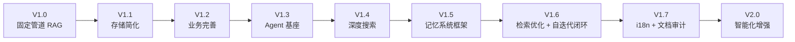
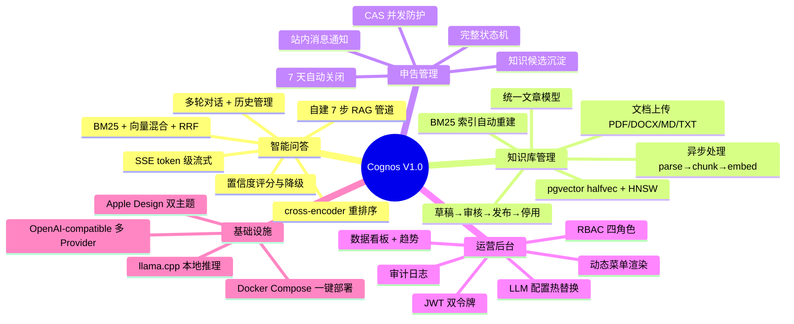
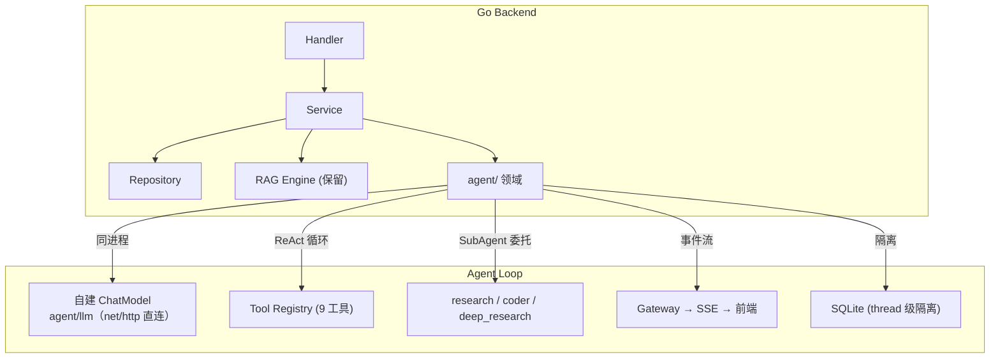
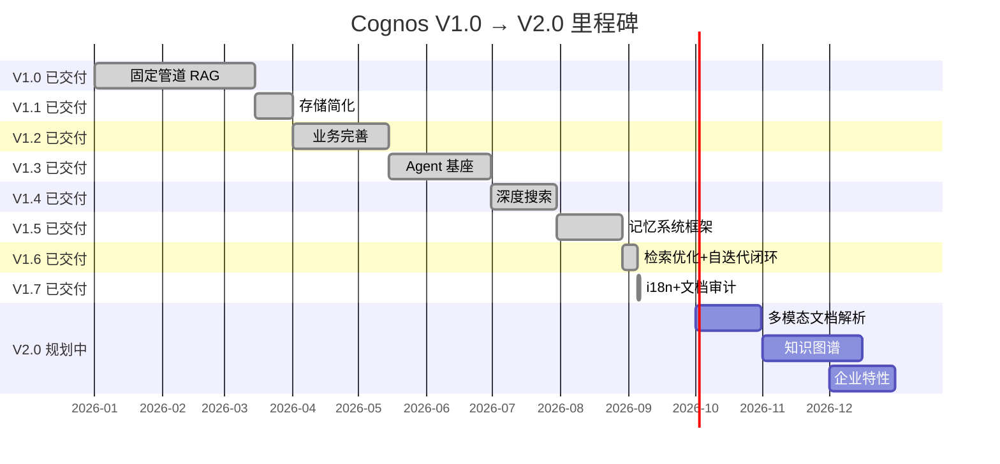

# Cognos 产品技术路线图

> 从 V1.0 到 V2.0 的版本规划。代码级改进清单见 [`TODO.md`](TODO.md)，技术架构详见 [`TECH.md`](TECH.md)。

## 1. 项目愿景

Cognos 是面向团队的**私有部署 AI 知识管理平台**。核心目标：让知识沉淀为可复用资产，让 AI 自主检索与写入知识，让团队从重复性咨询中解放。

**设计原则**：私有部署优先（数据不出域）、自建 RAG 引擎（全链路可控可审计）、单体分层架构（简洁可维护）。

---

## 2. 版本总览



| 版本 | 主题 | 核心交付 | 状态 |
|------|------|---------|------|
| V1.0 | 固定管道 RAG | 7 步 RAG 管道 + 申告状态机 + 知识库 CRUD + RBAC + SSE 流式 | ✅ 已交付 |
| V1.1 | 存储简化 | MinIO→本地 FS；配置体系统一 | ✅ 已交付 |
| V1.2 | 业务完善 | 知识库与申告增强；Markdown 富文本；看板增强；前端体验优化 | ✅ 已交付 |
| V1.3 | Agent 基座 | 自建 ReAct 循环 + 订阅渠道网关 + 9 OS 工具 + SubAgent(research/coder/deep_research) + 异步任务 + SQLite 隔离 + parts 前端模型 | ✅ 已交付 |
| V1.4 | 深度搜索 | 深度搜索工具链（搜索→爬取→产出 md）；自建 ReAct Loop + 统一工具接口 + SubAgent 真异步派发；SQLite 增量写入 | ✅ 已交付 |
| V1.5 | 记忆系统框架 | 记忆+RAG+知识库统一架构；kb 扁平 md + memory global/session 两层；记忆工具(remember/recall/forget)；六级上下文压缩；ExtractMemories + AutoDream 复盘；异步处理管道 | ✅ 已交付 |
| V1.6 | 检索优化 + 自迭代闭环 | Agent 写回即发布（CreateAndPublish/UpdateAndRepublish）；语义去重（>0.92 拒绝）；frontmatter schema + metadata 补全；embedding 1536/DashScope；5-worker pool；INDEX.md 锁；工单闭环（CreateSystemTicket）；Contextual Retrieval；Sandwich Reorder；BM25 Enriched Texts；RRF 调参（k=30）；Metadata 预过滤；Context Packing | ✅ 已交付 |
| V1.7 | i18n + 文档审计 | 前端中英文切换（next-intl cookie 策略）；GitHub 展示面英文优先（README/CONTRIBUTING/Issue 模板双语）；孤儿清理；FLOW/API 按业务域分块；文档纯净审计 | ✅ 已交付 |
| V2.0 | 智能化增强 | 多模态文档解析 / 知识图谱 / Agent 能力增强 / 企业特性 / 性能可观测 / 知识写入治理 | 📋 规划中 |

---

## 3. V1.0 — 固定管道 RAG（已交付）

### 3.1 已交付能力



### 3.2 技术栈

| 层 | 技术 |
|----|------|
| 后端 | Go + Gin + GORM |
| 数据库 | PostgreSQL + pgvector (halfvec + HNSW) |
| 对象存储 | 本地 FS（MinIO 可选） |
| RAG | 自建 Go 引擎 — BM25 (gse) / 向量 (pgvector) / RRF / cross-encoder |
| LLM | 自建 agent/llm.ChatModel（net/http 直连） |
| 前端 | Next.js + React + TypeScript + shadcn/ui + SWR + Tailwind v4 |
| 部署 | Docker Compose |

---

## 4. V1.1 — 存储简化（已交付）

**目标**：移除 MinIO 依赖，降低部署复杂度和资源占用。

### 4.1 MinIO → 本地文件系统

MinIO 在单实例部署中增加 200-500MB RAM + HTTP 延迟层。同类系统（Dify / Open WebUI / AnythingLLM）均默认本地 FS。

### 4.2 交付项

| 项 | 说明 |
|----|------|
| `LocalFSClient` | 本地 FS 适配器，原子写（temp+rename），UUID 文件名 |
| 后端代理下载 | `GET /api/storage/:bucket/:key` 替代 Presigned URL |
| Docker 简化 | MinIO 改可选；`storage_data` volume |
| 配置统一 | `storage.type` (local/minio) + `storage.root_path` |

### 4.3 保留决策

| 组件 | 决策 | 依据 |
|------|------|------|
| pgvector | 保留 | halfvec(FP16) + HNSW 不可替代 |
| PostgreSQL | 保留 | JSONB GIN 索引；跨表事务一致性 |
| `MinIOClient` | 保留代码 | escape hatch，多实例时恢复使用 |

---

## 5. V1.2 — 业务完善（已交付）

**目标**：完善知识库、申告、看板等业务功能与前端体验。

### 5.1 知识库上传增强

| 项 | 说明 |
|----|------|
| 上传上限配置化 | `kb.max_upload_size` 可配置 |
| 批量上传 | 前端 react-dropzone 拖拽；后端并发处理 |
| 上传进度 | XMLHttpRequest upload progress 实时反馈 |
| 文件类型校验 | 前端+后端双重校验 PDF/DOCX/XLSX/PPTX/MD/TXT |

### 5.2 申告管理增强

| 项 | 说明 |
|----|------|
| 申告标签 | TagsInput 组件；回车/逗号/粘贴自动分割 |
| 批量操作 | 多选 + 批量删除/关闭 |
| 处理时限 | 超时站内消息通知 |

### 5.3 看板增强

| 项 | 说明 |
|----|------|
| 自定义日期范围 | 日期选择器；趋势图按范围刷新 |
| 数据导出 | CSV + BOM 头防 Excel 乱码 |
| `granularity` 生效 | day/week 切换正常 |

### 5.4 前端体验优化

| 项 | 说明 |
|----|------|
| 代码分割 | `next/dynamic` 按路由懒加载重组件 |
| 虚拟列表高度 | 变长消息 `estimateSize` 动态测量 |
| 表单 required 标记 | Field 组件 required prop 全覆盖 |
| 搜索空状态 | 4 个列表页空状态统一 |
| 组件一致性 | raw 元素替换为设计系统组件 |

### 5.5 Markdown 富文本编辑

| 项 | 说明 |
|----|------|
| MarkdownViewer | react-markdown + remark-gfm + remark-math + rehype-katex |
| 代码高亮 | Shiki 异步高亮，主题感知 |
| Mermaid 图表 | 代码块渲染为 SVG，主题感知 |
| MarkdownEditor | @uiw/react-md-editor 分屏编辑 |
| 图片粘贴上传 | 粘贴/拖拽图片自动上传 + 插入 Markdown |
| 模式切换确认 | diff 检测 + ConfirmDialog |

---

## 6. V1.3 — Agent 基座（已交付）

**目标**：铺设原生 Go Agent Loop 基础设施，实现 ReAct 循环 + Tool Calling。

**选型**：自建 ReAct 循环（`agent/loop.go`）+ 自建 ChatModel（`agent/llm`，net/http 直连 OpenAI 兼容 API）。

### 6.1 Agent 架构



### 6.2 已交付能力

| 项 | 说明 |
|----|------|
| `server/internal/agent/` | Agent 领域包：provider 构造 + tool 注册 + handler |
| 自建 ChatModel | agent/llm net/http 直连 OpenAI 兼容 API |
| 自建 ReAct 循环 | ReAct 循环 + typed tools + parallel execution |
| 订阅渠道网关 | Gateway 统一 SSE 事件分发 |
| 9 OS 工具 | bash / async_bash / read / write / edit / list / glob / grep / mkdir |
| SubAgent | research（只读探查）+ coder（读写操作）+ deep_research，dispatch_subagent AsyncTool 注册 |
| 异步任务 | async_bash 流式输出；任务管理 |
| SQLite 隔离 | 单库 `data/agent.db`，thread 级逻辑隔离（表内 thread_id 区分，非物理分文件） |
| threads API | 对话线程管理 |
| parts 数组模型 | 前端渲染并行工具调用 + SubAgent + TaskCard |
| Provider 热切换 | `LLMConfigManager.OnChange` → 替换 agent/llm.ChatModel |

### 6.3 工具集成

| 工具 | 来源 | 调用方式 | 版本 |
|------|------|----------|------|
| `search_knowledge_base` | Go RAG Engine | 同进程 `rag.Pipeline.Search()` | V1.3 |
| `ticket_lookup` | Go Ticket Service | 同进程 `ticket.Service.Query()` | V1.3 |
| `sql_query` | Go SQL 执行 | 同进程 `db.Raw()`（只读） | V1.3 |
| `web_search` | SearXNG | 直接 HTTP | V1.4 |
| `web_fetch` | Firecrawl 自托管 | 直接 HTTP | V1.4 |
| `exa_search`（可选） | Exa API | 直接 HTTP | V1.4 |
| `kb(action=create)` | Go Agent | 搜索结果 → Markdown，CreateAndPublish 自动发布进 RAG | V1.4 |

### 6.4 SSE 事件

SSE 事件：`step` / `chunks` / `token` / `done` / `error` / `reasoning` / `tool_call` / `tool_result`。前端 `parts` 数组模型渲染并行工具调用与 SubAgent。

---

## 7. V1.4 — 深度搜索（已交付）

**目标**：Agent 配备深度搜索工具链，实现搜索→爬取→整理→产出 md 文章闭环；Agent 具备跨会话记忆能力和动态上下文压缩。

**调研依据**：[`docs/research/knowledge-organization/`](research/knowledge-organization/) + [`docs/research/unified-memory/`](research/unified-memory/) + [`docs/research/agent-memory/`](research/agent-memory/)

### 7.1 深度搜索工具链

Agent 能搜索网络资料、爬取网页内容、整理产出结构化 Markdown 文章。

**需求**：
- 网络搜索能力（私有部署优先，可选 SaaS 增强）
- 网页提取能力（URL → 干净 Markdown，JS 渲染）
- 深度研究 SubAgent（与现有 research/coder 并列）
- 搜索结果 → 结构化 md 文章（frontmatter + sources 引用）
- 产出写入草稿箱（draft/），人工审核后发布触发 RAG 索引

### 7.2 Agent 记忆能力

Agent 具备跨会话记忆和动态上下文压缩。

**需求**：
- 记忆操作作为 Agent 工具（remember/recall/forget）
- 记忆与系统相关、与用户无关（scope = system_id）
- 上下文动态压缩（无损优先，有损最后）
- 会话暂停/恢复（Thread 可序列化）
- 自建六级压缩管线（Tool Result Budget → Snip → Microcompact → HeadAndTail → 去重 → Autocompact）

### 7.3 深度搜索方法论

deep_research SubAgent 的系统提示词遵循以下原则（参考 [`engineering-skills/research`](https://github.com/int2t05/engineering-skills/tree/main/skills/02-research/research) skill + 开源项目实践）：

**搜索原则**：分层搜索 / 源优先级 / 全页提取 / 对抗性验证 / 引用注册表 / 上下文压缩 / 收敛控制 / 工具降级

**架构原则**：三层分离（planner→execution→publisher）/ 多 LLM 角色分工 / 先大纲再填充 / 对抗性反思 / 累积式知识

### 7.4 深度搜索场景

| 场景 | 查询示例 | 来源 |
|------|---------|------|
| 技术问题查找 | "ORA-00942 error" | Stack Overflow、厂商文档 |
| CVE 查询 | "CVE-2025-XXXX" | NVD、厂商安全公告 |
| 软件版本兼容 | "PostgreSQL 17 pgvector" | 厂商文档、GitHub releases |
| 内部 KB 未命中 | 内部无文档的问题 | 回退网络搜索 |

---

## 8. V1.5 — 记忆系统框架（已交付）

**目标**：搭建统一记忆系统框架。记忆 + RAG + 知识库统一为一个架构，Agent 上下文 = 内存（L1 cache），MD 文件 = 硬盘，页表 = 映射，知识库分库 = 分区。

**设计文档**：[`FLOW/chat/memory-compression-flow.md`](FLOW/chat/memory-compression-flow.md)、[`FLOW/knowledge/indexing-pipeline-flow.md`](FLOW/knowledge/indexing-pipeline-flow.md)　**调研依据**：[`docs/research/unified-memory/`](research/unified-memory/)

### 8.1 文档组织架构

```
storage/
├── kb/                                # 知识库（对外资产，审核后可引用）
│   └── {kb_slug}/                     # 知识库分区
│       ├── INDEX.md                    # 页目录（脚本自动重建）
│       ├── draft/                      # 草稿（不进 RAG）
│       │   └── {filename}.md
│       └── published/                  # 已发布（进 RAG 索引）
│           └── {filename}.md
│
├── memory/                            # 记忆（Agent 自用，参考 Claude Code）
│   ├── global/                         # 全局记忆（跨会话）
│   │   ├── MEMORY.md                    # 索引（启动加载，≤200 行）
│   │   └── {name}.md
│   └── sessions/                       # 会话记忆（单会话）
│       └── {session_id}/
│           ├── MEMORY.md
│           └── {name}.md
│
└── _index/                            # 派生索引（可重建）
    ├── pgvector/
    ├── bm25/
    └── ingest_queue.jsonl
```

- **kb**：扁平 md 文件，`{draft|published}/{filename}.md`；图片统一到 `image/` 目录；分类靠 frontmatter `type`
- **memory/global**：扁平 md + `MEMORY.md` 索引，参考 Claude Code `~/.claude/memories/`
- **memory/sessions**：单会话隔离，结束后提取有价值内容到 `global/`
- **文件即真相**：MD 文件 = 真相源，pgvector/BM25 = 派生索引（可重建）

### 8.2 Agent 记忆工具

| 工具 | 说明 | scope |
|------|------|-------|
| `memory_remember(text, scope, importance)` | 写入记忆 | session / global |
| `memory_recall(query, scope, limit)` | 检索记忆 | session / global / knowledge |
| `memory_forget(scope, key)` | 标记失效（非物理删除） | session / global |

`scope=knowledge` 时路由到 RAG 引擎（BM25 + pgvector + RRF + rerank）。

### 8.3 上下文压缩

| 级别 | 触发 | 操作 | 有损 |
|------|------|------|:---:|
| 1. Tool Result Budget | 每轮 | 单条 tool_result 超限截断为占位 | 否 |
| 2. Snip | token > 50% | 丢弃最旧非系统消息（消息级裁剪） | 是 |
| 3. Microcompact | 每轮 | 按 tool_use ID 清理旧 tool_result（保留记录） | 否 |
| 4. HeadAndTail | 每轮 | 保留系统+最近窗口，中间截断 | 否 |
| 5. 去重清理 | token > 70% | 丢弃重复 tool result | 否 |
| 6. Autocompact | token > 85% | LLM 摘要（熔断器保护） | 是 |

自建六级压缩管线：Tool Result Budget → Snip → Microcompact → HeadAndTail → 去重 → Autocompact。

### 8.4 检索方案

| scope | 检索方式 | 理由 |
|-------|---------|------|
| knowledge（大语料） | BM25 + 向量 + RRF + rerank | 保留现有 RAG 引擎 |
| global（Agent 自记忆） | 纯文本 + BM25 | 规模小，Claude Code 实证 |
| session（会话记忆） | BM25 / 精确 | 不需要语义检索 |

BM25 为主，向量为补充。只有 kb/ 需要向量化，memory/ 用纯文本 + BM25。

### 8.5 异步处理管道

- 深度搜索产出 → `draft/{filename}.md`（消息队列 `ingest_queue.jsonl`）
- 定时消费者：去重 → 质量门 → 分解 → 重组 → 索引入库
- 审查门控：draft → published 状态机
- 优雅降级：嵌入服务不可用时仍写入文件

### 8.6 会话生命周期

- **启动**：加载 `global/MEMORY.md` → 注入 L1 上下文
- **会话中**：六级压缩管线 → checkpoint 持久化 → `memory_recall` 按需检索
- **会话结束**：扫描 `sessions/{id}/` → LLM 提取 → 写入 `global/` → 更新 `MEMORY.md`
- **暂停/恢复**：Thread 可序列化，pause = 持久化，resume = 加载

---

## 9. V1.6 — 检索优化（已交付）

**目标**：在大量文档中精确找到对应的那份上下文。基于 V1.5 记忆框架，深挖检索质量优化。

**调研依据**：[`docs/research/unified-memory/06-retrieval-optimization.md`](research/unified-memory/06-retrieval-optimization.md)　**设计文档**：[`FLOW/chat/retrieval-crag-flow.md`](FLOW/chat/retrieval-crag-flow.md)

### 9.1 Contextual Retrieval（最大优化机会）

对每个 chunk，索引时 LLM 生成 1-2 句上下文摘要 prepend 到 chunk 前，然后同时做 embedding 和 BM25 索引。

Anthropic 实证：基线失败率 5.7% → +Contextual 2.9% → +Rerank **1.9%**（降低 67%）。

### 9.2 Sandwich Reorder（Lost in the Middle 缓解）

rerank 后 topK 截断前，高分 chunk 放首尾，低分放中间。LLM 对上下文窗口首尾信息处理能力优于中间。

### 9.3 BM25 Enriched Texts

将文章标题（重复两次增加权重）、来源、分类注入 BM25 索引文本，提升关键词检索召回率。

### 9.4 RRF k 值调优

RRF k 值从 60 调低到 30（可配置）。k 值越小排名靠前结果得分优势越大，rerank 效果更好。

### 9.5 Token-based Chunking（推迟）

将 chunker 从 rune-count 改为 token-count（tiktoken-go），中英混排文档 chunk 大小更一致。

> 推迟：rune-based + markdown-aware chunker 对 CJK 已够好（1 rune ≈ 1 token）；换 tiktoken-go 加依赖且须重嵌存量 chunk，边际收益小。eval 驱动：标定集测 recall@5 前后对比再定。

### 9.6 Metadata 预过滤

检索时支持按 frontmatter 字段（type/tags/system/severity）预过滤，缩小搜索空间。

### 9.7 Context Packing

token 预算内贪心填充——从高分到低分依次放入，剩余 token 用截断的下一个 chunk 填充。


## 10. V2.0 — 智能化增强（规划中）

V1.6 已交付 Agentic RAG 自迭代闭环（Agent ReAct 循环 + 自建 ChatModel + 知识写回即发布）。V2.0 在此基础上增强智能化能力。

### 10.1 多模态文档解析

- 图片内容提取（MinerU vision 模式）——当前图片仅存储不解析，无法被 RAG 检索
- 表格结构化提取——复杂表格转 Markdown/HTML 结构，当前降级为纯文本
- 扫描件 OCR——MinerU 云端高精度 OCR，补充本地解析能力

### 10.2 知识图谱

- 文章间关联抽取——LLM 提取实体关系，构建知识图谱
- 图谱可视化——前端图谱浏览（节点=文章/实体，边=关系）
- 图谱增强检索——向量检索 + 图谱遍历融合，提升多跳问答能力

### 10.3 Agent 能力增强

- 多 Agent 协作——research/coder/deep_research SubAgent 间任务委派与结果汇总
- 长任务断点续传——Agent 任务持久化 + 崩溃恢复（当前仅 SQLite 事件流）
- 工具市场——插件化工具注册，支持热加载第三方工具

### 10.4 企业特性

- 多租户——知识库 + 工单按组织隔离
- SSO 集成——OIDC/SAML 单点登录
- 细粒度权限——知识库级 ACL（当前仅 RBAC 权限码）
- 审计增强——Agent 决策轨迹完整回放

### 10.5 性能与可观测

- BM25 增量更新——当前全量重建，大 KB 下性能瓶颈
- 检索缓存——query embedding LRU 缓存（已实现单文本缓存，扩展到 batch）
- Prometheus 指标——RAG 管道 + Agent 循环 + embedding 延迟监控
- 告警规则——检索失败率、embedding 超时、Agent 循环异常阈值告警（接 Alertmanager / Webhook）
- 成本预算控制——单会话 token 上限 + rerank 按置信度阈值触发而非每轮强制；budget gate 在 ReAct 循环内截断
- 容量基线——k6 压测标定并发上限、RAG p95 延迟、单节点承载 KB 规模，产出 `docs/CAPACITY.md`
- 分布式部署——Processor 跨节点水平扩展（当前单节点 goroutine pool）

### 10.6 知识写入治理

> 回应 v1.7 评价短板：Agent 自动写入知识库默认无审核，AI 幻觉可直接污染 KB。

- 写入审核门控——`auto_publish` 配置开关；关闭时 `CreateAndPublish` 落 `draft/` 走人工审核（复用现有 draft→published 状态机），不直发进 RAG
- 写入前质量门——置信度阈值 + 引用完整性校验（无 sources/citation 的产出拒绝直发），低质量内容降级为草稿
- Agent 决策轨迹审计——记录每轮 ReAct 的 tool_call/tool_result/检索召回，支持按 thread 回放，异常决策聚合
- 速率限制——单会话/单时间窗 create 上限，防灌入低质量文章（TODO 已标 🟢，治理章节统一收口）

---

## 11. 里程碑



---

## 12. 技术决策记录

| 决策 | 选择 | 依据 |
|------|------|------|
| Web 框架 | Gin + GORM | Go 生态成熟；Gin 路由性能 + GORM ORM 生产力；SSE 原生支持 |
| 中文分词 | gse（go-ego/gse） | 纯 Go 无 CGO；HMM 模式；字典加载失败降级字符级 |
| Rerank 通信 | Python 子进程（os/exec stdin/stdout） | 单租户私有部署免独立 HTTP 服务；崩溃自动重启 |
| Rerank 模型 | ms-marco-MiniLM-L-4-v2 | 轻量 80MB cross-encoder；CPU FP16；质量/成本平衡 |
| 文档解析双引擎 | MinerU 云端 + 本地纯 Go 降级 | MinerU 处理公式/表格/版面；本地兜底离线/无 Key/低延迟 |
| CRAG 评估器 | 阈值 + 可选 LLM（非 fine-tuned T5） | 无训练数据；部署简洁；阈值零成本，LLM 仅 Ambiguous 带 |
| 部署模式 | Docker Compose（开发）+ All-in-One（生产） | Compose 灵活编排；All-in-One 单容器降低生产部署门槛 |
| 文档存储 | 本地 FS（MinIO 可选） | 单实例下本地 FS 足够 |
| 向量数据库 | pgvector | halfvec+HNSW 不可替代 |
| 业务数据库 | PostgreSQL | JSONB GIN 索引；pgvector 依赖；跨表事务 |
| Agent 数据 | SQLite（单库 thread 级隔离） | ReAct 高频读写隔离，单文件 `data/agent.db` |
| Agent 基座 | 自建 ReAct 循环 + 自建 ChatModel | 无外部框架依赖；ReAct 循环 + 工具派发 + 异步恢复全自建 |
| LLM Provider | 自建 agent/llm.ChatModel | net/http 直连 OpenAI 兼容 API；工具描述透明传入，无 WithTools 黑盒 |
| SSE 输出 | Gin `fmt.Fprintf + Flush` | 标准 SSE 模式 |
| 工具生态 | 自建 ToolRegistry | SyncTool / AsyncTool 接口；dispatch_subagent 委托子 Agent |
| 网络搜索 | 私有部署优先，可选 SaaS 增强 | 数据不出域优先 |
| deep_research SubAgent | 与 research/coder 并列 | 独立工具集和系统提示词 |
| Agent 记忆 | 记忆操作作为 Agent 工具 | Agent 自主决定何时记忆/检索 |
| 记忆系统框架 | 记忆+RAG+知识库统一架构 | 上下文=L1 cache, md=disk, 页表=索引 |
| 记忆压缩 | 无损优先，有损最后 | 知识信息不能被摘要丢失 |
| 记忆 scope | 与系统相关，与用户无关 | scope = system_id |
| 知识库组织 | 文件式 Markdown，索引是派生 | 文件即真相，可重建 |
| RAG 检索 | BM25 为主，向量为补充 | BEIR 基准 + Claude Code 实证 |
| Agent 模式 | ReAct + Corrective RAG | 知识问答需要多步推理 + 检索质量保证 |
| LLM Provider 热切换 | `LLMConfigManager.OnChange` | `atomic.Value` 存储 ChatModel |
| 前端 SSE | 保留现有 `ChatStreamProvider` | rAF 批处理 + 纯函数 reducer + 单测 |
| 版本规划 | V1.x 已交付，V2.0 智能化增强 | V1.6 交付自迭代闭环；V2.0 聚焦多模态/知识图谱/企业特性 |

---

## 13. 关联文档

| 文档 | 用途 |
|------|------|
| [`PRD.md`](PRD.md) | 产品需求 — 功能定义、业务规则 |
| [`TECH.md`](TECH.md) | 技术架构 — 分层设计、DDL、ADR |
| [`API/README.md`](API/README.md) | API 文档索引 |
| [`FLOW/README.md`](FLOW/README.md) | 业务流程图 |
| [`TODO.md`](TODO.md) | 代码级改进清单与优先级 |
| [`research/knowledge-organization/`](research/knowledge-organization/) | V1.4 调研 — 知识库组织形式、Markdown 存储、Agent 写入实践、Firecrawl vs Exa |
| [`research/agent-memory/`](research/agent-memory/) | V1.4 调研 — Agent 记忆系统：三层模型、Claude Code 五层实践、10 个参考项目对比 |
| [`research/unified-memory/`](research/unified-memory/) | V1.4/V1.5/V1.6 调研 — 统一记忆架构 + OS 类比 + 页表分库 + 异步管道 + 竞品对比 + 检索优化 |
| [`FLOW/chat/retrieval-crag-flow.md`](FLOW/chat/retrieval-crag-flow.md) | 检索管道 + CRAG 评估设计 |
| [`FLOW/chat/memory-compression-flow.md`](FLOW/chat/memory-compression-flow.md) | 记忆系统 + 上下文压缩设计 |
| [`FLOW/knowledge/indexing-pipeline-flow.md`](FLOW/knowledge/indexing-pipeline-flow.md) | 索引管道 + 异步处理设计 |
| [`FLOW/knowledge/search-kb-loop-flow.md`](FLOW/knowledge/search-kb-loop-flow.md) | 搜索→知识库闭环设计 |
