# OpsMind 产品技术路线图

> 从 V1.0 到 V2.0 的版本规划。代码级改进清单见 [`TODO.md`](TODO.md)，技术架构详见 [`TECH.md`](TECH.md)。

## 1. 项目愿景

OpsMind 是面向企业 IT 运维的**私有部署 AI 数字员工系统**。核心目标：让运维团队从重复性咨询中解放，让知识沉淀为可复用资产，让 AI 成为运维流程的第一响应者。

**设计原则**：私有部署优先（数据不出域）、自建 RAG 引擎（全链路可控可审计）、单体分层架构（简洁可维护）。

---

## 2. 版本总览

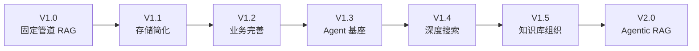

| 版本 | 主题 | 核心交付 | 状态 |
|------|------|---------|------|
| V1.0 | 固定管道 RAG | 7 步 RAG 管道 + 申告状态机 + 知识库 CRUD + RBAC + SSE 流式 | ✅ 已交付 |
| V1.1 | 存储简化 | MinIO→本地 FS；配置体系统一 | ✅ 已交付 |
| V1.2 | 业务完善 | 知识库与申告增强；Markdown 富文本；看板增强；前端体验优化 | ✅ 已交付 |
| V1.3 | Agent 基座 | Eino ReactAgent + 订阅渠道网关 + 9 OS 工具 + SubAgent(research/coder) + 异步任务 + SQLite 隔离 + parts 前端模型 | ✅ 已交付 |
| V1.4 | 深度搜索 | SearXNG 自托管 + Firecrawl 自托管；Exa 可选；deep_research SubAgent；搜索→爬取→产出 md；Agent 记忆系统（两层 + 动态压缩） | 📋 规划中 |
| V1.5 | 知识库组织 | 文件式 Markdown 知识库重构；目录树 + frontmatter；INDEX.md 自动重建；Agent 写入工具链 | 📋 规划中 |
| V2.0 | Agentic RAG | Agent ReAct 循环替代固定管道；Agent 事件 UI；多步推理；事件知识自进化 | 📋 规划中 |

---

## 3. V1.0 — 固定管道 RAG（已交付）

### 3.1 已交付能力

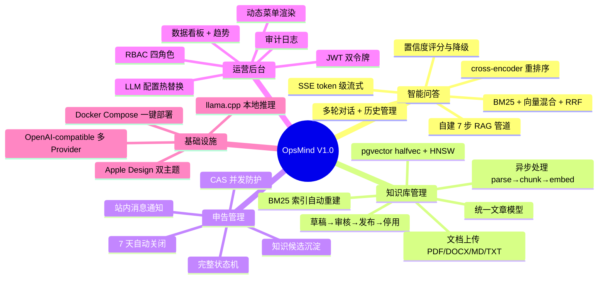

### 3.2 技术栈

| 层 | 技术 |
|----|------|
| 后端 | Go + Gin + GORM |
| 数据库 | PostgreSQL + pgvector (halfvec + HNSW) |
| 对象存储 | 本地 FS（MinIO 可选） |
| RAG | 自建 Go 引擎 — BM25 (gse) / 向量 (pgvector) / RRF / cross-encoder |
| LLM | llama.cpp server 或 OpenAI-compatible API |
| 前端 | Next.js + React + TypeScript + shadcn/ui + SWR + Tailwind v4 |
| 部署 | Docker Compose |

---

## 4. V1.1 — 存储简化（已交付）

**目标**：移除 MinIO 依赖，降低部署复杂度和资源占用。

### 4.1 MinIO → 本地文件系统

MinIO 在单实例部署中增加 200-500MB RAM + HTTP 延迟层。同类系统（Dify / Open WebUI / AnythingLLM）均默认本地 FS。

### 4.2 交付项

| 项 | 说明 |
|----|------|
| `LocalFSClient` | 本地 FS 适配器，原子写（temp+rename），UUID 文件名 |
| 后端代理下载 | `GET /api/storage/:bucket/:key` 替代 Presigned URL |
| Docker 简化 | MinIO 改可选；`storage_data` volume |
| 配置统一 | `storage.type` (local/minio) + `storage.root_path` |

### 4.3 保留决策

| 组件 | 决策 | 依据 |
|------|------|------|
| pgvector | 保留 | halfvec(FP16) + HNSW 不可替代 |
| PostgreSQL | 保留 | JSONB GIN 索引；跨表事务一致性 |
| `MinIOClient` | 保留代码 | escape hatch，多实例时恢复使用 |

---

## 5. V1.2 — 业务完善（已交付）

**目标**：完善知识库、申告、看板等业务功能与前端体验。

### 5.1 知识库上传增强

| 项 | 说明 |
|----|------|
| 上传上限配置化 | `kb.max_upload_size` 可配置 |
| 批量上传 | 前端 react-dropzone 拖拽；后端并发处理 |
| 上传进度 | XMLHttpRequest upload progress 实时反馈 |
| 文件类型校验 | 前端+后端双重校验 PDF/DOCX/XLSX/PPTX/MD/TXT |

### 5.2 申告管理增强

| 项 | 说明 |
|----|------|
| 申告标签 | TagsInput 组件；回车/逗号/粘贴自动分割 |
| 批量操作 | 多选 + 批量删除/关闭 |
| 处理时限 | 超时站内消息通知 |

### 5.3 看板增强

| 项 | 说明 |
|----|------|
| 自定义日期范围 | 日期选择器；趋势图按范围刷新 |
| 数据导出 | CSV + BOM 头防 Excel 乱码 |
| `granularity` 生效 | day/week 切换正常 |

### 5.4 前端体验优化

| 项 | 说明 |
|----|------|
| 代码分割 | `next/dynamic` 按路由懒加载重组件 |
| 虚拟列表高度 | 变长消息 `estimateSize` 动态测量 |
| 表单 required 标记 | Field 组件 required prop 全覆盖 |
| 搜索空状态 | 4 个列表页空状态统一 |
| 组件一致性 | raw 元素替换为设计系统组件 |

### 5.5 Markdown 富文本编辑

| 项 | 说明 |
|----|------|
| MarkdownViewer | react-markdown + remark-gfm + remark-math + rehype-katex |
| 代码高亮 | Shiki 异步高亮，主题感知 |
| Mermaid 图表 | 代码块渲染为 SVG，主题感知 |
| MarkdownEditor | @uiw/react-md-editor 分屏编辑 |
| 图片粘贴上传 | 粘贴/拖拽图片自动上传 + 插入 Markdown |
| 模式切换确认 | diff 检测 + ConfirmDialog |

---

## 6. V1.3 — Agent 基座（已交付）

**目标**：铺设原生 Go Agent Loop 基础设施，实现 ReAct 循环 + Tool Calling。

**选型**：Eino（LLM Provider + Agent Loop + Stream Handling）+ modelcontextprotocol/go-sdk（MCP 工具）。详见 [`docs/design/agent-loop.md`](design/agent-loop.md)。

### 6.1 Agent 架构

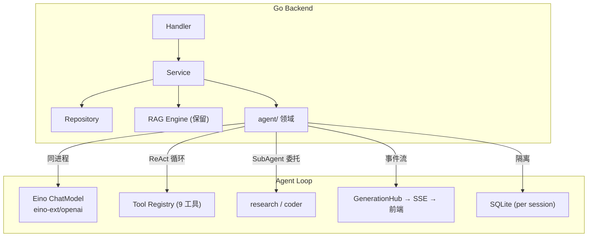

### 6.2 已交付能力

| 项 | 说明 |
|----|------|
| `server/internal/agent/` | Agent 领域包：provider 构造 + tool 注册 + handler |
| Eino ChatModel | eino-ext/openai 接入 llama.cpp / OpenAI 兼容 |
| Eino ReactAgent | ReAct 循环 + typed tools + parallel execution |
| 订阅渠道网关 | Gateway 统一 SSE 事件分发 |
| 9 OS 工具 | bash / async_bash / read / write / edit / list / glob / grep / mkdir |
| SubAgent | research（只读探查）+ coder（读写操作），`adk.NewAgentTool` 注册 |
| 异步任务 | async_bash 流式输出；任务管理 |
| SQLite 隔离 | 每个 agent session 独立 SQLite 文件 |
| threads API | 对话线程管理 |
| parts 数组模型 | 前端渲染并行工具调用 + SubAgent + TaskCard |
| Provider 热切换 | `LLMConfigManager.OnChange` → 替换 Eino ChatModel |

### 6.3 工具集成

| 工具 | 来源 | 调用方式 | 版本 |
|------|------|----------|------|
| `search_knowledge_base` | Go RAG Engine | 同进程 `rag.Pipeline.Search()` | V1.3 |
| `ticket_lookup` | Go Ticket Service | 同进程 `ticket.Service.Query()` | V1.3 |
| `sql_query` | Go SQL 执行 | 同进程 `db.Raw()`（只读） | V1.3 |
| `web_search` | SearXNG | 直接 HTTP | V1.4 |
| `web_fetch` | Firecrawl 自托管 | 直接 HTTP | V1.4 |
| `exa_search`（可选） | Exa API | 直接 HTTP | V1.4 |
| `generate_article` | Go Agent | 搜索结果 → Markdown | V1.4 |

### 6.4 SSE 事件

SSE 事件：`step` / `chunks` / `token` / `done` / `error` / `reasoning` / `tool_call` / `tool_result`。前端 `parts` 数组模型渲染并行工具调用与 SubAgent。

---

## 7. V1.4 — 深度搜索

**目标**：Agent 配备深度搜索工具链，搜索→爬取→整理→产出 md 文章。

**调研依据**：[`docs/research/knowledge-organization/`](research/knowledge-organization/)

### 7.1 搜索 API 分层

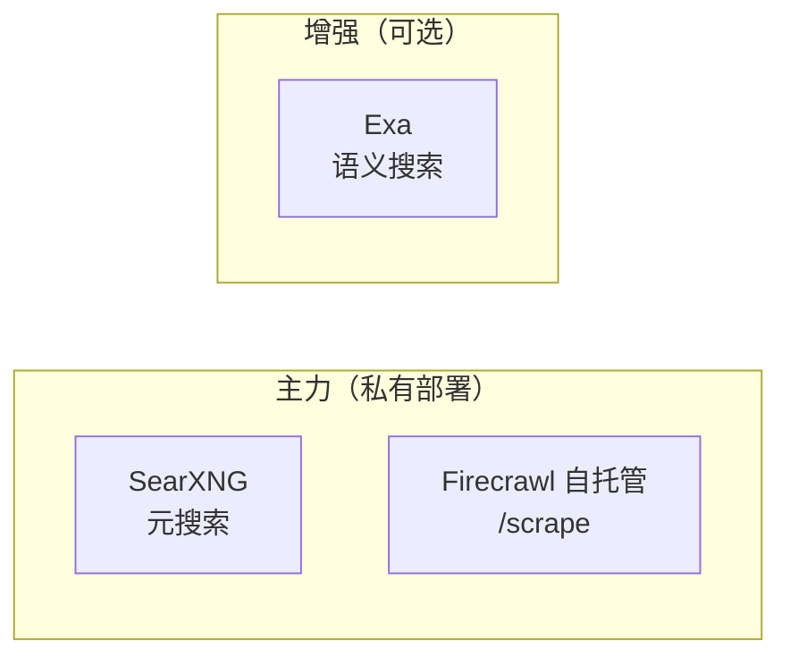

| API | 自托管 | 定价 | 用途 |
|-----|:---:|------|------|
| SearXNG | ✅ | 免费 | 元搜索，聚合 130+ 引擎 |
| Firecrawl 自托管 | ✅ | 免费（Apache-2.0） | URL → Markdown，JS 渲染 |
| Exa | ❌ | $7-15/千次 | 语义搜索，highlights 10x token 效率 |

**分层**：默认私有部署（零成本，数据不出域）；用户配 Exa Key 后启用语义搜索增强。

### 7.2 SearXNG 自托管

| 项 | 说明 |
|----|------|
| Docker | `searxng` + `valkey` 服务 |
| 配置 | `formats: [html, json]`；`limiter: false`；`public_instance: false` |
| Go 集成 | 直接 HTTP GET `http://searxng:8080/search?q=...&format=json` |
| Ops 域 | `it`/`science` 类别优先 StackOverflow/GitHub/厂商域名 |

### 7.3 Firecrawl 自托管

| 项 | 说明 |
|----|------|
| Docker | Firecrawl `v2.11.162` + PostgreSQL + Redis + RabbitMQ + Playwright |
| 能力 | 核心 scrape / crawl / map；Fetch + Playwright |
| 不支持 | 截图 / 页面操作 / Agent / Interact（需 Cloud） |
| Go 集成 | 直接 HTTP POST `http://firecrawl:3002/v2/scrape` |
| 配置 | `USE_DB_AUTHENTICATION=false`（受信任网络，不暴露公网） |

### 7.4 deep_research SubAgent

新建 `deep_research` SubAgent，与 `research` / `coder` 并列。

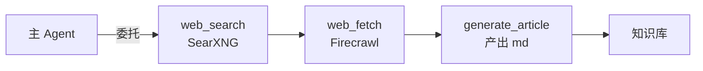

| 工具 | 部署 | 说明 |
|------|:----:|------|
| `web_search` | 自托管 | 聚合 130+ 引擎；`it`/`science` 类别 |
| `web_fetch` | 自托管 | URL → 干净 Markdown；JS 渲染 |
| `exa_search`（可选） | SaaS | highlights 10x token 效率；`type=deep` 多步推理 |
| `generate_article` | 内部 | 搜索结果 → Markdown；frontmatter 含 sources |

**集成**：
- 注册到 `AgentFactory.buildSubAgentTools()`
- 搜索工具注册到 `ToolFactory.BuildSearchTools()`
- 主 Agent 通过 SubAgent 委托（GPT-Researcher 模式）
- SSE 复用 `tool_call` / `tool_result`，`Label` 区分工具类型

### 7.5 深度搜索方法论

deep_research SubAgent 的系统提示词和架构遵循以下原则（参考 [`engineering-skills/research`](https://github.com/int2t05/engineering-skills/tree/main/skills/02-research/research) skill + `reference/` 下开源项目实践）：

**搜索原则**

| 原则 | 说明 | 来源 |
|------|------|------|
| 分层搜索 | 搜索→爬取→验证→综合，每步有明确输入输出；不跳过验证直接综合 | engineering-skills/research |
| 源优先级 | GitHub 源 > 官方文档 > 社区信号 > SEO 列表；负向断言必须在 GitHub 上验证 | engineering-skills/research |
| 全页提取 | 搜索 snippet 不可作为最终证据；必须 fetch 源页后才能总结 | engineering-skills/research |
| 对抗性验证 | 每个关键断言回溯到一手源；记录标题/URL/日期/可靠性；冲突和过期数据显式标注 | engineering-skills/research |
| 引用注册表 | 全局 source ID 注册表，防合成幻觉；正文行内引用 `[1]`，frontmatter 维护映射 | gpt-researcher |
| 上下文压缩 | 子 Agent 返回前压缩发现（1-2K token），原始数据不传递；大结果卸载到文件 | deep-research learnings+directions |
| 收敛控制 | 固定结构（N 子问题 × K 来源），硬性上限防无限循环；不做动态收敛判断 | deep-research depth/breadth |
| 工具降级 | 工具配额耗尽时分层降级（GitHub→索引文档→scrape→discovery）；记录访问限制 | engineering-skills/research |

**架构原则**

| 原则 | 说明 | 来源 |
|------|------|------|
| 三层分离 | planner（规划）→ execution（搜集）→ publisher（聚合）三层职责分离，每层可独立配置 | gpt-researcher |
| 多 LLM 角色分工 | 摘要用快模型、综合用强模型；规划用强模型、执行用快模型；降低成本 | open_deep_research |
| 先大纲再填充 | generate_article 先列大纲再逐节生成带引用全文，而非一次性生成 | storm two-stage writing |
| 对抗性反思 | 反思环节识别信息缺口（"thought-provoking questions"），而非友好评价总是投"足够" | storm Co-STORM Moderator |
| 累积式知识 | 知识库写入不覆盖旧知识，ADD-only 累积增长；实体链接增强跨文档关联 | mem0 single-pass ADD-only |

### 7.6 知识库输出

深度搜索产出 md 文件存入知识库，frontmatter 含 `source_type: deep_research` + `sources`（URL 列表），引用标注用行内编号 `[1]`。产出默认 `status: draft`，人工审核后 `published` 触发 RAG 索引。新增 `SourceType = 3`（深度搜索生成）。

> 知识库组织形式、目录结构、frontmatter schema、INDEX.md 自动重建、Agent 写入工具链详见 [§8 V1.5](#8-v15--知识库组织)。

### 7.7 Ops 域场景

| 场景 | 查询示例 | 来源 |
|------|---------|------|
| 错误代码查找 | "ORA-00942 error" | Stack Overflow、厂商文档 |
| CVE 查询 | "CVE-2025-XXXX" | NVD、厂商安全公告 |
| 软件版本兼容 | "PostgreSQL 17 pgvector" | 厂商文档、GitHub releases |
| 内部 KB 未命中 | 内部无文档的问题 | 回退网络搜索 |

### 7.8 Agent 记忆系统

Agent 配备两层记忆系统，支持动态压缩，与系统相关与用户无关。

**调研依据**：[`docs/research/agent-memory/`](research/agent-memory/)

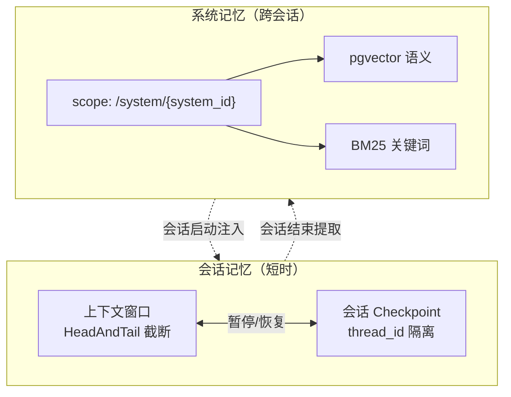

**两层记忆**：

| 层 | 持有 | 生命周期 | 隔离 | 持久化 |
|----|------|---------|------|--------|
| 会话记忆 | 上下文窗口 + 执行状态 | 单会话 | `thread_id` | SQLite（V1.3 已有） |
| 系统记忆 | 系统拓扑、故障历史、操作记录 | 跨会话 | `system_id`（非 `user_id`） | PostgreSQL + pgvector |

**动态压缩（三级管线，廉价到昂贵）**：

| 级别 | 触发 | 操作 | 有损 | 参考 |
|------|------|------|:---:|------|
| 1. HeadAndTail | 每轮 | 保留系统 prompt + 最近对话，中间省略 | 否 | autogen |
| 2. 去重清理 | token > 70% | 丢弃重复 tool result，保留 tool_use 记录 | 否 | Claude Code Snip |
| 3. Autocompact | token > 85% | fork sub-agent 生成结构化摘要 | 是 | Claude Code Autocompact |

**关键设计**：
- 级别 1-2 无损——运维信息（错误日志、配置片段）不能被摘要丢失
- 压缩而非摘要（参考 open_deep_research "DO NOT summarize"）
- `system_id` scope，非 `user_id`——记忆与系统相关、与用户无关
- 复合评分检索：`0.5*语义 + 0.3*时间衰减 + 0.2*重要度`（参考 crewAI）
- 会话启动批量注入 top-K，会话结束批量提取（非每轮 side-query）
- 暂停/恢复：Thread 可序列化，pause = 持久化，resume = 加载（参考 12-factor-agents Factor 6）

---

## 8. V1.5 — 知识库组织

**目标**：知识库底层重构为文件式 Markdown，确定组织形式，Agent 配备修改工具链。

**调研依据**：[`docs/research/knowledge-organization/`](research/knowledge-organization/)，尤其 [04-recommendation.md](research/knowledge-organization/04-recommendation.md)

### 8.1 组织形式

混合式：目录树（按运维文档类型）+ frontmatter 标签（多维度筛选）。

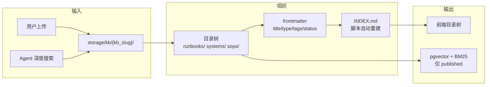

### 8.2 目录结构

```
storage/kb/{kb_slug}/
├── INDEX.md              # 目录索引（脚本自动重建，禁止手编）
├── log.jsonl             # 审计日志（append-only）
├── SCHEMA.md             # frontmatter 规范
├── runbooks/             # 运维手册
├── systems/              # 系统文档
├── sops/                 # 标准操作流程
├── postmortems/          # 故障复盘
├── cves/                 # CVE 跟踪
├── draft/                # 草稿（不进 RAG）
└── inbox/                # 质量门未通过（不进 RAG）
```

### 8.3 frontmatter schema

| 字段 | 必填 | 说明 |
|------|:---:|------|
| `title` | ✅ | 文档标题 |
| `type` | ✅ | runbook/architecture/sop/postmortem/cve/draft/quarantined |
| `status` | ✅ | draft/reviewing/published/disabled |
| `created` / `updated` | ✅ | ISO 8601 时间戳 |
| `tags` | — | 多维度标签数组 |
| `system` | — | 关联系统 |
| `severity` | — | SEV-1 到 SEV-4 |
| `sources` | — | URL 列表（Agent 生成时必填） |
| `source_type` | — | manual/upload/agent |
| `credibility_score` | — | 1-10 可信度评分 |

### 8.4 INDEX.md 自动重建

- 脚本从 frontmatter 重建目录索引，写入 `INDEX.md`
- 写入/更新/删除后立即触发；禁止手编
- 扫描所有 `.md`（排除 `draft/` `inbox/`），按 `type` 分组，按 `title` 排序

### 8.5 Agent 写入工具链

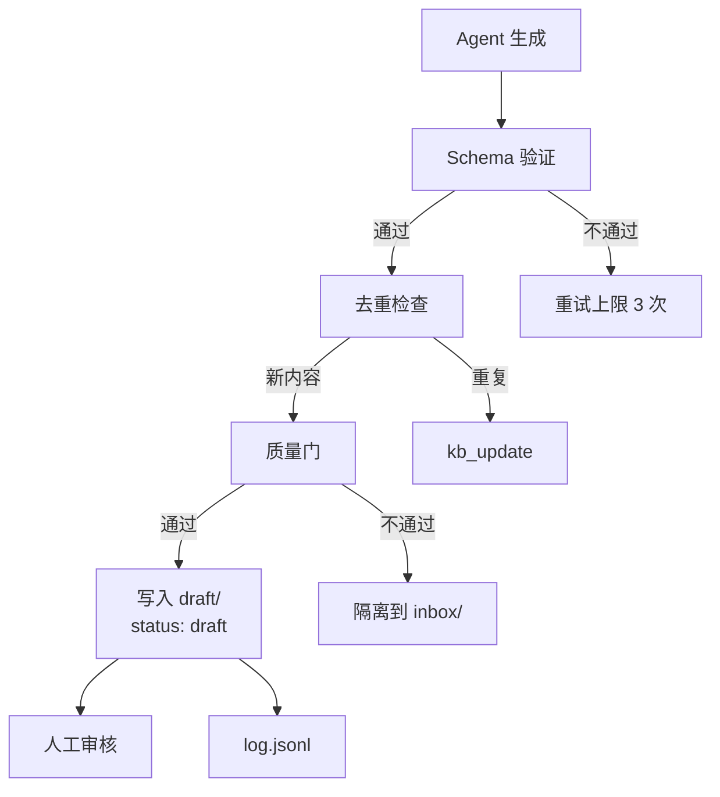

| 工具 | 说明 |
|------|------|
| `kb_create` | 新建文章（schema 验证 → 去重 → 质量门 → 写入 draft） |
| `kb_update` | 更新文章 |
| `kb_move` | 移动/重命名 |
| `kb_delete` | 删除文章 |
| `kb_search` | 搜索已有文章（防止重复写入） |

**多层防线**：Schema 验证（自动）→ 去重（自动）→ 质量门（自动）→ 草稿隔离（自动）→ 人工审核（手动）。

### 8.6 RAG 衔接

| 文件状态 | 存储位置 | 进 RAG | 进 INDEX.md | 前端可见 |
|---------|---------|:------:|:-----------:|:-------:|
| `published` | `{type}/` | 是 | 是 | 是 |
| `draft` | `draft/` | 否 | 否 | 草稿区 |
| `quarantined` | `inbox/` | 否 | 否 | 待处理区 |
| `disabled` | `{type}/` | 否 | 否 | 否 |

文件状态从 `draft` → `published` 时触发 RAG 索引；frontmatter `tags`/`system`/`severity` 作为 RAG 检索的元数据过滤条件。

---

## 9. V2.0 — Agentic RAG（终点）

**目标**：Agent ReAct 循环替代固定 7 步管道，实现自主检索决策、网络搜索、多步推理。

### 9.1 核心变化

固定 7 步线性管道 → Agent ReAct 循环自主决策。

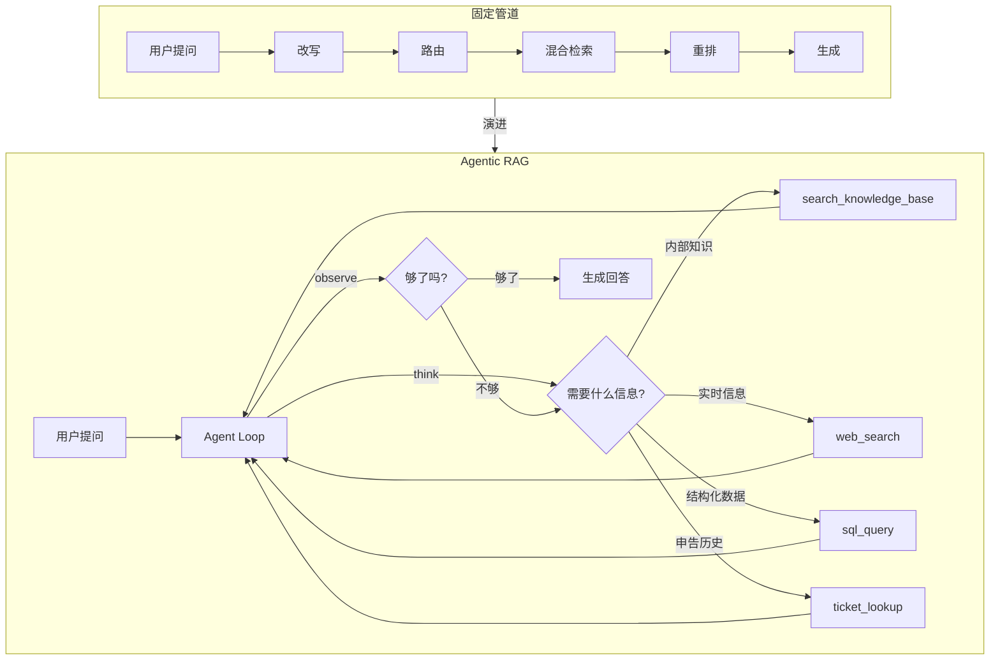

### 9.2 目标架构

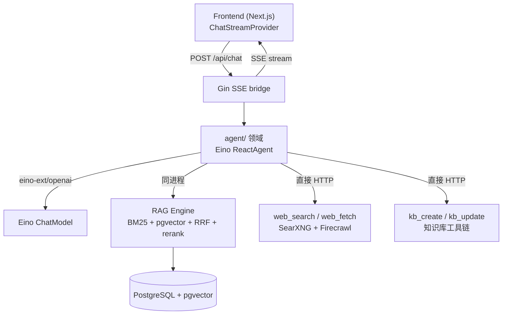

### 9.3 深度搜索与知识库

V1.4 已部署 SearXNG + Firecrawl 自托管 + deep_research SubAgent。V1.5 已确定知识库组织形式 + Agent 写入工具链。V2.0 启用 Agent 自主调用完整工具链。

### 9.4 Agent 场景

| 场景 | Agent 模式 | 工具 |
|------|-----------|------|
| 智能问答 | ReAct + Corrective RAG | RAG 检索、网络搜索、申告历史 |
| 根因分析 | Plan-then-Execute | 日志查询、拓扑探索、指标查询、知识检索 |
| 自助修复 | ReAct + Tool Use | API 调用、脚本执行（需人工审批门） |

### 9.5 废弃与保留

| 废弃（固定管道） | 替代（Agentic） |
|-----------|------------|
| `ai.rag_query_rewrite` 开关 | Agent 自主决策 |
| `ai.rag_multi_route` 开关 | Agent 循环多次调用 |
| `ai.rag_hybrid` 开关 | 工具参数 `strategy=hybrid` |
| `ai.rag_rerank` 开关 | 工具参数 `rerank=true` |
| 固定 `Pipeline.Execute()` | `agent.Agent.Run()` ReAct 循环 |

| 保留 | 原因 |
|------|------|
| RAG 引擎 | Go 引擎作为工具后端 |
| pgvector + PostgreSQL | 向量存储 + 业务数据 |
| Document Processor | 文档处理管道 |
| SSE 流式 + GenerationHub | 事件类型已扩展 |
| Auth/RBAC/Ticket/Knowledge | 领域逻辑不变 |

### 9.6 验收标准

| 验收项 | 标准 |
|--------|------|
| Agent 对话端到端 | 用户提问 → Agent 自主检索（≥1 轮）→ 带引用回答 |
| 网络搜索 | 内部 KB 无结果时 Agent 自主触发搜索 |
| 深度搜索 | 复杂问题 Agent 多轮搜索（≥2 轮）并综合 |
| 知识库自进化 | 已解决申告生成知识条目 → 嵌入 pgvector |
| Agent 事件 UI | thinking / tool_call / tool_result 实时渲染 |
| 降级 | Agent Loop 异常时回退固定管道 |
| 审计 | Agent 轨迹写入审计日志 |

---

## 10. 里程碑

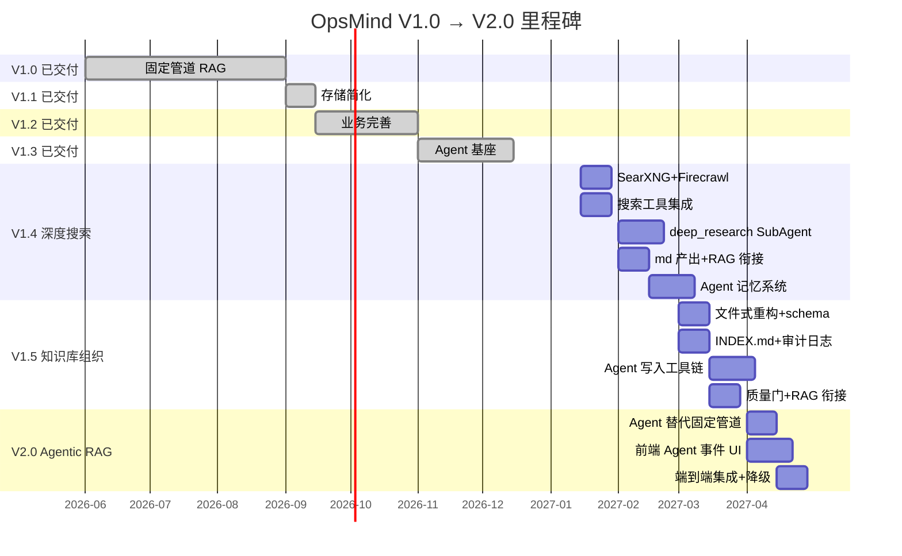

---

## 11. 技术决策记录

| 决策 | 选择 | 依据 |
|------|------|------|
| 文档存储 | 本地 FS（MinIO 可选） | 单实例下本地 FS 足够 |
| 向量数据库 | pgvector | halfvec+HNSW 不可替代 |
| 业务数据库 | PostgreSQL | JSONB GIN 索引；pgvector 依赖；跨表事务 |
| Agent 数据 | SQLite（per session） | ReAct 高频读写隔离 |
| Agent 基座 | Eino (ByteDance) | 唯一覆盖 LLM Provider + Agent Loop + Stream Handling 的 Go 框架 |
| LLM Provider | eino-ext/openai | OpenAI 兼容 → llama.cpp；含 tool calling + streaming |
| SSE 输出 | Gin `fmt.Fprintf + Flush` | 标准 SSE 模式 |
| 工具生态 | 官方 Go MCP SDK | `modelcontextprotocol/go-sdk` v1.6.0 |
| 网络搜索 | SearXNG（自托管） | 私有部署无 API 密钥；聚合 130+ 引擎 |
| 网页提取 | Firecrawl 自托管 `/scrape` | 开源 Apache-2.0；JS 渲染；数据不出域 |
| 语义搜索增强 | Exa API（可选） | highlights 10x token 效率；SaaS 闭源，可选增强 |
| 搜索工具集成 | 直接 HTTP，非 MCP 中间层 | 简单 JSON API 用 `net/http` 足够 |
| deep_research SubAgent | 与 research/coder 并列 | 独立工具集和系统提示词；GPT-Researcher 委托模式 |
| Agent 记忆 | 两层：会话记忆 + 系统记忆 | 会话记忆用 SQLite checkpoint；系统记忆用 pgvector；与系统相关与用户无关 |
| 记忆压缩 | 三级管线：HeadAndTail → 去重清理 → Autocompact | 无损优先，有损最后；运维信息不能被摘要丢失 |
| 记忆 scope | `system_id`，非 `user_id` | 记忆与系统相关、与用户无关；参考 crewAI scope path |
| 知识库底层 | 纯 `.md` 文件 + YAML frontmatter | 与 Obsidian/Git 工具链兼容 |
| 知识库组织 | 混合式：目录树 + frontmatter 标签 | 运维场景需目录导航 + 标签多维筛选 |
| 知识库索引 | `INDEX.md` 声明式，脚本自动重建 | Agent 不手编索引 |
| Agent 写入 | 专用工具接口（`kb_create` 等） | 工具内嵌质量门 + 去重 + 索引重建 |
| Agent 模式 | ReAct + Corrective RAG | 运维问答需要多步推理 + 检索质量保证 |
| LLM Provider 热切换 | `LLMConfigManager.OnChange` | `atomic.Value` 存储 ChatModel |
| 前端 SSE | 保留现有 `ChatStreamProvider` | rAF 批处理 + 纯函数 reducer + 单测 |
| 版本终点 | V2.0 | 不规划 V2.x |

---

## 12. 关联文档

| 文档 | 用途 |
|------|------|
| [`PRD.md`](PRD.md) | 产品需求 — 功能定义、业务规则 |
| [`TECH.md`](TECH.md) | 技术架构 — 分层设计、DDL、ADR |
| [`API/README.md`](API/README.md) | API 文档索引 |
| [`FLOW/README.md`](FLOW/README.md) | 业务流程图 |
| [`TODO.md`](TODO.md) | 代码级改进清单与优先级 |
| [`research/knowledge-organization/`](research/knowledge-organization/) | V1.4/V1.5 调研 — 知识库组织形式、Markdown 存储、Agent 写入实践、Firecrawl vs Exa |
| [`research/agent-memory/`](research/agent-memory/) | V1.4 调研 — Agent 记忆系统：三层模型、Claude Code 五层实践、10 个参考项目对比、OpsMind 两层方案 |
