# OpsMind 产品技术路线图

> 从 V1.0 到 V2.0 的版本规划。代码级改进清单见 [`TODO.md`](TODO.md)，技术架构详见 [`TECH.md`](TECH.md)。

## 1. 项目愿景

OpsMind 是面向企业 IT 运维的**私有部署 AI 数字员工系统**。核心目标：让运维团队从重复性咨询中解放，让知识沉淀为可复用资产，让 AI 成为运维流程的第一响应者。

**设计原则**：私有部署优先（数据不出域）、自建 RAG 引擎（全链路可控可审计）、单体分层架构（简洁可维护）。

---

## 2. 版本总览

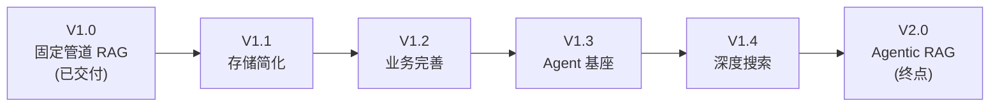

| 版本 | 主题 | 核心交付 | 状态 |
|------|------|---------|------|
| V1.0 | 固定管道 RAG | 7 步 RAG 管道 + 申告状态机 + 知识库 CRUD + RBAC + SSE 流式 | ✅ 已交付 |
| V1.1 | 存储简化 | MinIO→本地 FS；配置体系统一 | 📋 规划中 |
| V1.2 | 业务完善 | 知识库与申告增强；Markdown 富文本；看板增强；前端体验优化 | ✅ 已交付 |
| V1.3 | Agent 基座 | Eino ReactAgent + 订阅渠道网关(Gateway)；9 OS 工具(bash/async_bash/read/write/edit/list/glob/grep/mkdir)；SubAgent(research+coder)；异步任务；SQLite 隔离；threads API；parts 数组模型前端渲染 | ✅ 已交付 |
| V1.4 | 深度搜索 | SearXNG 自托管 + Firecrawl 自托管；Exa 语义搜索（可选）；deep_research SubAgent；搜索→爬取→整理→产出 md 文章→写入知识库 | 📋 规划中 |
| V2.0 | Agentic RAG | Agent ReAct 循环替代固定管道；Agent 事件 UI；多步推理；事件知识自进化 | 📋 规划中 |

---

## 3. V1.0 — 固定管道 RAG（已交付）

### 3.1 已交付能力

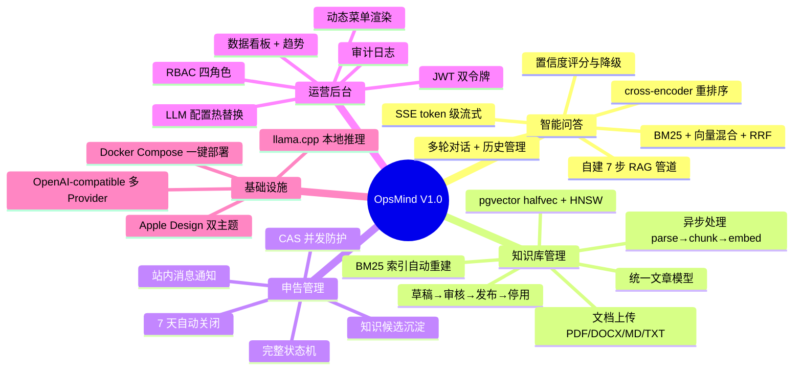

### 3.2 技术栈

| 层 | 技术 |
|----|------|
| 后端 | Go + Gin + GORM |
| 数据库 | PostgreSQL + pgvector (halfvec + HNSW) |
| 对象存储 | MinIO (S3-compatible) |
| RAG | 自建 Go 引擎 — BM25 (gse) / 向量 (pgvector) / RRF / cross-encoder |
| LLM | llama.cpp server 或 OpenAI-compatible API |
| 前端 | Next.js + React + TypeScript + Radix UI + SWR + Tailwind CSS |
| 部署 | Docker Compose |

---

## 4. V1.1 — 存储简化

**目标**：移除 MinIO 依赖，降低部署复杂度和资源占用。

### 4.1 MinIO → 本地文件系统

MinIO 在单实例部署中增加 200-500MB RAM + HTTP 延迟层。同类系统（Dify / Open WebUI / AnythingLLM）均默认本地 FS。

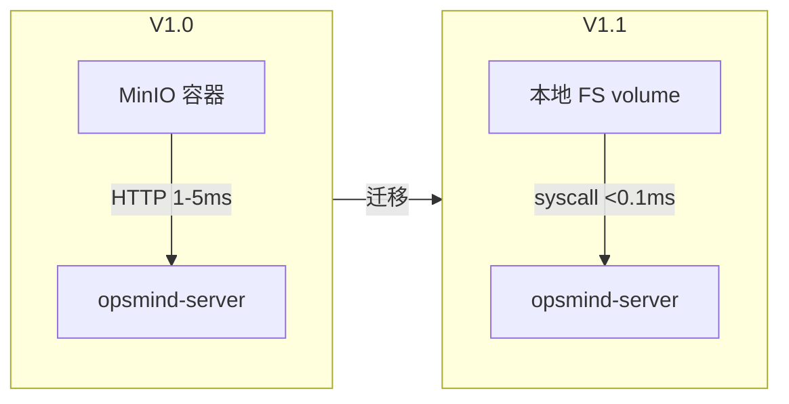

### 4.2 交付项

| 项 | 说明 | 验收标准 |
|----|------|---------|
| `LocalFSClient` | 本地 FS 适配器，原子写（temp+rename），UUID 文件名 | `StorageClient` 接口不变；MinIO 数据迁移脚本可用 |
| 后端代理下载 | `GET /api/storage/:bucket/:key` 替代 Presigned URL | 认证后 `http.ServeFile`；权限校验通过 |
| Docker 简化 | 移除 minio 服务，加 `storage_data` volume | `docker compose up` 仅 3 必须服务 |
| 配置统一 | `storage.type` (local/minio) + `storage.root_path` | 切换配置即可换后端，无需改代码 |
| MinIO 惰性下载修复 | 本地 FS 直接 `os.Open`，无惰性问题 | `defer Close` 检查错误 |

### 4.3 保留决策

| 组件 | 决策 | 依据 |
|------|------|------|
| pgvector | 保留 | halfvec(FP16) + HNSW 不可替代；增长最快 PG 扩展 |
| PostgreSQL | 保留 | 12+ JSONB 列依赖 GIN 索引；跨表事务一致性 |
| `MinIOClient` | 保留代码 | 作为 escape hatch，多实例时恢复使用 |

---

## 5. V1.2 — 业务完善

**目标**：完善知识库、申告、看板等业务功能与前端体验，为 Agent 基座夯实业务基础。

### 5.1 知识库上传增强

| 项 | 说明 | 验收标准 |
|----|------|---------|
| 上传上限配置化 | 50MB 硬编码改为按 KB 粒度配置 | `kb.max_upload_size` 可配置 |
| 批量上传 | 支持多文件拖拽批量上传 | 前端 react-dropzone 拖拽；后端并发处理 |
| 上传进度 | 前端显示上传进度条 | XMLHttpRequest upload progress 实时反馈 |
| 文件类型校验 | 前端+后端双重校验文件类型 | 非 PDF/DOCX/XLSX/PPTX/MD/TXT 拒绝 |

### 5.2 申告管理增强

| 项 | 说明 | 验收标准 |
|----|------|---------|
| 申告标签 | 申告支持标签分类（复用 Tags 字段） | TagsInput 组件；回车/逗号/粘贴自动分割 |
| 批量操作 | 申告批量删除/关闭 | 多选 + 批量操作确认 |
| 处理时限 | 申告可设处理时限，超时预警 | 配置时限；超时站内消息通知 |

### 5.3 看板增强

| 项 | 说明 | 验收标准 |
|----|------|---------|
| 自定义日期范围 | 看板支持自定义起止日期 | 日期选择器；趋势图按范围刷新 |
| 数据导出 | 看板数据 CSV 导出 | PapaParse 生成 CSV + BOM 头防 Excel 乱码 |
| `granularity` 生效 | 趋势查询 `granularity` 参数实际生效 | day/week 切换正常 |

### 5.4 前端体验优化

| 项 | 说明 | 验收标准 |
|----|------|---------|
| 代码分割 | `next/dynamic` 按路由懒加载重组件 | TrendChart / ChatPipeline / Markdown 组件按需加载 |
| 虚拟列表高度 | 变长消息 `estimateSize` 动态测量 | 按内容长度估算；滚动位置准确 |
| 表单 required 标记 | 前端表单必填字段标记 `*` | Field 组件 required prop 全覆盖 |
| 搜索空状态 | 列表搜索无结果显示 EmptyState | 4 个列表页空状态统一 |
| 组件一致性 | 全项目统一使用设计系统组件 | raw `<label>`/`<a>`/`<h1>` 替换为 Field/Link/PageTitle |

### 5.5 Markdown 富文本编辑

| 项 | 说明 | 验收标准 |
|----|------|---------|
| MarkdownViewer | react-markdown + remark-gfm + remark-math + rehype-katex | 标题/列表/表格/代码块/公式正确渲染 |
| 代码高亮 | Shiki 异步高亮，主题感知 | 12+ 语言高亮；dark/light 自动切换 |
| Mermaid 图表 | ```mermaid 代码块渲染为 SVG | flowchart/sequence/class 等正确渲染；主题感知 |
| MarkdownEditor | @uiw/react-md-editor 分屏编辑 | 工具栏操作 + 实时预览 |
| 图片粘贴上传 | 粘贴/拖拽图片自动上传 + 插入 Markdown | 调用存储上传 API |
| 模式切换确认 | 未保存内容弹确认框 | diff 检测 + ConfirmDialog |

---

## 6. V1.3 — Agent 基座

**目标**：铺设原生 Go Agent Loop 基础设施，实现 ReAct 循环 + Tool Calling，不改变用户可见行为。

**选型决策**：全部使用外部库，不自建。Eino（LLM Provider + Agent Loop + Stream Handling）+ modelcontextprotocol/go-sdk（MCP 工具）。详见 [`docs/design/agent-loop.md`](design/agent-loop.md)。

### 6.1 原生 Go Agent Loop

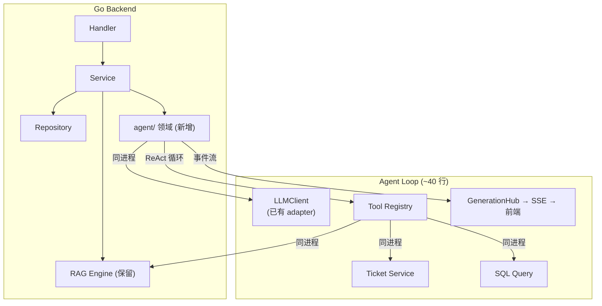

| 项 | 说明 | 验收标准 |
|----|------|---------|
| `server/internal/agent/` | Agent 领域包：provider 构造 + tool 注册 + handler | Eino ReactAgent `Stream()` 跑通 |
| Eino ChatModel | eino-ext/openai 接入 llama.cpp | OpenAI 兼容流式 + tool calling 可用 |
| Eino ReactAgent | ReAct 循环 + typed tools + parallel execution | 基本对话通过 Agent 走通；可中断 |
| Gin SSE bridge | `fmt.Fprintf + Flush` 输出 SSE 事件 | 前端 `ChatStreamProvider` 消费成功 |
| 前端 | 保留现有 `ChatStreamProvider` | 现有 SSE 事件类型无需修改 |
| Provider 热切换 | `LLMConfigManager.OnChange` → 替换 Eino ChatModel | 配置热替换生效，无需重启 |

### 6.2 MCP 工具集成

通过官方 Go MCP SDK（`modelcontextprotocol/go-sdk` v1.6.0）消费第三方工具，无需手写集成。V1.3 先集成知识库 / 申告 / SQL 等同进程工具；深度搜索工具在 V1.4 接入。

| 工具 | 来源 | 调用方式 | 版本 |
|------|------|----------|------|
| `search_knowledge_base` | Go RAG Engine | 同进程 `rag.Pipeline.Search()` | V1.3 |
| `ticket_lookup` | Go Ticket Service | 同进程 `ticket.Service.Query()` | V1.3 |
| `sql_query` | Go SQL 执行 | 同进程 `db.Raw()`（只读） | V1.3 |
| `web_search` | SearXNG | 直接 HTTP（`net/http`） | V1.4 |
| `web_fetch` | Firecrawl 自托管 `/scrape` | 直接 HTTP | V1.4 |
| `exa_search`（可选） | Exa API | 直接 HTTP（需用户配 Key） | V1.4 |
| `generate_article` | Go Agent | 搜索结果 → 结构化 Markdown | V1.4 |

### 6.3 SSE 事件扩展

当前 SSE 事件：`step` / `chunks` / `token` / `done` / `error`。V1.3 扩展 Agent 事件类型。

| 新增事件类型 | 说明 |
|-------------|------|
| `thinking` | Agent 推理过程（V2.0 启用） |
| `tool_call` | Agent 工具调用详情（V2.0 启用） |
| `tool_result` | 工具返回结果（V2.0 启用） |
| `answer` | Agent 最终回答（V2.0 启用） |

V1.3 阶段 `GenerationHub` 的 `StreamEvent` 类型扩展，但前端不渲染（V2.0 启用）。

---

## 6.5. V1.4 — 深度搜索

**目标**：Agent 配备深度搜索工具链，实现"搜索网络资料 → 爬取知识 → 整理产出 md 文章 → 写入知识库"闭环。知识库输出为 md 文件，简洁直接。

**调研依据**：[`docs/research/knowledge-organization/`](research/knowledge-organization/)，尤其 [05-firecrawl-vs-exa.md](research/knowledge-organization/05-firecrawl-vs-exa.md)

### 6.5.1 搜索 API 集成

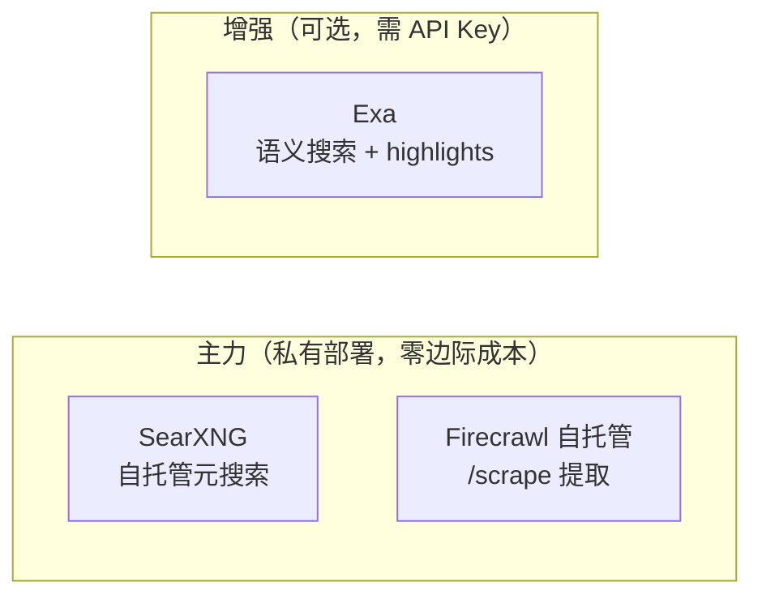

| API | 自托管 | LLM 优化 | 定价 | 用途 |
|-----|:---:|:---:|------|------|
| **SearXNG** | ✅ | ❌ | 免费（仅基础设施） | 主力搜索：私有部署元搜索，聚合 130+ 引擎 |
| **Firecrawl 自托管** | ✅ | ✅ | 免费（开源 Apache-2.0） | 主力提取：URL → 干净 Markdown，JS 渲染 |
| **Exa** | ❌ | ✅ | $7-15 / 千次 | 可选增强：语义搜索，highlights 10x token 效率，deep-reasoning 多步推理 |

**分层策略**：默认私有部署（SearXNG + Firecrawl 自托管，零边际成本，数据不出域）；用户配置 Exa API Key 后启用语义搜索增强。

### 6.5.2 SearXNG 自托管

| 项 | 说明 | 验收标准 |
|----|------|---------|
| Docker 部署 | `searxng` + `valkey` 服务加入 docker-compose | JSON 输出启用；`it`/`science` 类别 |
| settings.yml | `formats: [html, json]` 显式开启；`limiter: false`；`public_instance: false` | `?format=json` 返回 200；Agent 自动化流量不被限流 |
| Go 集成 | 直接 HTTP GET `http://searxng:8080/search?q=...&format=json` | 无需 MCP 中间层；`net/http` + `encoding/json` |
| Ops 域配置 | 预配置 `it`/`science` 类别优先 | StackOverflow/GitHub/厂商域名优先 |
| 私有搜索验证 | 查询不出域，无 API 密钥 | 日志确认无第三方数据发送 |

### 6.5.3 Firecrawl 自托管

| 项 | 说明 | 验收标准 |
|----|------|---------|
| Docker 部署 | Firecrawl `v2.11.162` + PostgreSQL + Redis + RabbitMQ + Playwright | `docker compose up` 启动；`/v2/scrape` 返回 Markdown |
| 自托管能力 | 核心 scrape / crawl / map / search；Fetch + Playwright | JS 渲染页面正确提取；干净 Markdown 输出 |
| 不支持项 | 截图 / 页面操作 / Agent / Interact | 需 Fire-engine 或 Cloud，自托管不含 |
| Go 集成 | 直接 HTTP POST `http://firecrawl:3002/v2/scrape` | `net/http` + JSON；无官方 Go SDK |
| 配置 | `USE_DB_AUTHENTICATION=false`（受信任网络） | 不暴露公网；仅 Docker 内部网络访问 |

### 6.5.4 Agent 工具链

新建 `deep_research` SubAgent，配备搜索工具集，与现有 `research` / `coder` SubAgent 并列。

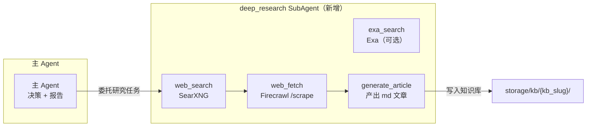

| 工具 | 来源 | 部署 | 验收标准 |
|------|------|:----:|---------|
| `web_search` | SearXNG | 自托管 | 聚合 130+ 引擎；`it`/`science` 类别；JSON 输出 |
| `web_fetch` | Firecrawl `/scrape` | 自托管 | URL → 干净 Markdown；JS 渲染；metadata 提取 |
| `exa_search`（可选） | Exa API | SaaS | highlights 10x token 效率；`type=deep` 多步推理 |
| `generate_article` | 内部 | — | 搜索结果 → 结构化 Markdown；frontmatter 含 sources 引用 |

**与 V1.3 Agent 基座集成**：
- `deep_research` SubAgent 注册到 `AgentFactory.buildSubAgentTools()`
- 搜索工具注册到 `ToolFactory.BuildSearchTools()`（与 `BuildTools()` / `BuildReadOnlyTools()` 平行）
- 主 Agent 不直接使用搜索工具 — 通过 SubAgent 委托（与 GPT-Researcher MCP 委托模式一致）
- SSE 事件复用 `tool_call` / `tool_result`，通过 `Label` 字段区分搜索/爬取/生成

### 6.5.5 知识库输出（md 文件）

深度搜索产出为 md 文件，存入知识库目录，简洁直接。

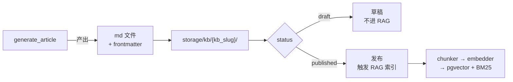

| 项 | 说明 | 验收标准 |
|----|------|---------|
| frontmatter 最小字段 | `title` / `source_type: deep_research` / `sources`（URL 列表）/ `created` | Agent 生成时必填 sources |
| 文件命名 | `{YYYYMMDD-HHmmss}-{slug}.md`，slug 取标题 kebab-case | 扁平存储，无目录层级 |
| 引用标注 | 正文中行内编号 `[1]` `[2]`，frontmatter `sources` 维护编号→URL 映射 | 不用脚注（避免 chunker 切割引用） |
| 状态管控 | 复用现有 `KnowledgeArticle` 状态机：Draft → Reviewing → Published | Agent 产出默认 `draft`；人工审核后 `published` |
| RAG 衔接 | Published 后触发现有 chunker → embedder → pgvector + BM25 | 新增 `SourceType = 3`（深度搜索生成） |
| 存储 | 写入 `StorageClient` + `KnowledgeArticle` 记录 | `MinioPath` 指向 md 文件 |

### 6.5.6 Ops 域搜索场景

| 场景 | 查询示例 | 来源 |
|------|---------|------|
| 错误代码查找 | "ORA-00942 error" | Stack Overflow、厂商文档 |
| CVE 查询 | "CVE-2025-XXXX affected versions" | NVD、厂商安全公告 |
| 软件版本兼容 | "PostgreSQL 17 pgvector compatibility" | 厂商文档、GitHub releases |
| 内部 KB 未命中 | 内部无文档的问题 | 回退到网络搜索 |

---

## 7. V2.0 — Agentic RAG（终点）

**目标**：Agent ReAct 循环替代固定 7 步管道，实现自主检索决策、网络搜索、多步推理。

### 7.1 核心变化

固定 7 步线性管道 → Agent ReAct 循环自主决策。

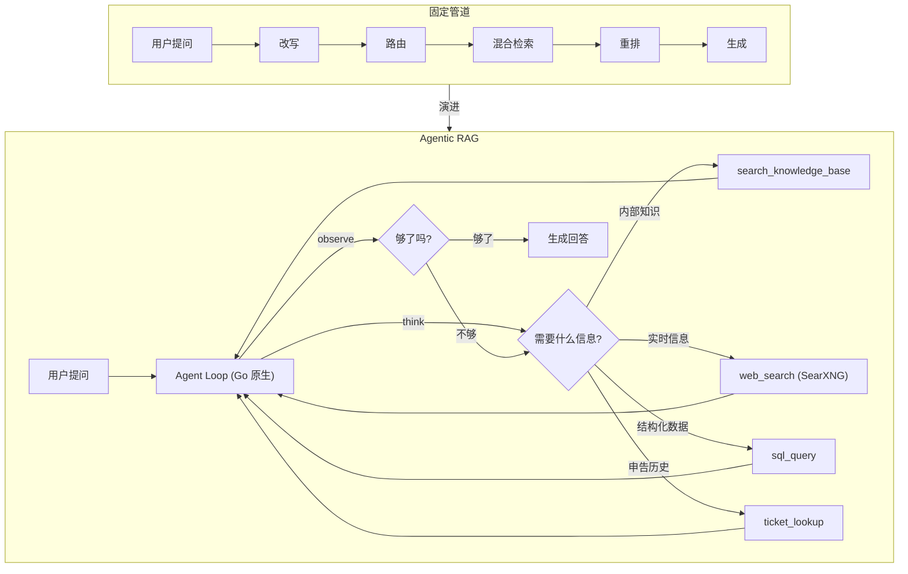

### 7.2 Agent 基座：Eino 全栈

| 维度 | Eino 全栈 |
|------|---------------------|
| Agent Loop | Eino ReactAgent；ReAct + Graph 编排 + DeepAgent + HITL interrupt/resume |
| LLM Provider | eino-ext/openai；OpenAI 兼容（llama.cpp / DeepSeek / OpenAI） |
| Stream Handling | Eino 框架内自动流拼接/合并/复制 |
| SSE 输出 | Gin `fmt.Fprintf + Flush` ~20 行（标准库） |
| 前端消费 | 保留现有 `ChatStreamProvider`（rAF 批处理 + 纯函数 reducer + 单测） |
| 工具生态 | modelcontextprotocol/go-sdk v1.6.0；MCP client 消费第三方工具 |
| 部署 | 单二进制；Eino 为 Go 库，无额外运行时 |
| 成熟度 | 12k star，字节生产级（千级 QPS），Apache-2.0 |

### 7.3 网络搜索与深度搜索

V1.4 已部署 SearXNG + Firecrawl 自托管 + deep_research SubAgent。V2.0 启用 Agent 自主调用深度搜索与知识库写入工具。

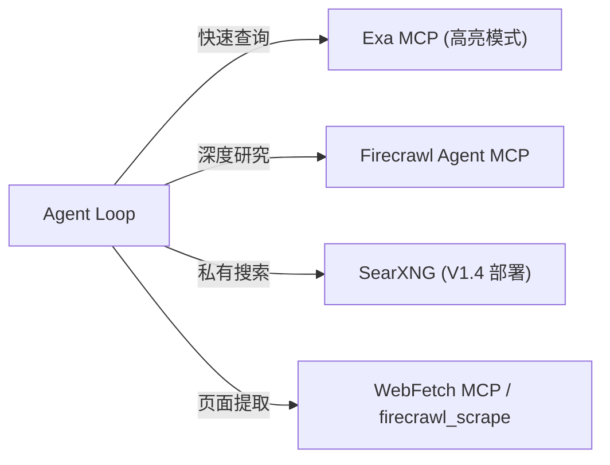

| 能力 | 工具 | 说明 |
|------|------|------|
| 快速网络搜索 | Exa MCP / Firecrawl MCP | 高亮模式 10x token 效率 |
| 深度研究 | `firecrawl_agent` MCP / GPT-Researcher MCP | 多轮迭代搜索→阅读→综合 |
| 自托管搜索 | SearXNG + MCP（V1.4 部署） | 聚合 130+ 引擎，无 API 密钥，私有部署 |
| Ops 域过滤 | SearXNG `it`/`science` 类别 | 优先 StackOverflow / GitHub / 厂商域名 |

### 7.4 Agent 场景

| 场景 | Agent 模式 | 工具 |
|------|-----------|------|
| 智能问答 | ReAct + Corrective RAG | RAG 检索、网络搜索、申告历史 |
| 根因分析 | Plan-then-Execute | 日志查询、拓扑探索、指标查询、知识检索 |
| 自助修复 | ReAct + Tool Use | API 调用、脚本执行（需人工审批门） |

### 7.5 目标架构

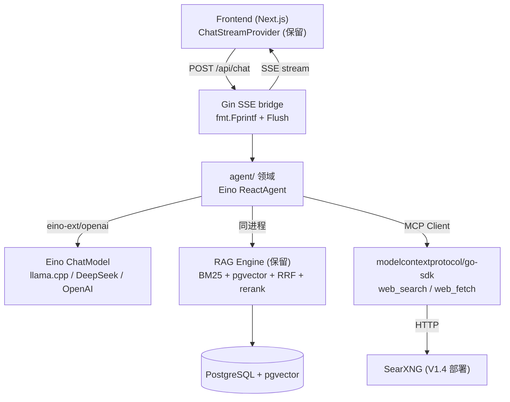

### 7.6 废弃与新增

| 废弃（固定管道） | 替代（Agentic） |
|-----------|------------|
| `ai.rag_query_rewrite` 开关 | Agent 自主决策（工具参数） |
| `ai.rag_multi_route` 开关 | Agent 循环多次调用 |
| `ai.rag_hybrid` 开关 | 工具参数 `strategy=hybrid` |
| `ai.rag_rerank` 开关 | 工具参数 `rerank=true` |
| 固定 `Pipeline.Execute()` | `agent.Agent.Run()` ReAct 循环 |
| `LLMConfigManager` 单默认 | Agent 重建 + 多 Provider |

| 保留 | 原因 |
|------|------|
| RAG 引擎（BM25 + vector + RRF + rerank） | Go 引擎作为工具后端 |
| pgvector + PostgreSQL | 向量存储 + 业务数据不变 |
| Document Processor | 文档处理管道不变 |
| SSE 流式 + GenerationHub | 扩展事件类型（V1.3 预留） |
| Auth/RBAC/Ticket/Knowledge | 领域逻辑不变 |

| 新增 | 说明 |
|------|------|
| `agent/` 领域 | Agent struct + Tool 接口 + ToolRegistry + Agent Loop |
| MCP Client | 官方 Go MCP SDK，消费第三方工具 |
| 前端 Agent 事件 UI | thinking / tool_call / tool_result / answer 渲染 |
| 人工审批门（HITL） | 敏感操作（自助修复）必须人工确认 |
| 事件知识自进化 | 已解决申告生成知识条目 → 嵌入 pgvector → RAG 检索历史经验 |

### 7.7 验收标准

| 验收项 | 标准 |
|--------|------|
| Agent 对话端到端 | 用户提问 → Agent 自主检索（≥1 轮）→ 带引用回答 |
| 网络搜索 | 内部 KB 无结果时 Agent 自主触发 SearXNG 搜索 |
| 深度搜索 | 复杂问题 Agent 多轮搜索（≥2 轮）并综合 |
| Agent 事件 UI | thinking / tool_call / tool_result 实时渲染；用户可见推理过程 |
| 降级 | Agent Loop 异常时回退固定管道；SearXNG 不可用时跳过网络搜索 |
| 审计 | Agent 轨迹（工具调用、检索查询、推理步骤）写入审计日志 |

---

## 8. 里程碑

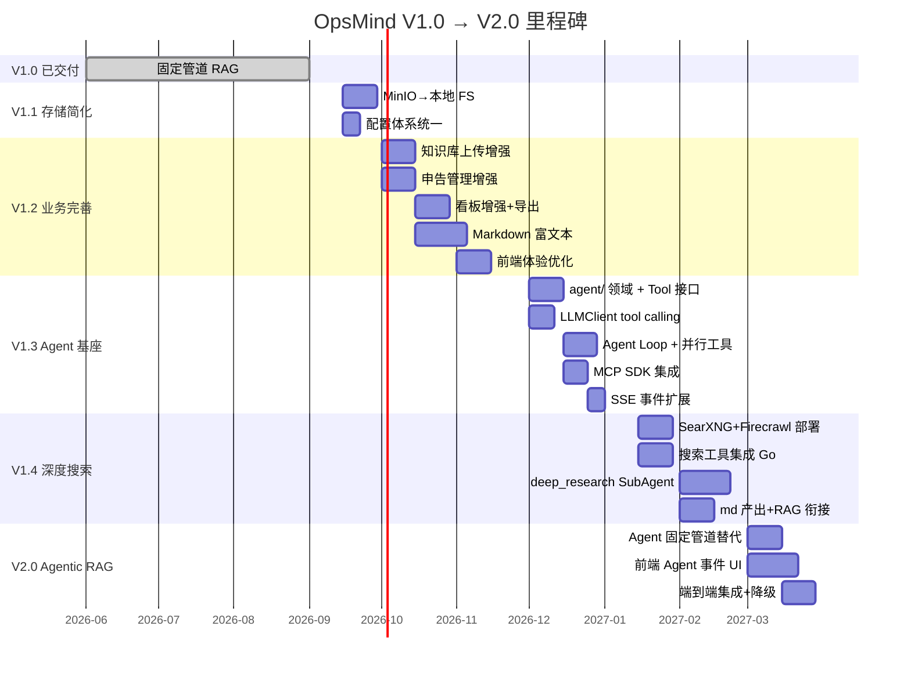

---

## 9. 技术决策记录

| 决策 | 选择 | 依据 |
|------|------|------|
| 文档存储 | 本地 FS（移除 MinIO） | 单实例下本地 FS 足够；Dify/Open WebUI/AnythingLLM 均默认本地 |
| 向量数据库 | 保留 pgvector | halfvec+HNSW 不可替代；增长最快 PG 扩展；sqlite-vec 无 ANN |
| 业务数据库 | 保留 PostgreSQL | JSONB GIN 索引；pgvector 依赖；跨表事务；GORM 迁移安全 |
| Agent 数据 | 未来 SQLite | ReAct 高频读写时拆分；当前非瓶颈 |
| Agent 基座 | Eino (ByteDance) | 12k star 字节生产级；唯一同时覆盖 LLM Provider + Agent Loop + Stream Handling 的 Go 框架；sashabaranov/go-openai 不含 agent loop |
| LLM Provider | eino-ext/openai | Eino 配套；OpenAI 兼容 → llama.cpp；含 tool calling + streaming |
| SSE 输出 | Gin 标准库 `fmt.Fprintf + Flush` | 标准 SSE 模式（headers + http.Flusher + data: %s\n\n） |
| 工具生态 | 官方 Go MCP SDK | `modelcontextprotocol/go-sdk` v1.6.0，与 Google 共维护 |
| 网络搜索 | SearXNG（自托管）+ Exa/Firecrawl | 私有部署无 API 密钥；深度研究用 Firecrawl Agent |
| 网页提取 | Firecrawl 自托管 `/scrape` | 开源 Apache-2.0；核心 scrape/crawl/map 自托管；JS 渲染；私有部署数据不出域 |
| 语义搜索增强 | Exa API（可选，需用户配 Key） | highlights 10x token 效率；deep-reasoning 多步推理；SaaS 闭源，作为可选增强 |
| 搜索工具集成 | 直接 HTTP（`net/http`），非 MCP 中间层 | SearXNG/Firecrawl/Exa 都是简单 HTTP JSON API；Go 原生 HTTP 足够 |
| deep_research SubAgent | 新建 SubAgent，与 research/coder 并列 | 搜索工具有独立工具集和系统提示词；参考 GPT-Researcher MCP 委托模式 |
| Agent 模式 | ReAct + Corrective RAG | 运维问答需要多步推理 + 检索质量保证 |
| LLM Provider 热切换 | `LLMConfigManager.OnChange` → Eino ChatModel 替换 | `atomic.Value` 存储 ChatModel 实例 |
| 前端 SSE | 保留现有 `ChatStreamProvider` | rAF 批处理 + 纯函数 reducer + 单测，已足够好 |
| 版本终点 | V2.0 | 不规划 V2.x，业务提升全部归入 V1.1-V1.4 |

---

## 10. 关联文档

| 文档 | 用途 |
|------|------|
| [`PRD.md`](PRD.md) | 产品需求 — 功能定义、业务规则 |
| [`TECH.md`](TECH.md) | 技术架构 — 分层设计、DDL、ADR |
| [`API/README.md`](API/README.md) | API 文档索引 |
| [`FLOW/README.md`](FLOW/README.md) | 业务流程图 |
| [`TODO.md`](TODO.md) | 代码级改进清单与优先级 |
| [`research/knowledge-organization/`](research/knowledge-organization/) | V1.4 深度搜索工具调研 — 知识库组织形式、Markdown 底层存储、Agent 写入实践、Firecrawl vs Exa 深度对比 |
