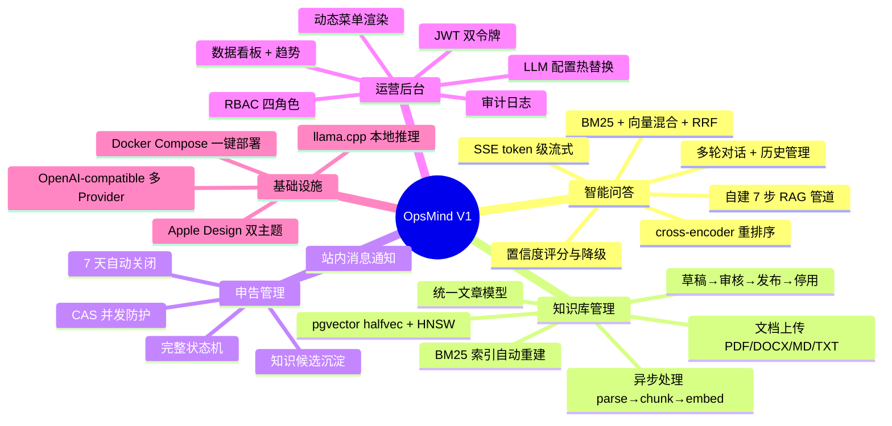
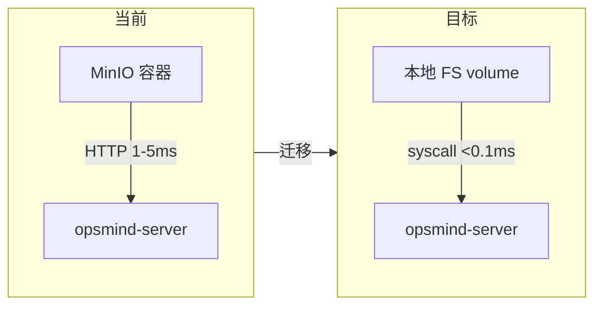
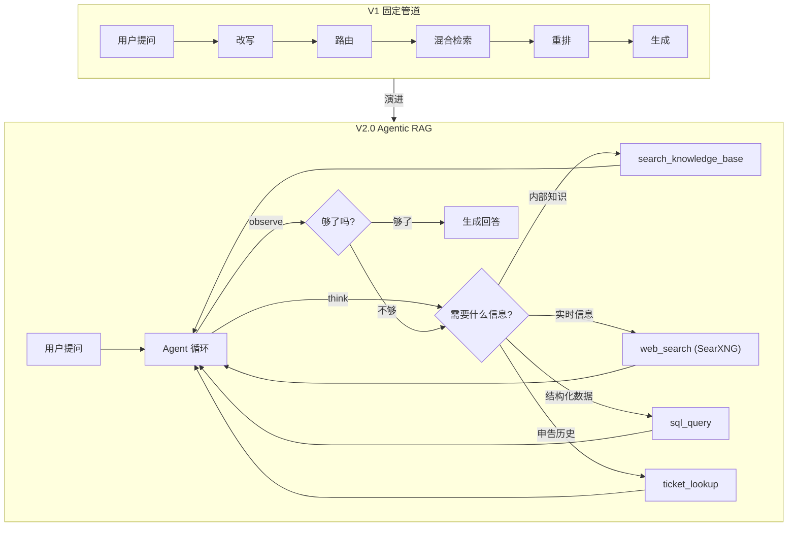
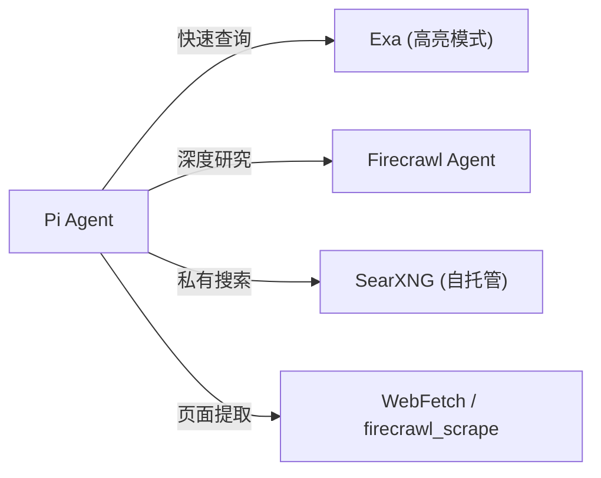
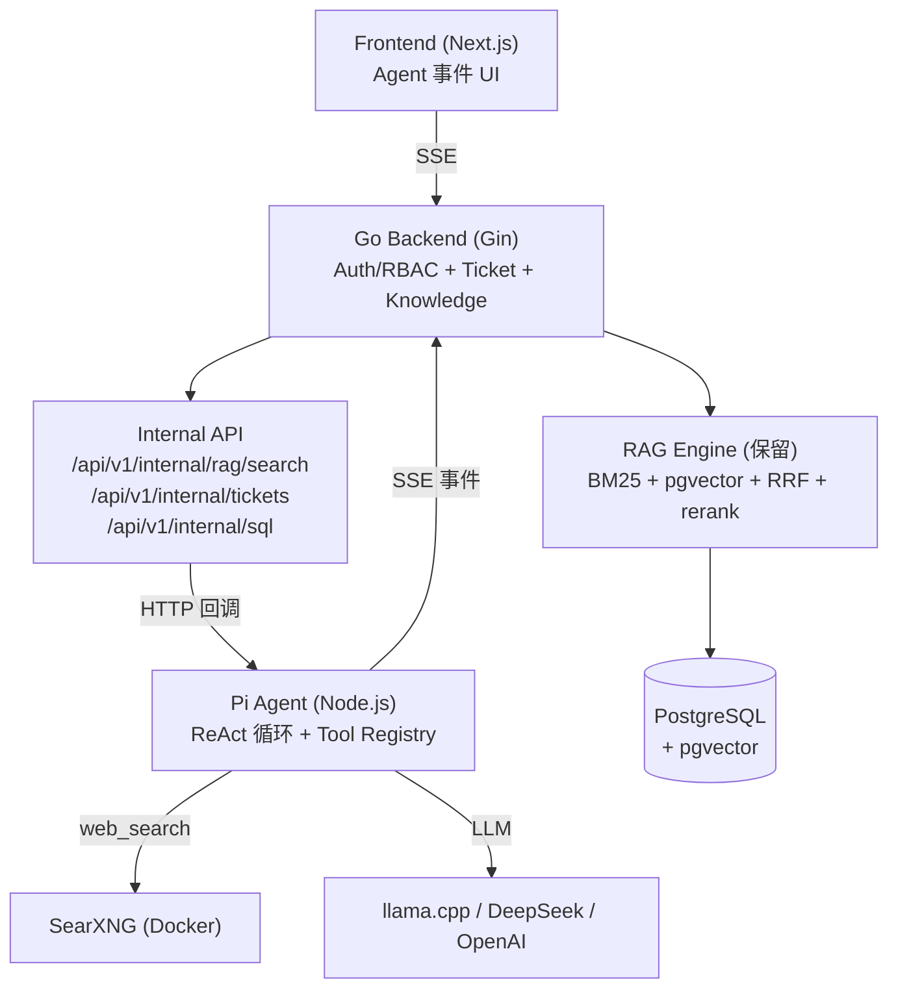
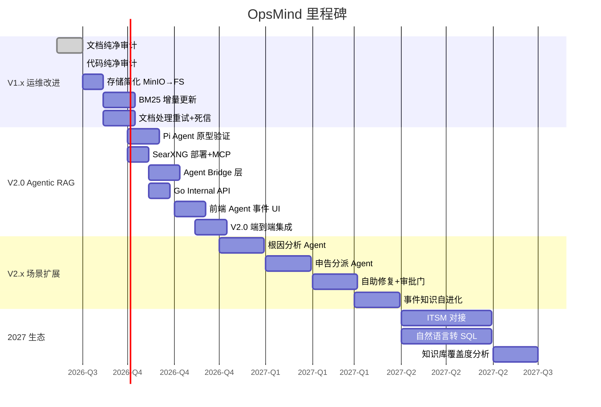

# OpsMind 产品技术路线图

> 战略方向与里程碑。代码级改进清单见 [`TODO.md`](TODO.md)，技术架构详见 [`TECH.md`](TECH.md)。

## 1. 项目愿景

OpsMind 是面向企业 IT 运维的**私有部署 AI 数字员工系统**。核心目标：让运维团队从重复性咨询中解放，让知识沉淀为可复用资产，让 AI 成为运维流程的第一响应者。

**设计原则**：私有部署优先（数据不出域）、自建 RAG 引擎（全链路可控可审计）、单体分层架构（简洁可维护）。

---

## 2. 当前状态（V1）

### 2.1 已交付能力

### 2.2 技术栈

| 层 | 技术 |
|----|------|
| 后端 | Go + Gin + GORM |
| 数据库 | PostgreSQL + pgvector (halfvec + HNSW) |
| 对象存储 | MinIO (S3-compatible) |
| RAG | 自建 Go 引擎 — BM25 (gse) / 向量 (pgvector) / RRF / cross-encoder |
| LLM | llama.cpp server 或 OpenAI-compatible API |
| 前端 | Next.js + React + TypeScript + Radix UI + SWR + Tailwind CSS |
| 部署 | Docker Compose |

---

## 3. V1.x — 运维改进（进行中）

近期完成的文档纯净审计与代码纯净审计已修复 130+ 项。当前聚焦存储简化与基础设施轻量化。

### 3.1 存储简化：MinIO → 本地文件系统

**动机**：MinIO 在单实例部署中增加 200-500MB RAM + HTTP 延迟层，同类系统（Dify / Open WebUI / AnythingLLM）均默认本地 FS。

| 项 | 说明 |
|----|------|
| `LocalFSClient` | 新增 ~100 行，原子写（temp+rename），UUID 文件名消除并发冲突 |
| `StorageClient` 接口 | 不变，保留 `MinIOClient` 作为 escape hatch |
| Presigned URL | 后端代理端点 `GET /api/storage/:bucket/:key` 替代 |
| Docker | 移除 minio 服务，加 `storage_data` volume |

**调研依据**：`docs/research/storage/00-summary.md`（本地，非正式产物）。Dify `STORAGE_TYPE=local` 默认；Open WebUI UUID 文件名无并发写冲突。

### 3.2 保留决策

| 组件 | 决策 | 依据 |
|------|------|------|
| pgvector | **保留** | halfvec(FP16) + HNSW + `::text`快照不可替代；2026 增长最快 PG 扩展 |
| PostgreSQL | **保留** | 12+ JSONB 列依赖 GIN 索引；pgvector 依赖；跨表事务一致性 |
| MinIO | **移除** | 单实例下本地 FS 足够，少一个容器 |
| Agent 数据用 SQLite | **未来** | ReAct 高频读写时拆分，当前 LLM 调用 300ms+ DB 非瓶颈 |

---

## 4. V2.0 — Agentic RAG 与 Agent 基座

### 4.1 核心变化

V1 的 RAG 是**固定 7 步线性管道**（改写→路由→检索→融合→重排→生成），V2.0 引入 **Agent 基座**让 AI 自主决策：何时检索、从哪个源检索、是否多轮搜索、是否调用外部工具。

### 4.2 Agent 基座选型：Pi Agent

| 维度 | Pi (earendil-works/pi) |
|------|----------------------|
| 成熟度 | ~10 万 star，265 万周下载，257 releases，MIT |
| Agent 循环 | ReAct 循环 + tool calling + steering + compaction |
| 多 Provider | 30+（llama.cpp / DeepSeek / OpenAI / Anthropic） |
| RAG 能力 | 无内置（OpsMind Go 引擎互补作为工具后端） |
| HTTP 服务器 | 无（需桥接层） |
| Go SDK | 无（TypeScript） |

**桥接策略**：
- **MVP**：Pi RPC 子进程（`pi --mode rpc`，JSONL over stdin/stdout）
- **生产**：Node.js HTTP Sidecar（`createAgentSession` SDK，标准 HTTP/SSE）
- **兜底**：若桥接成本过高，回退自建 Go Agent Loop（~500 行）或 tRPC-Agent-Go

### 4.3 网络搜索与深度搜索

| 能力 | 工具 | 说明 |
|------|------|------|
| 快速网络搜索 | Exa MCP / Firecrawl | 高亮模式 10x token 效率 |
| 深度研究 | `firecrawl_agent` / GPT-Researcher MCP | 多轮迭代搜索→阅读→综合 |
| 自托管搜索 | SearXNG + MCP | 聚合 130+ 引擎，无 API 密钥，私有部署 |
| Ops 域过滤 | SearXNG `it`/`science` 类别 | 优先 StackOverflow / GitHub / 厂商域名 |

### 4.4 目标架构

### 4.5 废弃与新增

| 废弃（V1） | 替代（V2.0） |
|-----------|------------|
| `ai.rag_query_rewrite` 开关 | Agent 自主决策（工具参数） |
| `ai.rag_multi_route` 开关 | Agent 循环多次调用 |
| `ai.rag_hybrid` 开关 | 工具参数 `strategy=hybrid` |
| `ai.rag_rerank` 开关 | 工具参数 `rerank=true` |
| 固定 `Pipeline.Execute()` | Pi `createAgentSession()` |
| `LLMConfigManager` 单默认 | Pi 多 Provider + session 级配置 |

| 保留 | 原因 |
|------|------|
| RAG 引擎（BM25 + vector + RRF + rerank） | Pi 无 RAG，Go 引擎作为工具后端 |
| pgvector + PostgreSQL | 向量存储 + 业务数据不变 |
| Document Processor | 文档处理管道不变 |
| SSE 流式 + GenerationHub | 扩展事件类型 |
| Auth/RBAC/Ticket/Knowledge | 领域逻辑不变 |

| 新增 | 说明 |
|------|------|
| `server/internal/agent/` | Agent Bridge 层 |
| Go Internal API 端点 | 供 Pi 工具回调 |
| Pi Extension（TS） | 自定义 tools |
| 前端 Agent 事件 UI | thinking/action/observation 渲染 |
| Docker: Node.js + SearXNG | 新增两个服务 |

---

## 5. V2.x — 运维场景扩展

### 5.1 Agentic 场景映射

| 场景 | Agent 模式 | 工具 |
|------|-----------|------|
| 智能问答 | ReAct + Corrective RAG | RAG 检索、网络搜索、申告历史 |
| 根因分析 | Plan-then-Execute | 日志查询、拓扑探索、指标查询、知识检索 |
| 申告分派 | Multi-Agent Orchestrator | 申告分类、路由规则、通知 |
| 自助修复 | ReAct + Tool Use | API 调用、脚本执行（需人工审批门） |
| 知识库更新 | ReAct | 文档检索、差异对比、审核流程 |

### 5.2 事件知识自进化

每个已解决申告生成知识条目 → 嵌入 pgvector → 未来类似事件通过 RAG 检索历史经验。对应 OpsAgent（联想生产部署）的"外部自进化"模式。

### 5.3 人工审批门（HITL）

敏感操作（重启、扩容、配置变更）必须经人工审批。Agent 建议措施 → 人工确认 → 执行。所有 agent 轨迹写入审计日志。

---

## 6. 里程碑

---

## 7. 技术决策记录

| 决策 | 选择 | 依据 |
|------|------|------|
| 文档存储 | 本地 FS（移除 MinIO） | 单实例下本地 FS 足够；Dify/Open WebUI/AnythingLLM 均默认本地 |
| 向量数据库 | 保留 pgvector | halfvec+HNSW 不可替代；增长最快 PG 扩展；sqlite-vec 无 ANN |
| 业务数据库 | 保留 PostgreSQL | JSONB GIN 索引；pgvector 依赖；跨表事务；GORM 迁移安全 |
| Agent 数据 | 未来 SQLite | ReAct 高频读写时拆分；当前非瓶颈 |
| Agent 基座 | Pi Agent（TS） | 10 万星验证、30+ Provider、成熟 agent loop；Go 桥接 |
| 网络搜索 | SearXNG（自托管）+ Exa/Firecrawl | 私有部署无 API 密钥；深度研究用 Firecrawl Agent |
| Agent 模式 | ReAct + Corrective RAG | 运维问答需要多步推理 + 检索质量保证 |
| LLM Provider | 多 Provider（llama.cpp/DeepSeek/OpenAI） | Pi 管理 Provider 路由，保留本地部署能力 |

---

## 8. 关联文档

| 文档 | 用途 |
|------|------|
| [`PRD.md`](PRD.md) | 产品需求 — 功能定义、业务规则 |
| [`TECH.md`](TECH.md) | 技术架构 — 分层设计、DDL、ADR |
| [`API/README.md`](API/README.md) | API 文档索引 |
| [`FLOW/README.md`](FLOW/README.md) | 业务流程图 |
| [`TODO.md`](TODO.md) | 代码级改进清单与优先级 |
