# Cognos — 技术架构文档

> 覆盖系统架构、前后端分层设计、数据库、可靠性、设计系统。关联文档：[PRD](PRD.md) · [TODO](TODO.md) · [API](API/README.md) · [FLOW](FLOW/README.md)

## 1. 系统架构

### 1.1 分层架构

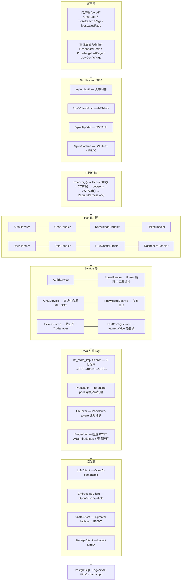

### 1.2 请求生命周期

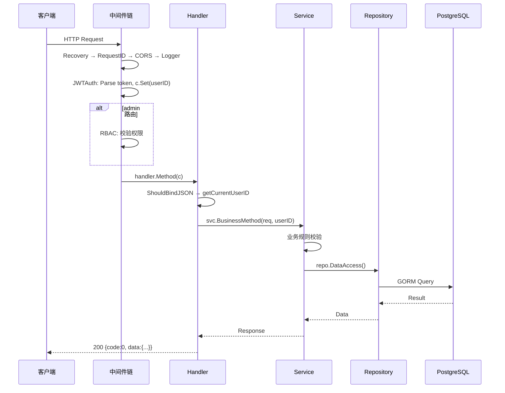

### 1.3 启动流程

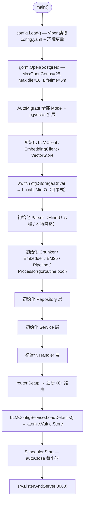

## 2. 后端架构

### 2.1 三层分离

| 层 | 职责 | 禁止 |
|----|------|------|
| Handler | 参数绑定、调用 Service、响应格式化 | 不含业务逻辑 |
| Service | 业务规则、事务编排、调用 Repo/Adapter | 不含 SQL |
| Repository | 数据访问、GORM 查询 | 不含业务规则 |

Handler 层共享工具：`parsePagination` / `parseID` / `getCurrentUserID` / `safeHandler`（消除 nil 检查样板）。

### 2.2 RAG 引擎

自包含领域引擎，不依赖 HTTP 层。检索原语由 `kb(action=search)` 封装，Agent ReAct 循环驱动调用（非线性 Pipeline，线性 `Pipeline.Execute` 已废弃）。

| 文件 | 职责 |
|------|------|
| `retriever.go` | 向量检索入口；`Retrieve` / `RetrieveFiltered`（metadata 硬过滤） |
| `bm25.go` | Okapi BM25 (k1=1.5, b=0.75) + gse 中文分词；enriched 文本（title×2 + tags×3）；内存索引 30min TTL |
| `hybrid.go` | RRF 融合：`score = Σ 1/(k+rank_i)`，k=30 可配（`ai.rrf_k`） |
| `rerank.go` | Cross-Encoder 重排序（子进程模式）；失败降级原序并日志化 |
| `crag.go` | CRAG 充分性评估——`Verdict{Strong/Ambiguous/Weak}`；`ThresholdEvaluator`（纯函数）+ 可选 LLM 评估器（仅 Ambiguous 带） |
| `contextual.go` | Contextual Retrieval——索引时 LLM 为 chunk 生成上下文摘要 prepend |
| `chunker.go` | Markdown-aware 递归分块（500 字符 / 重叠 100） |
| `embedder.go` | 批量 Embedding（batch=20）+ 查询侧 LRU 缓存 |
| `packing.go` | Context Packing——token 预算内贪心填充（2000 token） |
| `sandwich.go` | Sandwich Reorder——高分放首尾，缓解 Lost in the Middle |
| `processor.go` | goroutine pool 异步文档处理（parse→chunk→embed→pgvector） |
| `ingest_queue.go` | 异步索引队列（append-only JSONL，<5ms 入队） |
| `types.go` | 共享类型定义 |

**检索管道**（`kb_store_impl.go:Search`，毫秒级）：

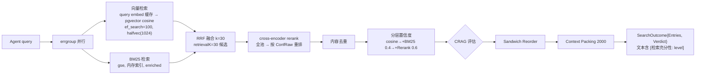

两阶段检索：向量 + BM25 各取 `retrievalK=30` 候选 → RRF 融合 → cross-encoder rerank 全池 → 截到 `limit`（top N）。`ef_search` 必须 ≥ `retrievalK`。

### 2.3 适配层接口

```mermaid
classDiagram
    class LLMClient {
        <<interface>>
        ChatCompletion(ctx, ChatRequest) (*ChatResponse, error)
        ChatCompletionStream(ctx, ChatRequest) (<-chan StreamChunk, error)
    }
    class EmbeddingClient {
        <<interface>>
        CreateEmbeddings(ctx, EmbeddingRequest) (*EmbeddingResponse, error)
    }
    class VectorStore {
        <<interface>>
        BatchInsert(ctx, []VectorChunk) error
        CosineSearch(ctx, kbID, embedding, topK) ([]SearchResult, error)
        CosineSearchWithFilter(ctx, kbID, embedding, topK, tags) ([]SearchResult, error)
        DeleteByArticle(ctx, articleID) error
        DeleteByKB(ctx, kbID) error
        ReplaceVectors(ctx, articleID, []VectorChunk) error
    }
    class Reranker {
        <<interface>>
        Rerank(ctx, query, passages) (*RerankResult, error)
    }
    class SufficiencyEvaluator {
        <<interface>>
        Evaluate(ctx, query, results) (Verdict, error)
    }
    class StorageClient {
        <<interface>>
        UploadFile(ctx, bucket, dir, filename, reader, size, contentType) error
        DownloadDir(ctx, bucket, dir) (map[string]io.ReadCloser, error)
        DeleteDir(ctx, bucket, dir) error
        GetFileURL(ctx, bucket, dir, filename) (string, error)
    }
```

- `LLMClient` / `EmbeddingClient`：OpenAI-compatible 实现，指数退避重试（maxRetries=3，429/503 可重试）
- `VectorStore`：pgvector 实现，halfvec 半精度 + HNSW 索引，维度一致性校验；`SetEfSearch` 设查询时 `hnsw.ef_search`（只读事务内 `SET LOCAL`，连接池安全）
- `Reranker`：cross-encoder 子进程实现（ms-marco-MiniLM-L-4-v2），崩溃自动重启
- `SufficiencyEvaluator`：CRAG 充分性评估；`ThresholdEvaluator`（纯函数，复用 `ai.confidence_threshold_low/high`）+ 可选 `LLMCRAGEvaluator`（仅 Ambiguous 带，失败降级阈值）
- `StorageClient`：Local + MinIO 双实现（目录式），桶：`cognos-documents` 文档（`kb-{kbID}/{draft|published}/{filename}.md`）+ `image` 统一图片目录

## 3. 前端架构

### 3.1 路由映射

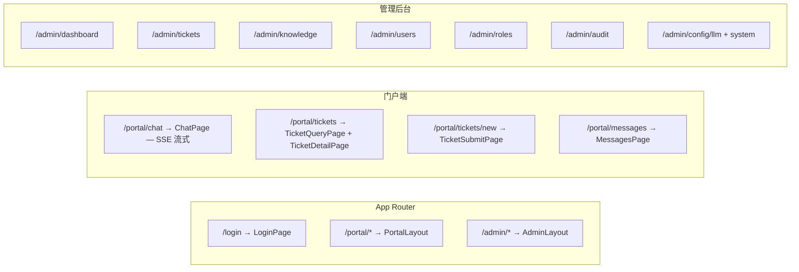

### 3.2 组件分类

**Server Components（无 `'use client'`）：** RootLayout、NotFound、各 Layout 壳、AppleButton、AppleCard、AppleBadge、AppleSpinner

**Client Components（`'use client'`）：** 全部 Page 组件、AdminLayout、PortalLayout、AppleDialog、AppleInput/Textarea、ChatInput、ChatMessage、ChatPipeline、ConfirmDialog、StatusBadge、StatCard、ErrorBoundary

### 3.3 状态管理

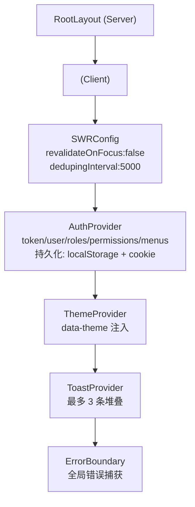

- AuthProvider 使用 `useLayoutEffect` 设置 token getter，确保 SWR 首次请求携带 token
- 客户端 fetch 默认走相对路径，通过 Next.js rewrite 代理到后端；开发时可设 `NEXT_PUBLIC_API_URL` 直连后端

### 3.4 API 模块速查

| 前端模块 | 核心函数 | 后端端点 |
|---------|---------|---------|
| `lib/api/auth.ts` | login / refreshToken / changePassword / logout | `/api/v1/auth/*` |
| `lib/api/chat.ts` | createSession / getSessionList / deleteSession / submitFeedback | `/api/v1/portal/chat-sessions/*` |
| `lib/api/knowledge.ts` | getKBList / createKB / getArticleList / publishArticle / uploadDocuments | `/api/v1/admin/knowledge-bases/*` |
| `lib/api/ticket.ts` | createTicket / getMyTickets / supplementTicket / updateTicketStatus | `/api/v1/portal/tickets/*` `/api/v1/admin/tickets/*` |
| `lib/api/user.ts` | getUserList / createUser / freezeUser | `/api/v1/admin/users/*` |
| `lib/api/role.ts` | getRoleList / createRole / updateRoleMenus / getMenus | `/api/v1/admin/roles/*` `/api/v1/admin/menus` |
| `lib/api/llm_config.ts` | getLLMConfigs / createLLMConfig / testLLMConnection | `/api/v1/admin/llm-configs/*` |
| `lib/api/dashboard.ts` | getStats / getTrends | `/api/v1/admin/dashboard/*` |
| `lib/api/audit.ts` | getAuditLogs | `/api/v1/admin/audit-logs` |
| `lib/api/message.ts` | getMessages / markAsRead / getUnreadCount | `/api/v1/portal/messages/*` |
| `lib/api/config.ts` | getConfig / setConfig / getAllConfigs | `/api/v1/admin/configs/*` |

### 3.5 关键 Hooks

| Hook | 用途 |
|------|------|
| `useAuth()` | 全局认证（login/logout/hasPermission），React Context |
| `useTheme()` | 双主题切换（light/dark），localStorage + cookie + data-theme |
| `useToast()` | Toast 通知，分级消失时间 |
| `useAppConfig()` | 从后端读取系统配置，非管理员页面 401 时静默回落默认值 |
| `useChatSessions()` | 会话列表 CRUD + `?sid=` URL 参数双向同步 |
| `useChatStream()` | SSE 流式问答状态管理，ReadableStream 解析 + AbortController |
| `useAutoScroll()` | 对话区自动滚动（流式跟随、非流式仅底部附近跟随） |
| `useBatchSelection()` | 批量选择与删除（users/tickets/audit/knowledge 复用） |
| `useAccountSwitcher()` | 历史登录会话管理，7 天过期，过期需重新输入密码 |
| `useDebounce()` | 搜索防抖，300ms 默认 |
| `useUnreadCount()` | 消息未读数轮询，30s 间隔 |

## 4. 数据库设计

### 4.1 ER 关系

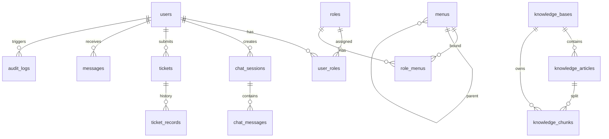

### 4.2 pgvector 配置

| 参数 | 值 | 说明 |
|------|-----|------|
| 向量类型 | `halfvec(1024)` | 半精度，维度随 embedding 模型 |
| 索引 | HNSW | `halfvec_cosine_ops`，m=16，ef_construction=200 |
| 距离算子 | `<=>` | 余弦距离；score = `1 - 距离` |
| ef_search | 100（`COGNOS_AI_EF_SEARCH`） | 查询时旋钮，≥ LIMIT，100 达 95%+ recall |
| retrievalK | 30（`COGNOS_AI_RETRIEVAL_K` / `ai.retrieval_k`） | 两阶段候选池；rerank 全池后截到 limit |
| RRF k | 30（`COGNOS_AI_RRF_K` / `ai.rrf_k`） | 融合常数，可调 |
| 分块大小 | 500 字符 | 重叠 100 字符 |

### 4.3 关键索引

| 表 | 索引 | 用途 |
|----|------|------|
| `knowledge_chunks` | HNSW `embedding halfvec_cosine_ops` | 向量相似度检索 |
| `knowledge_chunks` | B-tree `kb_id` + `article_id` | 按范围过滤/删除 |
| `knowledge_articles` | GIN `tags` | metadata 标签硬过滤（JSONB `?|`） |
| `knowledge_articles` | B-tree `article_type` | metadata 类型硬过滤 |
| `tickets` | UNIQUE `ticket_no` | 编号唯一 |
| `tickets` | B-tree `user_id, status, created_at` | 列表查询 + AutoClose |
| `chat_sessions` | B-tree `user_id, created_at` | 会话列表 |

### 4.4 业务域划分

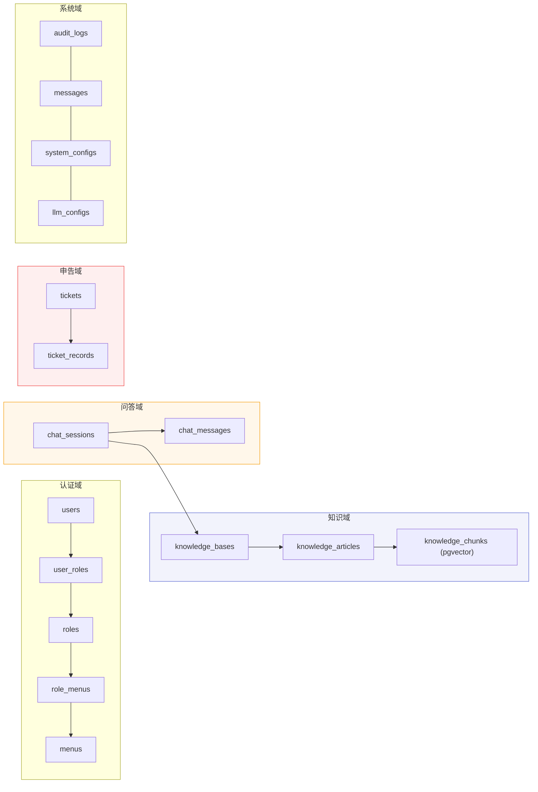

## 5. 可靠性设计

### 5.1 RAG 检索降级矩阵

检索由 `kb_store_impl.go:Search` 执行（Agent ReAct 驱动调用）；向量检索与 BM25 经 errgroup 并行，单路失败不阻塞另一路。

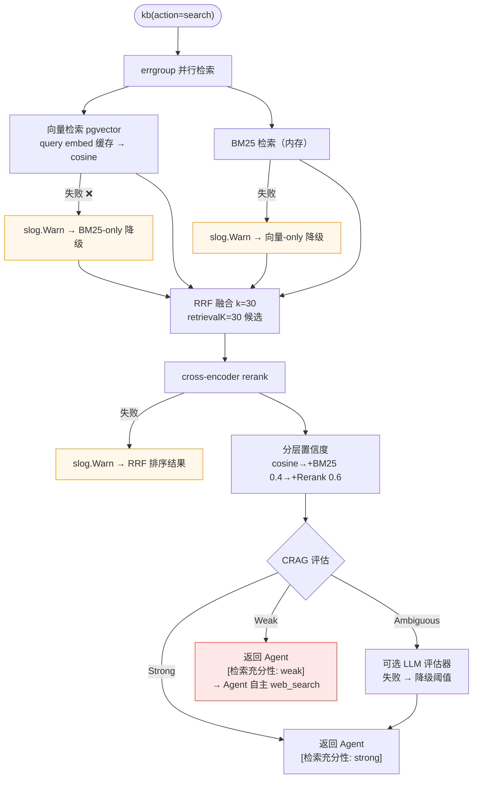

核心原则：非核心步骤失败降级不阻塞。向量检索是核心路径，双路全失败返回 20002；LLM 生成失败返回 20001。CRAG 评估失败降级阈值，永不阻塞检索返回。web_search fallback 由 Agent 经 verdict 文本信号自主触发，RAG 引擎不触 web（保持 HTTP 无关）。

### 5.2 置信度评分与 CRAG 评估

分层置信度（`computeConfidence`），从基础向量分逐层叠加：

| 层 | 公式 | 权重 |
|----|------|------|
| 基础 | `s = RawCosineScore`（pgvector 余弦 [0,1]） | — |
| +BM25（hybrid 命中） | `s = 0.6×s + 0.4×Bm25NormScore` | 0.4 |
| +Rerank（rerank 命中） | `s = 0.4×s + 0.6×RerankScore` | 0.6 |
| 钳位 | `[0, 1]` | — |

BM25 归一化（min-max → [0,1]；单结果 0.8；零跨度 0.8）。置信度计算后按 `ConfRaw` 降序重排，再 Sandwich Reorder。

**CRAG 充分性评估**（`crag.go`）：`ThresholdEvaluator` 按 `ConfRaw` 与阈值比较产出 `Verdict`：

| Verdict | 条件 | Agent 行为 |
|---------|------|-----------|
| Strong | `ConfRaw >= high` | 直接基于检索 chunk 答（零额外成本） |
| Ambiguous | `low <= ConfRaw < high` | 可选 LLM 评估器二次判定（失败降级阈值） |
| Weak | `ConfRaw < low` | 文本含 `[检索充分性: weak]`，Agent 自主 web_search 补充 |

阈值 `ai.confidence_threshold_low/high`（默认 0.40/0.70），经 `ComputeThresholds` 从近 N 天 `chat_messages.confidence_raw` 算 P30/P70 分位数动态更新（p30 下限 0.10，p70 上限 0.95，p70-p30 最小间距 0.10；无数据回退 0.40/0.70）。verdict 以文本 preamble 返回 Agent，web fallback 由 Agent ReAct 触发，RAG 引擎不触 web。

### 5.3 外部服务重试策略

| 服务 | 重试 | 策略 | 关键保护 |
|------|------|------|---------|
| LLM API | 3 次 | 指数退避，仅 429/503 | 超时 120s |
| Embedding API | 3 次 | 指数退避，连接/超时始终重试 | batch=20 分批；查询侧 LRU 缓存（10min/1000） |
| Reranker 子进程 | 自动重启 | 崩溃后 3s 重连 | 内部 30s 超时；失败降级原序并日志化 |
| CRAG LLM 评估器 | 无 | Ambiguous 带触发；失败降级阈值 | 仅 `COGNOS_AI_CRAG_LLM_EVAL=true` 启用 |
| pgvector | 无 | 瞬时故障返回 20002 | HNSW 索引；`ef_search=100` |
| MinIO | 无 | 惰性检查 | io.LimitReader(100MB) |
| Local | 无 | 直接文件系统操作 | filepath.Join 防路径穿越 |

### 5.4 并发安全

- `llmClient` 指针：`sync.Mutex` 保护读写，通过 `getLLMClient()` 访问
- 申告状态更新：CAS `UPDATE WHERE id=? AND status=?` 防并发覆盖
- Processor goroutine pool：`stopped` 原子标志 + channel 关闭幂等
- BM25 索引构建：`building` 原子标志 + defer recover 防 panic 残留

## 6. 配置与环境

### 6.1 环境变量（核心）

| 变量 | 说明 | 默认值 |
|------|------|--------|
| `POSTGRES_PASSWORD` | 数据库密码 | cognos_dev |
| `JWT_SECRET` | JWT 签名密钥 | 需手动设置 |
| `LLM_BASE_URL` | LLM API 地址 | http://llama-cpp:8080/v1 |
| `LLM_API_KEY` | API 密钥（OpenAI 需要） | — |
| `LLM_MODEL` | LLM 模型名称 | qwen3-4b |
| `LLM_MAX_TOKENS` | 最大生成 Token | 8192 |
| `EMBEDDING_MODEL` | Embedding 模型 | Qwen3-Embedding-0.6B |
| `EMBEDDING_DIMENSION` | 向量维度 | 1024 |
| `COGNOS_AI_EF_SEARCH` | HNSW 查询时 ef_search（≥ LIMIT） | 100 |
| `COGNOS_AI_RETRIEVAL_K` | 两阶段候选池大小 | 30 |
| `COGNOS_AI_RRF_K` | RRF 融合常数 | 30 |
| `COGNOS_AI_EMBED_BATCH` | 索引侧 embedding batch | 20 |
| `COGNOS_AI_QUERY_EMBED_CACHE_TTL` | 查询 embedding 缓存 TTL | 10m |
| `COGNOS_AI_CONTEXTUAL_ENABLED` | Contextual Retrieval（索引时 LLM 前缀） | false |
| `COGNOS_AI_CRAG_LLM_EVAL` | CRAG LLM 评估器（仅 Ambiguous 带） | false |
| `MINIO_ROOT_USER` / `MINIO_ROOT_PASSWORD` | MinIO 凭证 | minioadmin |
| `COGNOS_STORAGE_DRIVER` | 文件存储驱动（local / minio） | local |
| `COGNOS_STORAGE_LOCAL_BASE_DIR` | 本地存储根目录 | ./data/storage |
| `AI_CONFIDENCE_THRESHOLD` | 置信度阈值 | 0.6 |
| `AI_DEFAULT_TOP_K` | 默认检索 TopK | 5 |
| `COGNOS_PARSER_ENGINE` | 文档解析引擎（mineru / local） | mineru |
| `MINERU_API_KEY` | MinerU 云端解析 API Key（空值降级到本地） | — |

> 完整 28 项环境变量见 `.env.example` 和 `docker-compose.yml`。

### 6.2 LLM 配置热替换

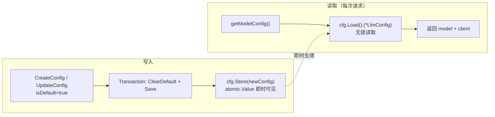

## 7. 设计系统

### 7.1 色彩

| 令牌 | 色值 | 用途 |
|------|------|------|
| Action Blue | `#0066cc` | 唯一品牌色，pill 按钮 |
| Focus Blue | `#2997ff` | 聚焦环 |
| Surface White | `#f5f5f7` | 浅色背景 |
| Surface Dark | `#1d1d1f` | 暗色背景 |
| Ink | `#1d1d1f` / `#f5f5f7` | 浅/暗主题正文字 |
| Ink Muted | `rgba(0,0,0,0.48)` | 辅助文字 |
| Hairline | `rgba(0,0,0,0.08)` | 分隔线 |

### 7.2 字体与圆角

- 字体：Inter Variable，正文字号 17px，标题 28px/20px，辅助 13px
- 按钮：完全圆角 pill（`9999px`）
- 卡片：`18px` 圆角，无边框，微阴影（`0 1px 3px rgba(0,0,0,0.04)`）
- 输入框：`12px` 圆角，hairline 边框

### 7.3 核心组件

| 组件 | 特征 |
|------|------|
| AppleButton | 4 变体：pill（蓝底白字）/ ghost（透明）/ utility（灰底）/ pearl（白底灰框） |
| AppleCard | 白底 + hairline 边框 + 12px 圆角，可选 hover 可点击 |
| AppleInput | 标准输入 + pill 搜索变体，forwardRef |
| AppleTable | 泛型 `<T>`，loading/empty 状态内置 |
| ApplePagination | 页码 + pageSize 选择器 |
| AppleDialog | Radix Dialog 封装，Apple 风格 |

## 8. 错误码

| 错误码 | HTTP | 说明 |
|--------|------|------|
| 0 | 200 | 成功 |
| 10001 | 401 | 未登录或令牌过期 |
| 10002 | 403 | 无权限 |
| 10003 | 400 | 参数校验失败 |
| 10004 | 404 | 资源不存在 |
| 10005 | 409 | 资源冲突 |
| 10006 | 400 | 用户已冻结 |
| 10007 | 400 | 用户已正常 |
| 20001 | 503 | AI 服务不可用 |
| 20002 | 503 | RAG 服务不可用 |
| 20003 | 503 | 存储服务不可用 |
| 99999 | 500 | 内部错误 |

## 9. 项目结构

```
server/
├── cmd/main.go              # entry: config → DB → RAG → domain → router → runtime
├── internal/
│   ├── domain/              # 业务领域（每领域 handler + service + repository 三文件）
│   │   ├── chat/           # 聊天/AI 问答（session + llm_config）
│   │   ├── knowledge/      # 知识库
│   │   ├── system/         # 系统管理（audit + config + dashboard + message）
│   │   ├── ticket/         # 工单
│   │   └── user/           # 用户/权限（auth + role + account）
│   ├── infra/              # 基础设施
│   │   ├── adapter/        # LLMClient / EmbeddingClient / VectorStore / Reranker
│   │   ├── cache/          # 用户状态缓存
│   │   ├── config/         # Viper 配置
│   │   ├── database/       # AutoMigrate + 连接管理
│   │   ├── log/            # 结构化日志
│   │   ├── middleware/     # JWT / RBAC / CORS / Logger
│   │   ├── runtime/        # scheduler / tx_manager / generation_hub
│   │   └── storage/        # StorageClient 接口 + MinIO / Local 双实现（目录式）
│   ├── rag/                # 自建 RAG 引擎（pipeline/bm25/hybrid/rerank/chunker/embedder/processor）
│   ├── parser/             # 文档解析（parser.go + mineru/ + local/）
│   ├── router/             # 路由注册 + safeHandler
│   └── shared/             # 共享类型和工具
│       ├── dto/            # request/ + response/
│       ├── handler/        # 共享 handler 工具
│       ├── model/          # GORM models + enums
│       └── pkg/            # jwt / hash / crypto / response / errcode
├── migrations/              # DDL + seed data
├── models/                  # rerank model files
├── test/                    # 外部测试包（domain/infra/rag/shared/router/e2e/integration）
└── rerank_server.py         # Python cross-encoder rerank service

web/src/
├── app/                     # Next.js App Router + globals.css (Design Tokens)
├── components/              # ui/ + layout/ + shared/ + chat/
├── contexts/                # ChatStreamProvider
├── hooks/                   # 11 custom Hooks
├── lib/api/                 # 11 API client modules
└── __tests__/               # frontend unit tests

docs/                        # formal docs — see §8
deploy/                      # Docker 部署（docker-compose.yml + allinone/）
Makefile                     # 本地开发命令入口
```
