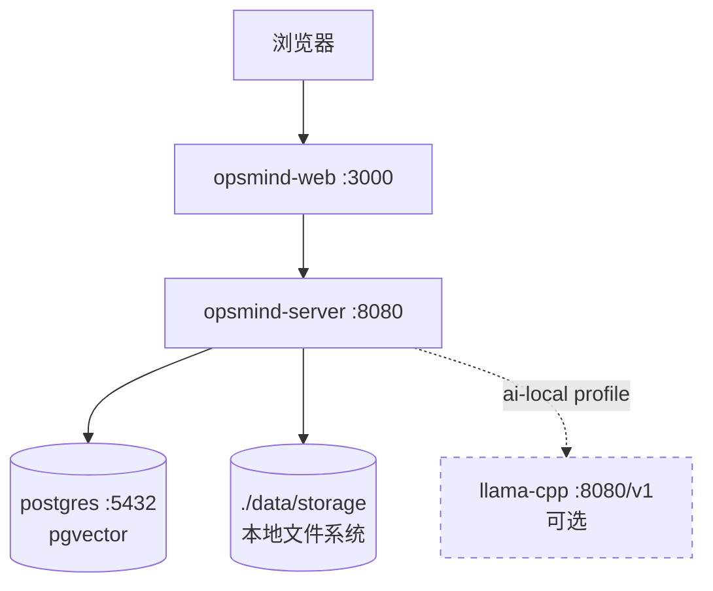
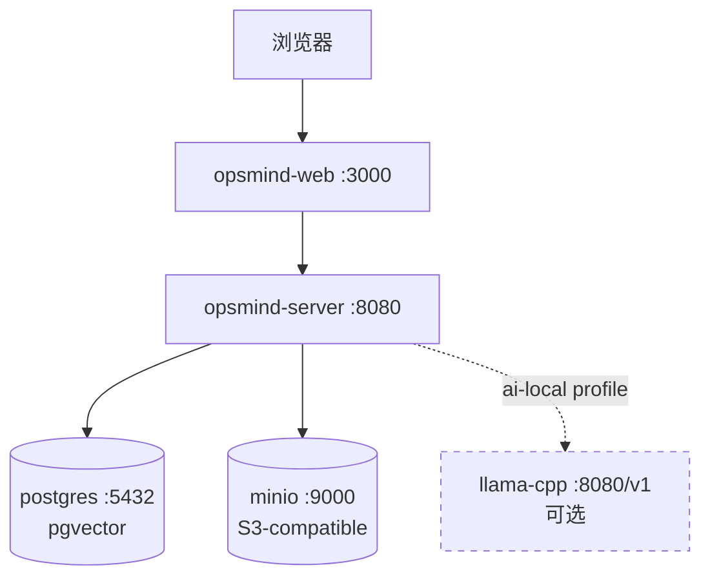

# OpsMind V1.1 — 文件存储层抽象（PRD）

> 版本：V1.1 · 主题：存储简化 · 状态：📋 规划中

## 1. 背景与目标

### 1.1 现状

V1.0 的文件存储硬绑定 MinIO（S3-compatible），是部署拓扑中的必选独立服务。对于单机/小规模部署，MinIO 增加了运维复杂度（独立容器 + 凭证 + 健康检查 + 卷管理），而实际存储需求仅为知识库文档的解析后正文（格式化 Markdown，非原始二进制）。

### 1.2 目标

- **存储引擎解离**——`StorageClient` 接口保持不变，新增本地文件系统实现（`LocalStorageClient`），与 MinIO 实现并列，启动时按配置选择。
- **默认本地**——配置 `storage.driver=local` 时无需 MinIO 容器，文档存本地磁盘；`storage.driver=minio` 时保留 S3 语义。
- **配置收敛**——bucket/目录配置从散落三处（`main.go` 字面量、`knowledge_service.go` 常量、`storage_client.go` 注释）收敛到 config 层单一来源。
- **部署简化**——本地模式下 docker-compose 的 MinIO 服务改为可选（`storage` profile），默认不启动。
- **存储格式升级**——文档解析后统一存储为 `.md`（Markdown），替代 `.txt`。`formatArticleText` 生成的 `# {title}\n\n{content}` 本就是 Markdown，扩展名改为 `.md`，contentType 改为 `text/markdown`。

### 1.3 非目标

- 不改变存储的内容语义（仍存解析后格式化文本，不存原始二进制）
- 不实现申告附件上传（`opsmind-attachments` 桶功能留待后续版本）
- 不改变文档上传/发布管道的业务逻辑

## 2. 功能需求

### 2.1 存储驱动配置

```yaml
storage:
  driver: local          # local | minio
  local:
    base_dir: ./data/storage   # 本地存储根目录
  minio:
    endpoint: localhost:9000
    access_key: minioadmin
    secret_key: minioadmin
    use_ssl: false
  buckets:
    documents: opsmind-documents     # 草稿/审核/处理中
    published: opsmind-published     # 已发布
```

- `driver=local`：启动 `LocalStorageClient`，不创建 MinIO 客户端，MinIO 容器可选不启动
- `driver=minio`：启动 `MinIOClient`（现有行为），MinIO 容器必选
- 切换 driver 不迁移已存数据（部署时选定，不热切换）

### 2.2 存储路径规则（目录式）

每篇文章存储为一个目录，包含 Markdown 正文和提取的图片：

```
{base_dir}/                              # local 模式
  opsmind-documents/                     # ← bucket=documents（草稿/审核/处理中）
    {article_key}/
      markdown.md                       # 正文（图片用相对路径 ）
      images/                            # 提取的图片
        {hash}.jpg
  opsmind-published/                     # ← bucket=published（已发布）
    {article_key}/
      markdown.md
      images/
        {hash}.png
```

- 每篇文章 = 一个目录（`{article_key}/`），key 为 title 清洗后的安全文件名
- 目录内 `markdown.md` 为正文，`images/` 存解析提取的图片
- markdown 中图片用相对路径引用（``），目录整体可移动/迁移
- MinIO 模式下同样目录式：`bucket/{article_key}/markdown.md` + `bucket/{article_key}/images/xxx.jpg`

### 2.3 接口升级（目录式存储）

目录式存储需支持多文件（markdown + images），原 `Upload(ctx, bucket, key, reader, size)` 单文件接口不够。升级为：

| 方法 | 说明 |
|---|---|
| `UploadFile(ctx, bucket, dir, filename, reader, size, contentType)` | 上传单文件到 `bucket/{dir}/{filename}` |
| `DownloadDir(ctx, bucket, dir)` | 下载整个目录（返回文件列表 + reader），用于 processor 读取 markdown + images |
| `DeleteDir(ctx, bucket, dir)` | 删除整个目录（递归，幂等） |
| `GetFileURL(ctx, bucket, dir, filename)` | 获取单文件访问 URL（MinIO 预签名 / 本地路径） |

- 原 `Upload/Download/Delete` 单文件接口废弃，改为目录式
- `UploadFile` 用于上传 `markdown.md` 和每张图片
- `DownloadDir` 用于 processor 读取整个文章目录解析
- `DeleteDir` 用于删除文章时清理整个目录

### 2.4 降级语义保持

现有 `storage == nil` 降级路径不变：
- `uploadFileAsync` 静默跳过
- `resolveContent` 走 `task.Content` 纯文本模式

本地模式下 `storage != nil`（LocalStorageClient 实例），正常存储，不走降级。

## 3. 部署拓扑变化

### 3.1 本地模式（默认）



- MinIO 容器不启动
- server 容器挂载 `./data/storage:/app/data/storage` volume

### 3.2 MinIO 模式（可选）



- `storage.driver=minio`，MinIO 容器必选
- 行为与 V1.0 完全一致

## 4. 配置项

| 环境变量 | 默认值 | 说明 |
|---|---|---|
| `OPSMIND_STORAGE_DRIVER` | `local` | 存储驱动：`local` / `minio` |
| `OPSMIND_STORAGE_LOCAL_BASE_DIR` | `./data/storage` | 本地存储根目录（local 模式） |
| `OPSMIND_MINIO_ENDPOINT` | `localhost:9000` | MinIO 地址（minio 模式） |
| `OPSMIND_MINIO_ACCESS_KEY` | `minioadmin` | MinIO 凭证（minio 模式） |
| `OPSMIND_MINIO_SECRET_KEY` | `minioadmin` | MinIO 凭证（minio 模式） |
| `OPSMIND_MINIO_USE_SSL` | `false` | MinIO SSL（minio 模式） |

## 5. 验收标准

- [ ] `driver=local` 时服务正常启动，无 MinIO 依赖
- [ ] 知识库文档上传 → 发布 → 分块 → embedding → pgvector 全链路在本地模式下正常
- [ ] `driver=minio` 时行为与 V1.0 完全一致（回归无破坏）
- [ ] bucket/目录配置来自 config 单一来源，代码中无硬编码
- [ ] docker-compose 默认不启动 MinIO，`--profile storage` 可启用
- [ ] 文档存储格式为 `.md`（contentType `text/markdown`），非 `.txt`
- [ ] TECH.md 同步更新存储架构
