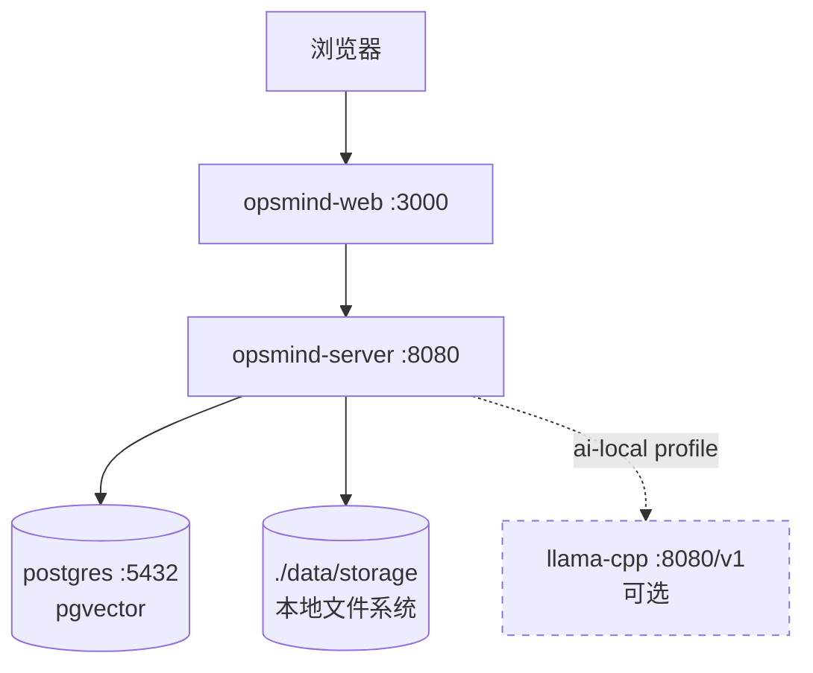
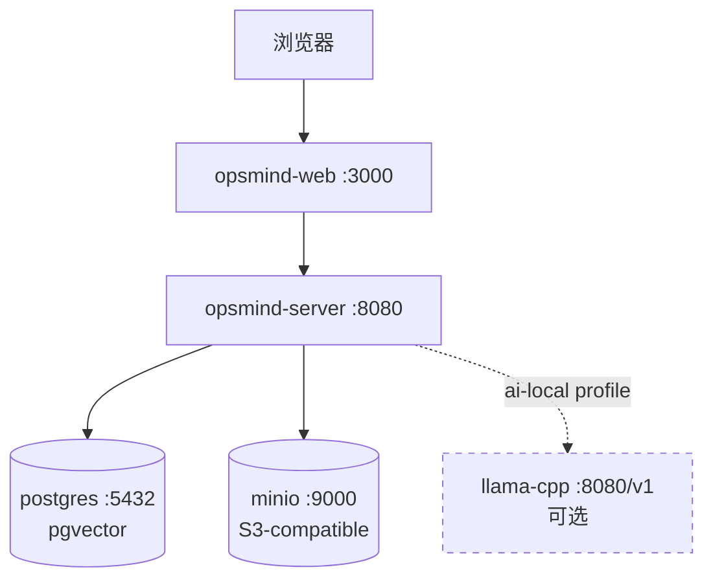

# OpsMind V1.1 — 文件存储层抽象（PRD）

> 版本：V1.1 · 主题：存储简化 · 状态：📋 规划中

## 1. 背景与目标

### 1.1 现状

V1.0 的文件存储硬绑定 MinIO（S3-compatible），是部署拓扑中的必选独立服务。对于单机/小规模部署，MinIO 增加了运维复杂度（独立容器 + 凭证 + 健康检查 + 卷管理），而实际存储需求仅为知识库文档的 `.txt` 正文（解析后格式化文本，非原始二进制）。

### 1.2 目标

- **存储引擎解离**——`StorageClient` 接口保持不变，新增本地文件系统实现（`LocalStorageClient`），与 MinIO 实现并列，启动时按配置选择。
- **默认本地**——配置 `storage.driver=local` 时无需 MinIO 容器，文档存本地磁盘；`storage.driver=minio` 时保留 S3 语义。
- **配置收敛**——bucket/目录配置从散落三处（`main.go` 字面量、`knowledge_service.go` 常量、`storage_client.go` 注释）收敛到 config 层单一来源。
- **部署简化**——本地模式下 docker-compose 的 MinIO 服务改为可选（`storage` profile），默认不启动。

### 1.3 非目标

- 不改变存储的内容语义（仍存解析后 `.txt`，不存原始二进制）
- 不实现申告附件上传（`opsmind-attachments` 桶功能留待后续版本）
- 不改变文档上传/发布管道的业务逻辑

## 2. 功能需求

### 2.1 存储驱动配置

```yaml
storage:
  driver: local          # local | minio
  local:
    base_dir: ./data/storage   # 本地存储根目录
  minio:
    endpoint: localhost:9000
    access_key: minioadmin
    secret_key: minioadmin
    use_ssl: false
  buckets:
    documents: opsmind-documents     # 草稿/审核/处理中
    published: opsmind-published     # 已发布
```

- `driver=local`：启动 `LocalStorageClient`，不创建 MinIO 客户端，MinIO 容器可选不启动
- `driver=minio`：启动 `MinIOClient`（现有行为），MinIO 容器必选
- 切换 driver 不迁移已存数据（部署时选定，不热切换）

### 2.2 本地存储路径规则

```
{base_dir}/
  opsmind-documents/      ← 对应 bucket=documents
    {title}.txt
  opsmind-published/       ← 对应 bucket=published
    {title}.txt
```

- 目录名 = bucket 名，文件名 = key（与 MinIO 的 bucket/key 语义对齐）
- 启动时自动创建目录（等价 MinIO 的 `ensureBucket`）

### 2.3 接口行为保持

`StorageClient` 4 方法不变，本地实现映射：

| 方法 | MinIO 实现 | 本地实现 |
|---|---|---|
| `Upload(ctx, bucket, key, reader, size, contentType)` | PutObject | `os.MkdirAll` + `os.Create` + `io.Copy` |
| `Download(ctx, bucket, key)` | GetObject | `os.Open` → `io.ReadCloser` |
| `Delete(ctx, bucket, key)` | RemoveObject（幂等） | `os.Remove`（忽略 `IsNotExist`，幂等） |
| `GetPresignedURL(ctx, bucket, key, expiry)` | PresignedGetObject | 返回 `/{base_dir}/{bucket}/{key}` 本地路径（只读场景） |

### 2.4 降级语义保持

现有 `storage == nil` 降级路径不变：
- `uploadMinioAsync` 静默跳过
- `resolveContent` 走 `task.Content` 纯文本模式

本地模式下 `storage != nil`（LocalStorageClient 实例），正常存储，不走降级。

## 3. 部署拓扑变化

### 3.1 本地模式（默认）



- MinIO 容器不启动
- server 容器挂载 `./data/storage:/app/data/storage` volume

### 3.2 MinIO 模式（可选）



- `storage.driver=minio`，MinIO 容器必选
- 行为与 V1.0 完全一致

## 4. 配置项

| 环境变量 | 默认值 | 说明 |
|---|---|---|
| `OPSMIND_STORAGE_DRIVER` | `local` | 存储驱动：`local` / `minio` |
| `OPSMIND_STORAGE_LOCAL_BASE_DIR` | `./data/storage` | 本地存储根目录（local 模式） |
| `OPSMIND_MINIO_ENDPOINT` | `localhost:9000` | MinIO 地址（minio 模式） |
| `OPSMIND_MINIO_ACCESS_KEY` | `minioadmin` | MinIO 凭证（minio 模式） |
| `OPSMIND_MINIO_SECRET_KEY` | `minioadmin` | MinIO 凭证（minio 模式） |
| `OPSMIND_MINIO_USE_SSL` | `false` | MinIO SSL（minio 模式） |

## 5. 验收标准

- [ ] `driver=local` 时服务正常启动，无 MinIO 依赖
- [ ] 知识库文档上传 → 发布 → 分块 → embedding → pgvector 全链路在本地模式下正常
- [ ] `driver=minio` 时行为与 V1.0 完全一致（回归无破坏）
- [ ] bucket/目录配置来自 config 单一来源，代码中无硬编码
- [ ] docker-compose 默认不启动 MinIO，`--profile storage` 可启用
- [ ] TECH.md 同步更新存储架构
