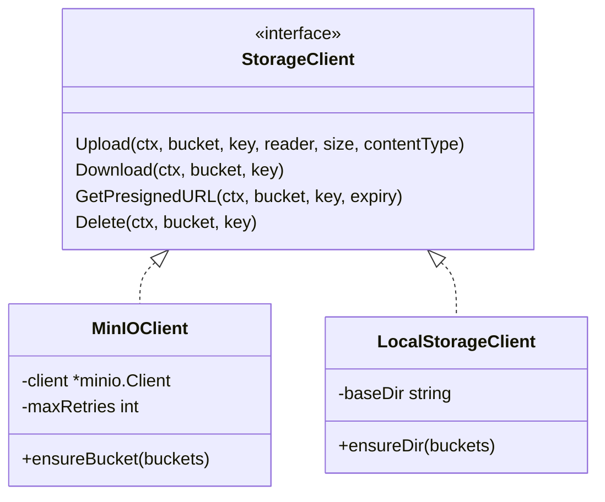
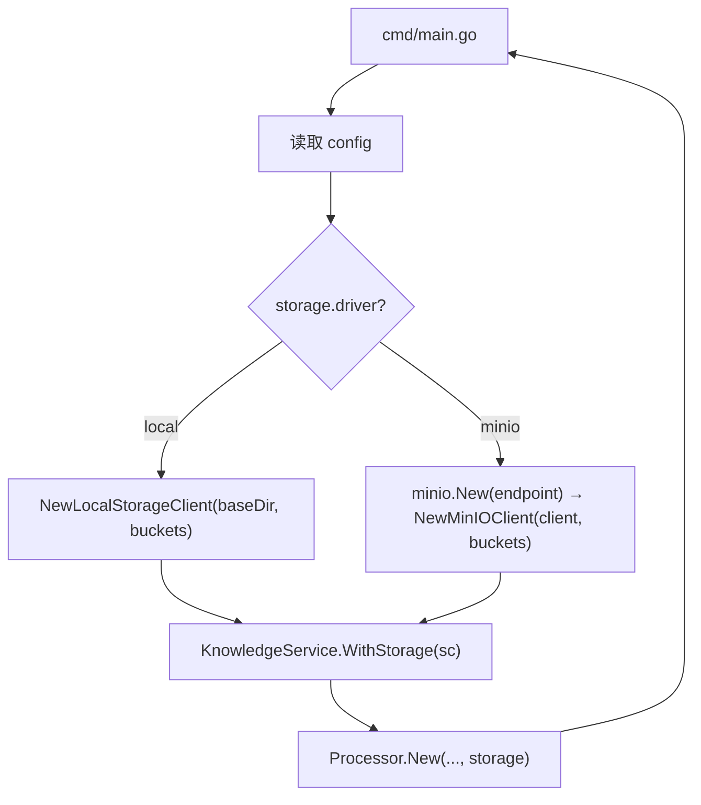

# OpsMind V1.1 — 文件存储层抽象（TECH）

> 版本：V1.1 · 主题：存储简化 · 状态：📋 规划中

## 1. 设计目标

- `StorageClient` 接口零改动，新增 `LocalStorageClient` 实现
- 配置驱动选择（`local` / `minio`），默认 `local`
- bucket 配置收敛到 config，消除硬编码
- MinIO 从必选变可选，本地模式零外部对象存储依赖

## 2. 存储引擎抽象

### 2.1 接口（不变）

```go
// server/internal/adapter/storage_client.go
type StorageClient interface {
    Upload(ctx context.Context, bucket, key string, reader io.Reader, size int64, contentType string) (string, error)
    Download(ctx context.Context, bucket, key string) (io.ReadCloser, error)
    GetPresignedURL(ctx context.Context, bucket, key string, expiry time.Duration) (string, error)
    Delete(ctx context.Context, bucket, key string) error
}
```

### 2.2 实现



### 2.3 LocalStorageClient 实现

```go
// server/internal/adapter/storage_local.go
type LocalStorageClient struct {
    baseDir string
}

func NewLocalStorageClient(baseDir string, buckets ...string) (*LocalStorageClient, error) {
    // 启动时遍历 buckets 创建 {baseDir}/{bucket} 目录
}

func (c *LocalStorageClient) Upload(ctx, bucket, key, reader, size, contentType) (string, error) {
    // os.MkdirAll(dir, 0755) + os.Create(path) + io.Copy
    // 返回 key（与 MinIO 实现对齐）
}

func (c *LocalStorageClient) Download(ctx, bucket, key) (io.ReadCloser, error) {
    // os.Open(path) → *os.File（实现 io.ReadCloser）
}

func (c *LocalStorageClient) Delete(ctx, bucket, key) error {
    // os.Remove(path)，忽略 IsNotExist（幂等，与 MinIO 对齐）
}

func (c *LocalStorageClient) GetPresignedURL(ctx, bucket, key, expiry) (string, error) {
    // 返回 filepath.Join(baseDir, bucket, key)
    // 本地无签名概念，返回直接路径
}
```

**路径映射**：`{baseDir}/{bucket}/{key}`，与 MinIO 的 `bucket/key` 语义对齐。

**无需重试**：本地文件系统操作失败多为磁盘满/权限错误，重试无意义（与 MinIO 的网络重试不同）。

**无需内存缓冲**：`Upload` 直接 `io.Copy` 到文件，不 `io.ReadAll`（本地无重试需求）。

## 3. 配置层

### 3.1 新增 StorageConfig

```go
// server/internal/config/config.go
type StorageConfig struct {
    Driver  string       `mapstructure:"driver"`   // local | minio
    Local   LocalStorageConfig `mapstructure:"local"`
    MinIO   MinIOConfig   `mapstructure:"minio"`
    Buckets BucketConfig  `mapstructure:"buckets"`
}

type LocalStorageConfig struct {
    BaseDir string `mapstructure:"base_dir"`
}

type BucketConfig struct {
    Documents string `mapstructure:"documents"`
    Published string `mapstructure:"published"`
}
```

### 3.2 默认值

```yaml
storage:
  driver: local
  local:
    base_dir: ./data/storage
  minio:
    endpoint: localhost:9000
    access_key: minioadmin
    secret_key: minioadmin
    use_ssl: false
  buckets:
    documents: opsmind-documents
    published: opsmind-published
```

### 3.3 配置收敛

消除以下硬编码，统一从 `config.StorageConfig.Buckets` 读取：

| 原位置 | 原值 | 改为 |
|---|---|---|
| `main.go:182` | `"opsmind-attachments", "opsmind-documents", "opsmind-published"` | `cfg.Storage.Buckets.Documents`, `cfg.Storage.Buckets.Published`（删 attachments，零使用） |
| `knowledge_service.go:40-42` | `minioBucketDocs`/`minioBucketPublished` 常量 | `s.cfg.Storage.Buckets.Documents` / `Published` |

## 4. 启动流程变化



- `driver=local`：不创建 `*minio.Client`，不调用 `minio.New`
- `driver=minio`：与 V1.0 行为一致

## 5. 调用方影响

### 5.1 knowledge_service.go

- 构造函数注入 `config.StorageConfig`，bucket 名从 config 读取（替代包级常量）
- `uploadMinioAsync` / `moveMinioFile` / `deleteMinioFile` 逻辑不变（调用 `s.storage.Upload/Download/Delete`，接口不变）
- 函数命名可保留（内部实现细节），或重命名为 `uploadFileAsync` 等（可选，低优先）

### 5.2 processor.go

- `resolveContent` 调用 `p.storage.Download`，接口不变
- 无改动

### 5.3 删除 opsmind-attachments

- `main.go` 启动时不再创建 `opsmind-attachments` 桶（零使用）
- `GetPresignedURL` 保留（接口不变，本地实现返回路径）

## 6. docker-compose 变化

### 6.1 MinIO 服务改为可选

```yaml
services:
  minio:
    profiles: ["storage"]    # 新增 profile，默认不启动
    # ... 其余不变

  opsmind-server:
    volumes:
      - ./data/storage:/app/data/storage    # 新增本地存储卷
    environment:
      - OPSMIND_STORAGE_DRIVER=local        # 默认 local
```

- `docker compose up`：本地模式，不启动 MinIO
- `docker compose --profile storage up`：MinIO 模式（需同时设 `OPSMIND_STORAGE_DRIVER=minio`）

### 6.2 卷变化

```yaml
volumes:
  postgres_data:
  minio_data:
  # 本地存储用 bind mount，不需要命名卷
```

## 7. 改动清单

| 文件 | 改动 |
|---|---|
| `server/internal/adapter/storage_local.go` | 新增 LocalStorageClient |
| `server/internal/config/config.go` | 新增 StorageConfig / LocalStorageConfig / BucketConfig |
| `server/internal/config/config.yaml` | 新增 storage 配置块 |
| `server/cmd/main.go` | 按 driver 选择创建 LocalStorageClient 或 MinIOClient；bucket 从 config 读取 |
| `server/internal/service/knowledge_service.go` | bucket 从 config 读取（删包级常量） |
| `docker-compose.yml` | MinIO 加 profile；server 加本地存储卷 |
| `.env.example` | 新增 `OPSMIND_STORAGE_DRIVER` / `OPSMIND_STORAGE_LOCAL_BASE_DIR` |
| `docs/TECH.md` | 同步存储架构（接口 4 方法、双实现、可选 MinIO） |

## 8. 验证

- `driver=local`：文档上传 → 发布 → embedding 全链路，文件落本地磁盘
- `driver=minio`：回归 V1.0 行为
- `storage == nil`：降级路径不变
- build + go vet + go test 通过
