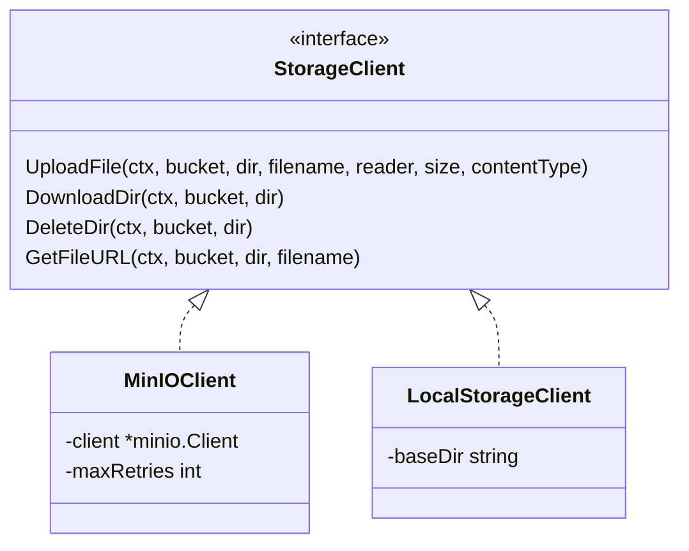
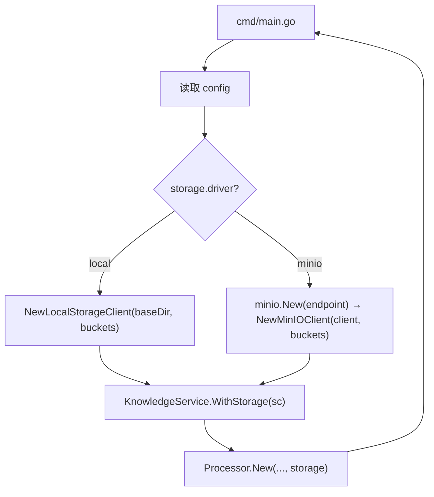

# OpsMind V1.1 — 文件存储层抽象（TECH）

> 版本：V1.1 · 主题：存储简化 · 状态：📋 规划中

## 1. 设计目标

- `StorageClient` 接口零改动，新增 `LocalStorageClient` 实现
- 配置驱动选择（`local` / `minio`），默认 `local`
- bucket 配置收敛到 config，消除硬编码
- MinIO 从必选变可选，本地模式零外部对象存储依赖

## 2. 存储引擎抽象

### 2.1 接口（升级为目录式）

目录式存储（markdown + images 多文件），原单文件接口废弃：

```go
// server/internal/adapter/storage_client.go
type StorageClient interface {
    // 上传单文件到 bucket/{dir}/{filename}
    UploadFile(ctx context.Context, bucket, dir, filename string, reader io.Reader, size int64, contentType string) error
    // 下载整个目录，返回文件名→reader 映射
    DownloadDir(ctx context.Context, bucket, dir string) (map[string]io.ReadCloser, error)
    // 删除整个目录（递归，幂等）
    DeleteDir(ctx context.Context, bucket, dir string) error
    // 获取单文件访问 URL（MinIO 预签名 / 本地路径）
    GetFileURL(ctx context.Context, bucket, dir, filename string) (string, error)
}
```

### 2.2 实现



### 2.3 LocalStorageClient 实现

```go
// server/internal/adapter/storage_local.go
type LocalStorageClient struct {
    baseDir string
}

func NewLocalStorageClient(baseDir string, buckets ...string) (*LocalStorageClient, error) {
    // 创建 {baseDir}/{bucket} 目录
}

func (c *LocalStorageClient) UploadFile(ctx, bucket, dir, filename, reader, size, contentType) error {
    // path = filepath.Join(baseDir, bucket, dir, filename)
    // os.MkdirAll(filepath.Dir(path), 0755) + os.Create + io.Copy
}

func (c *LocalStorageClient) DownloadDir(ctx, bucket, dir) (map[string]io.ReadCloser, error) {
    // 遍历 {baseDir}/{bucket}/{dir}/ 下所有文件
    // 返回 filename → ReadCloser 映射（包含 markdown.md + images/*）
}

func (c *LocalStorageClient) DeleteDir(ctx, bucket, dir) error {
    // os.RemoveAll(filepath.Join(baseDir, bucket, dir))，幂等
}

func (c *LocalStorageClient) GetFileURL(ctx, bucket, dir, filename) (string, error) {
    // 返回 filepath.Join(baseDir, bucket, dir, filename)
}
```

**路径映射**：`{baseDir}/{bucket}/{dir}/{filename}`，目录式存储。

**无需重试**：本地文件系统操作失败多为磁盘满/权限错误，重试无意义。

**无需内存缓冲**：`UploadFile` 直接 `io.Copy` 到文件。

### 2.4 MinIOClient 改造

MinIO 原单文件接口改为目录式：
- `UploadFile`：`PutObject(bucket, dir+"/"+filename, reader, size, PutObjectOptions{ContentType})`
- `DownloadDir`：列出 `bucket/{dir}/` 前缀所有对象，逐个 `GetObject` 返回映射
- `DeleteDir`：列出 `bucket/{dir}/` 前缀所有对象，逐个 `RemoveObject`（幂等）
- `GetFileURL`：`PresignedGetObject(bucket, dir+"/"+filename, expiry)`

## 3. 配置层

### 3.1 新增 StorageConfig

```go
// server/internal/config/config.go
type StorageConfig struct {
    Driver  string       `mapstructure:"driver"`   // local | minio
    Local   LocalStorageConfig `mapstructure:"local"`
    MinIO   MinIOConfig   `mapstructure:"minio"`
    Buckets BucketConfig  `mapstructure:"buckets"`
}

type LocalStorageConfig struct {
    BaseDir string `mapstructure:"base_dir"`
}

type BucketConfig struct {
    Documents string `mapstructure:"documents"`
    Published string `mapstructure:"published"`
}
```

### 3.2 默认值

```yaml
storage:
  driver: local
  local:
    base_dir: ./data/storage
  minio:
    endpoint: localhost:9000
    access_key: minioadmin
    secret_key: minioadmin
    use_ssl: false
  buckets:
    documents: opsmind-documents
    published: opsmind-published
```

### 3.3 配置收敛

消除以下硬编码，统一从 `config.StorageConfig.Buckets` 读取：

| 原位置 | 原值 | 改为 |
|---|---|---|
| `main.go:182` | `"opsmind-attachments", "opsmind-documents", "opsmind-published"` | `cfg.Storage.Buckets.Documents`, `cfg.Storage.Buckets.Published`（删 attachments，零使用） |
| `knowledge_service.go:40-42` | `minioBucketDocs`/`minioBucketPublished` 常量 | `s.cfg.Storage.Buckets.Documents` / `Published` |

## 4. 启动流程变化



- `driver=local`：不创建 `*minio.Client`，不调用 `minio.New`
- `driver=minio`：与 V1.0 行为一致

## 5. 调用方影响

### 5.1 knowledge_service.go

- bucket 名从 config 读取（删包级常量）
- `articleContentKey(title)` 返回的 key 改为目录名（无扩展名，文件名固定 `markdown.md`）
- `formatArticleText(title, content)` 生成 `# {title}\n\n{content}`，存为 `markdown.md`，contentType `text/markdown`
- `uploadMinioAsync` → `uploadArticleFilesAsync`：调用 `storage.UploadFile` 上传 `markdown.md`；若解析提取了图片，逐个上传 `images/{hash}.ext`
- `moveMinioFile` → `moveArticleDir`：调用 `storage.DownloadDir` + `UploadFile` 逐文件迁移 + `DeleteDir`
- `deleteMinioFile` → `deleteArticleDir`：调用 `storage.DeleteDir`

### 5.2 processor.go

- `resolveContent` 调用 `storage.DownloadDir` 读取整个文章目录
- 从返回的文件映射中取 `markdown.md` 解析为正文
- 图片文件暂不参与 embedding（仅正文文本分块），但保留在目录中供前端展示

### 5.3 文档解析器

- 当前 `docParser.Parse` 只提取纯文本，V1.1 需增强为提取文本 + 图片
- PDF/DOCX 解析时提取内嵌图片，存为 `images/{hash}.ext`，正文 Markdown 用相对路径 `` 引用
- 每篇文章存储为目录：`markdown.md` + `images/`，正文用相对路径 `` 引用图片

### 5.4 删除 opsmind-attachments

- `main.go` 启动时不再创建 `opsmind-attachments` 桶（零使用）

## 6. docker-compose 变化

### 6.1 MinIO 服务改为可选

```yaml
services:
  minio:
    profiles: ["storage"]    # 新增 profile，默认不启动
    # ... 其余不变

  opsmind-server:
    volumes:
      - ./data/storage:/app/data/storage    # 新增本地存储卷
    environment:
      - OPSMIND_STORAGE_DRIVER=local        # 默认 local
```

- `docker compose up`：本地模式，不启动 MinIO
- `docker compose --profile storage up`：MinIO 模式（需同时设 `OPSMIND_STORAGE_DRIVER=minio`）

### 6.2 卷变化

```yaml
volumes:
  postgres_data:
  minio_data:
  # 本地存储用 bind mount，不需要命名卷
```

## 7. 改动清单

| 文件 | 改动 |
|---|---|
| `server/internal/adapter/storage_client.go` | 接口升级为目录式（UploadFile/DownloadDir/DeleteDir/GetFileURL） |
| `server/internal/adapter/storage_local.go` | 新增 LocalStorageClient（目录式实现） |
| `server/internal/adapter/storage_minio.go` | MinIOClient 改造为目录式（原 storage_client.go 重命名） |
| `server/internal/adapter/doc_parser.go` | 增强解析器：提取文本 + 图片，生成 Markdown + images |
| `server/internal/config/config.go` | 新增 StorageConfig / LocalStorageConfig / BucketConfig |
| `server/internal/config/config.yaml` | 新增 storage 配置块 |
| `server/cmd/main.go` | 按 driver 选择创建 LocalStorageClient 或 MinIOClient；bucket 从 config 读取 |
| `server/internal/service/knowledge_service.go` | bucket 从 config 读取；UploadFile 目录式上传 markdown.md + images；moveArticleDir/deleteArticleDir 目录操作；`.md` 后缀 + `text/markdown` |
| `server/internal/rag/processor.go` | resolveContent 改为 DownloadDir 读取 markdown.md |
| `docker-compose.yml` | MinIO 加 profile；server 加本地存储卷 |
| `.env.example` | 新增 `OPSMIND_STORAGE_DRIVER` / `OPSMIND_STORAGE_LOCAL_BASE_DIR` |
| `docs/TECH.md` | 同步存储架构（目录式接口、双实现、可选 MinIO） |

## 8. 验证

- `driver=local`：文档上传 → 发布 → embedding 全链路，文件落本地磁盘
- `driver=minio`：回归 V1.0 行为
- `storage == nil`：降级路径不变
- build + go vet + go test 通过
