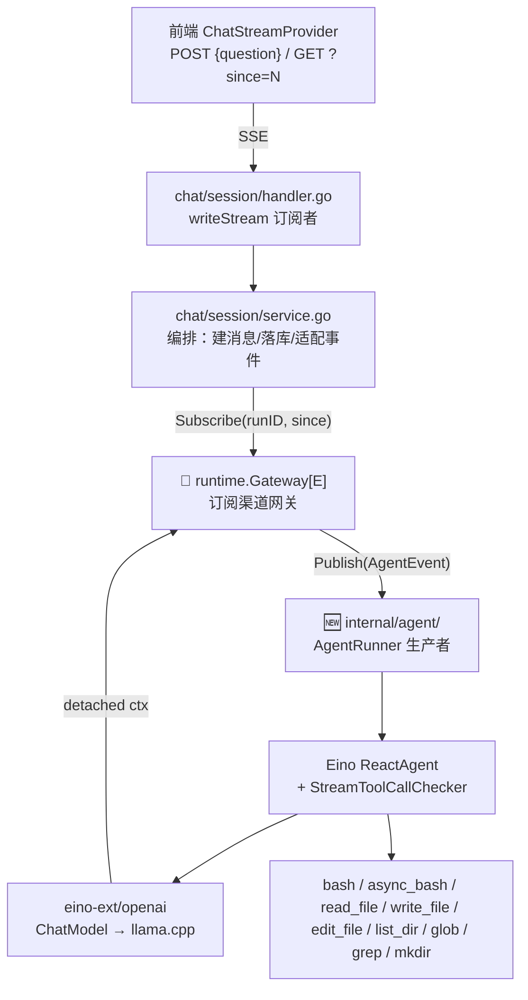

# V1.3 — Agent 基座（技术方案）

## 1. 架构

### 1.1 订阅渠道制（对齐先进实现）



生产者（AgentRunner）与交付渠道（Gateway）解耦：runner 只产出事件，chat 层订阅并 Publish 到网关。

### 1.2 调研来源映射

| 来源 | 机制 | 证据 |
|------|------|------|
| LangGraph Server | channel+worker 分离、`join_stream(last_event_id)`、`on_disconnect=continue`、多订阅者 | [agent-server](https://docs.langchain.com/langsmith/agent-server) |
| Mastra Durable | PubSub topic + cache 重放、`observe(runId,offset)` | [durable-agents](https://mastra.ai/docs/harness/durable-agents) |
| OpenAI background | `sequence_number` + `starting_after` 游标、断线 run 继续 | [background mode](https://developers.openai.com/api/docs/guides/background) |
| Eino | `StreamReader` 点对点、`Copy(n)` 实时副本、无内置 replay（应用层职责） | [schema/stream.go](https://github.com/cloudwego/eino/blob/main/schema/stream.go) |

### 1.3 与现有流程的关系

聊天流生成引擎为 Eino ReactAgent（Agent Loop）；交付渠道为 `Gateway` 通用网关（订阅渠道制）。`rag/` 引擎代码保留，作 `search_knowledge_base` 工具后端。

## 2. 网关引擎（`infra/runtime/gateway.go`）

### 2.1 核心 API

```go
// Gateway 订阅渠道制网关。E 为事件类型（泛型，不绑业务）。
type Gateway[E any] struct {
    runs   map[string]*run[E]       // runID → run
    setSeq func(evt E, seq int) E   // 注入 seq
}
func (g *Gateway[E]) Start(runID string, cancel context.CancelFunc) error
func (g *Gateway[E]) Publish(runID string, evt E)
func (g *Gateway[E]) Subscribe(runID string, since int) (replay []E, ch <-chan E, unsub func(), ok bool)
func (g *Gateway[E]) Finish(runID string)   // 30s grace
func (g *Gateway[E]) Cancel(runID string) bool
func (g *Gateway[E]) Active(runID string) bool
```

### 2.2 设计维度

| 维度 | 设计 |
|------|------|
| key | `string runID`（通用，chat 用 sessionID 字符串，未来其他渠道用各自 ID） |
| 事件类型 | 泛型 `E`（不绑业务） |
| 缓冲 | 环形缓冲 count（1024）+ 30s grace（覆盖最旧事件，防止长生成内存膨胀） |
| 结构 | `run[E]` + `eventStore[E]`（Broadcaster/EventStore 职责分离） |
| 慢订阅者 | 非阻塞 drop（可凭 since 重连补回） |

### 2.3 eventStore 环形缓冲

```go
type eventStore[E any] struct {
    buffer []E  // 定长环形（len==cap==1024），覆盖最旧
    head   int  // 下一个写入位置
    len    int  // 已写入事件数（持续增长；buffer 保留最近 cap 个）
}
// replay(since) 返回 seq >= since 的事件；游标过期从现存最旧开始
```

## 3. Eino 集成

### 3.1 ChatModel 构造（eino-ext/openai）

```go
openai.NewChatModel(ctx, &openai.ChatModelConfig{
    APIKey:  cfg.LLMAPIKey,
    Model:   cfg.LLMModel,
    BaseURL: cfg.LLMBaseURL,  // llama.cpp
})
```

### 3.2 ReactAgent

```go
react.NewAgent(ctx, &react.AgentConfig{
    ToolCallingModel:       chatModel,       // ChatModel 作为工具调用模型
    ToolsConfig:            compose.ToolsNodeConfig{Tools: tools},
    MaxStep:                20,              // ~9 次工具调用
    StreamToolCallChecker:  streamToolCallChecker,
})
```

### 3.3 StreamToolCallChecker（llama.cpp 兼容）

llama.cpp 可能先输出文本再输出 tool call，或发前导空 chunk。checker 读完流判断是否含 `ToolCalls`（参考 Eino FAQ）。

### 3.4 中间消息 + 最终流

```go
opt, future := react.WithMessageFuture()
reader, _ := agent.Stream(ctx, input, opt)
// future.GetMessageStreams() → 中间消息（thinking/tool_call/tool_result）
// reader.Recv() → 最终回答 token + reasoning
```

## 4. 工具实现

对标 Claude Code / SWE-agent ACI 的基础工具集（业务无关原语）。

| 工具 | 对标 | 参数 | 高级特性 |
|------|------|------|---------|
| bash | Claude Code Bash | command, description, timeout | GitBash 自适应（Windows）、description 强制意图、timeout 可配（上限 10min）、workDir sandbox、截断 |
| async_bash | Claude Code Bash（流式） | command, description | StreamableTool 接口，`schema.Pipe[string]` 流式输出 stdout/stderr（长命令不阻塞 SSE 流） |
| read_file | Claude Code Read | path, offset, limit | 行号输出（cat -n）、offset/limit 行范围、1MB 行 buffer |
| write_file | SWE-agent write+append | path, content, mode | mode: overwrite（默认）/ append（追加，不存在则创建）、自动建父目录 |
| edit_file | Claude Code Edit / Aider SEARCH-REPLACE | path, old_string, new_string, replace_all | str_replace 精确匹配、唯一性校验、失败时邻近行反馈 |
| list_dir | Claude Code List / SWE-agent ls | path | 类型(d/f)/大小/时间、目录优先排序 |
| glob | Claude Code Glob / Cursor file_search | pattern | ** 递归匹配、?/[abc] 模式 |
| grep | Claude Code Grep / SWE-agent search_file | pattern, path, include, ignore_case | 正则递归搜索、行号、include 过滤 |
| mkdir | 基础文件操作 | path | 递归创建父目录 |

### 4.1 SubAgent（对标 Claude Code Agent 工具）

两个内置子 Agent 通过 `adk.NewAgentTool` 包装为工具，父 Agent 可委托任务给子 Agent（上下文隔离）：

| 子 Agent | 工具集 | 对标 |
|---------|--------|------|
| research | read_file / glob / grep / list_dir（只读探查） | Claude Code Explore |
| coder | bash / async_bash / edit_file / write_file / mkdir（读写操作） | Claude Code general-purpose |

`BuildReadOnlyTools()` 供 research 子 Agent；`BuildTools()` 供主 Agent + coder 子 Agent。

### 4.2 str_replace 设计依据（行业共识）

str_replace 是 Claude Code / Anthropic API / Aider / SWE-agent / OpenHands / Cursor 全采用的编辑原语：
- 只替换匹配片段，不重写整文件（省 token、抗行号漂移）
- 严格精确匹配（非正则、非模糊）— Claude Code 安全策略
- 唯一性校验：非 replace_all 时 old_string 必须唯一，否则报错（避免歧义替换）
- 失败时显示邻近行（Aider 最佳实践）— 让模型自纠正

### 4.3 GitBash 自适应

bash 工具在 Windows 默认用 GitBash（对齐开发环境）：
- 优先 `OPSMIND_AGENT_BASH_BIN` env 覆盖
- Windows 探测 GitBash 常见路径（Program Files/Git/bin/bash.exe 等）
- 非 Windows 用 PATH 中的 bash，兜底 sh

### 4.4 安全

| 措施 | 实现 |
|------|------|
| workDir sandbox | safeJoin + filepath.Rel 二次校验，防 path traversal（.. / 绝对路径） |
| 命令超时 | context.WithTimeout（上限 10min） |
| 输出截断 | maxBytes 64KB |
| 工具失败返回字符串 | bash 失败返回 exit_code（不抛 error），agent 自行判断 |

## 5. SSE 桥接

### 5.1 事件格式

```go
// writeSSEEvent：id: {seq}\ndata: {json}\n\n
fmt.Fprintf(w, "id: %d\ndata: %s\n\n", evt.Seq, jsonData)
```

前端 `consume()` 只解析 `data:` 行，`id:` 被过滤忽略——不破坏前端。`id:` 供 SSE 标准 Last-Event-ID 重连（对齐 LangGraph）。

### 5.2 事件类型映射

| Eino 来源 | AgentEvent.Type | 前端 reducer |
|-----------|-----------------|------------|
| MessageFuture ReasoningContent | `reasoning` | ✅ 已有 case（合并到 reasoning part） |
| StreamReader Content | `token` | ✅ 已有 case（合并到 text part） |
| MessageFuture ToolCalls | `tool_call` | ✅ 已有 case（ID 合并 + JSON 闭合检测） |
| MessageFuture Role==Tool | `tool_result` | ✅ 已有 case（ID 配对到 tool_call） |
| Stream EOF | `done` | ✅ 已有 case |
| 错误 | `error` | ✅ 已有 case |

## 6. 热切换

```go
// setupLLMHotSwap：LLMConfigManager.OnChange 单回调
llmConfigSvc.GetManager().OnChange(func() {
    agentModelFactory.OnConfigChange()  // 重建 Eino ChatModel
    embedder.SetClient(...)             // 重建 Embedding
    knowledgeService.SetDefaultEmbeddingConfig(...)
})
```

> Agent / Embedding / 知识库三路重建须合入同一 OnChange 回调（OnChange 是覆盖式注册，后注册覆盖前者）。

## 7. 配置

| 环境变量 | 默认 | 用途 |
|---------|------|------|
| `OPSMIND_AGENT_WORK_DIR` | `./data/agent-workspace` | 工具沙箱目录 |
| `OPSMIND_AGENT_DB` | `./data/agent.db` | Agent 对话数据 SQLite 文件路径 |
| `OPSMIND_AGENT_TOOL_TIMEOUT` | `30s` | bash 执行超时 |
| `OPSMIND_AGENT_TOOL_MAX_BYTES` | `65536` | 输出截断上限 |

## 8. API

线程 CRUD + 流式对话 + 异步任务（SQLite 存储，与业务库隔离）：

| 端点 | 方法 | 说明 |
|------|------|------|
| `/api/v1/portal/threads` | POST | 创建线程 |
| `/api/v1/portal/threads` | GET | 列出当前用户线程 |
| `/api/v1/portal/threads/:id` | GET | 获取线程详情（含消息） |
| `/api/v1/portal/threads/:id` | DELETE | 删除线程 |
| `/api/v1/portal/threads/:id` | PATCH | 更新线程（标题） |
| `/api/v1/portal/threads/:id/stream` | POST | 发送消息，SSE 流式回答 |
| `/api/v1/portal/threads/:id/stream?since=N` | GET | 断线重连同游标重放 |
| `/api/v1/portal/threads/:id/cancel` | POST | 取消生成 |
| `/api/v1/portal/threads/:id/tasks` | POST | 创建异步任务 |
| `/api/v1/portal/threads/:id/tasks` | GET | 列出线程的异步任务 |
| `/api/v1/portal/tasks/:id` | GET | 查询任务状态 |
| `/api/v1/portal/tasks/:id/cancel` | POST | 取消任务 |

POST stream body：`{"question": "..."}`。

## 9. 验证计划

1. `make dev-db` + `make dev-ai`（PostgreSQL + llama.cpp）
2. 配置 LLM：admin UI BaseURL=http://localhost:8081/v1, Model=Qwen3-4B
3. 前端发问 → SSE token 流 + done
4. 问「列出当前目录文件」→ tool_call + tool_result + token + done
5. 断线重连：`GET ?since=N` 续传
6. 多订阅者：同 runID 两连接
7. 热切换：改配置 → 新对话用新模型
8. 网关单测：`go test ./test/infra/runtime/... -tags=integration`
9. 文档上传不受影响（Processor 路径不变）
