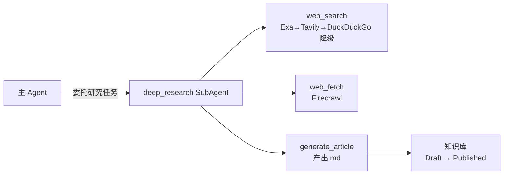

# V1.4 — 深度搜索工具（PRD）

## 1. 背景与目标

### 1.1 现状

V1.3 交付了 Agent 基座（Eino ReactAgent + 订阅渠道网关 + 9 OS 工具 + SubAgent + SQLite 隔离），但 Agent 只能操作本地文件系统，无法获取网络信息。运维场景中大量问题依赖外部知识（错误码、CVE、版本兼容、最佳实践），内部知识库未命中时无回退路径。

### 1.2 目标

为 Agent 配备深度搜索工具链，实现"搜索网络资料 → 爬取页面 → 整理产出 md 文章 → 写入知识库"闭环。效果优先，API key 模式，零 Docker 依赖。

- Exa API 语义搜索（主力，效果最佳，highlights 10x token 效率）+ Tavily API 降级（生态最成熟）
- Firecrawl API 页面提取（URL → 干净 Markdown，JS 渲染）
- `deep_research` SubAgent 委托模式（与 research / coder 并列）
- `generate_article` 产出结构化 Markdown + frontmatter，写入知识库（Draft 状态，人工审核后 Published 进 RAG）
- 复用 V1.3 的 SSE 事件流（tool_call / tool_result）和 parts 数组模型渲染

### 1.3 非目标

- 文件式知识库目录树 + INDEX.md + kb_modify 工具链（V1.5 知识库组织）
- Agent ReAct 循环替代固定 RAG 管道（V2.0 Agentic RAG）
- Eino DeepAgent / interrupt/resume HITL（V2.0+）
- SearXNG / Firecrawl 自托管（依赖过重，效果不如 API；SearXNG 仅在"完全免费 + 数据不出域"需求下才有价值）

## 2. 功能需求

### 2.1 搜索 API 集成（`server/internal/infra/adapter/`）

新建搜索 adapter，复用 V1.3 的 adapter 接口模式（HTTP 客户端 + 接口抽象）。全部 API key 模式，零 Docker 依赖。

| API | 用途 | 效果 | Go 集成 |
|-----|------|------|---------|
| Exa | 主力搜索：语义搜索 + highlights 10x token 效率 | 最佳（People R@1 75.5%，Publication R@1 63.3%） | `net/http` POST `https://api.exa.ai/search` |
| Tavily | 降级搜索：Agent 优化型，返回重排分块 + LLM 答案 | 成熟（open_deep_research / gpt-researcher 默认） | `net/http` POST `https://api.tavily.com/search` |
| Firecrawl | 页面提取：URL → 干净 Markdown，JS 渲染 | 最佳（96% 网页覆盖，P95 3.4s） | `net/http` POST `https://api.firecrawl.dev/v2/scrape` |

> Exa vs Tavily 效果对比来自 Exa 官方 benchmark（`exa.ai/versus/tavily`）。参考项目主流选择 API key 模式：open_deep_research / gpt-researcher 默认 Tavily，deep-research 默认 Firecrawl，仅 local-deep-research 用 SearXNG 自托管（隐私卖点非效果）。

### 2.2 Agent 工具链（`server/internal/agent/tools/`）

新增 3 个工具（唯一入口原则：同类操作只暴露一个工具，后端在内部降级），注册到 `ToolFactory.BuildDeepResearchTools()`。

| 工具 | 类型 | 参数 | 返回 |
|------|------|------|------|
| `web_search` | InvokableTool | `query`, `max_results`(默认 5) | 搜索结果列表（title + url + snippet） |
| `web_fetch` | InvokableTool | `url` | 干净 Markdown 内容 + metadata |
| `generate_article` | InvokableTool | `title`, `content`, `sources`, `kb_id` | 写入知识库的文章 ID + 状态 |

**`web_search` 降级链**（Agent 不感知，逐级降级直到本地兜底）：
1. Exa（主力，若 API Key 配置）→ 语义搜索 + highlights
2. Tavily（降级，若 API Key 配置）→ Agent 优化型搜索
3. DuckDuckGo（本地兜底，零配置无需 key）→ 关键词搜索
4. 全部失败 → 返回错误，Agent 决定是否重试或放弃

**`web_fetch` 降级链**（Agent 不感知）：
1. Firecrawl API（主力，JS 渲染 + 干净 Markdown）
2. 本地 `http.Get` + `html-to-markdown`（兜底，无 JS 渲染，简单页面可用）
3. 全部失败 → 返回错误

> DuckDuckGo 本地兜底参考 DeepResearchAgent 的 `DDGSSearch`（`reference/DeepResearchAgent/src/tool/default_tools/search/`），无需 API key，零 Docker 依赖。web_fetch 本地兜底用 Go 标准库 `net/http` + `golang.org/x/net/html` 转 Markdown。

**工具 schema 设计原则**（最小化模式，防 LLM 误用）：
- 参数最小化，`strict: true` + `additionalProperties: false` 保证可靠 JSON 生成
- `description` 字段是 LLM 决策的主要信号，明确说明"短、关键字、最多三个查询"
- `web_search` 查询 <1500 字符，关键字为主
- `generate_article` 的 `sources` 必填（URL 列表），frontmatter 维护编号→URL 映射

### 2.3 deep_research SubAgent

新建 `deep_research` SubAgent，与 `research` / `coder` 并列，通过 `adk.NewAgentTool` 注册到主 Agent。

| SubAgent | 工具集 | 对标 |
|---------|--------|------|
| research | read_file / glob / grep / list_dir（只读本地） | Claude Code Explore |
| coder | bash / async_bash / edit_file / write_file / mkdir（读写本地） | Claude Code general-purpose |
| **deep_research**（新增） | web_search（唯一入口，Exa→Tavily→DuckDuckGo 降级）/ web_fetch / generate_article | GPT-Researcher |

**委托模式**：主 Agent 不直接使用搜索工具——通过 SubAgent 委托（与 GPT-Researcher MCP 委托模式一致）。SubAgent 有隔离的上下文窗口，在狭窄主题上迭代，不污染主 Agent 上下文。

### 2.4 知识库输出

`generate_article` 产出结构化 Markdown，复用现有 `KnowledgeArticle` 模型 + `StorageClient` + 状态机 + `CreateArticle` 流程。

| 项 | 设计 |
|----|------|
| frontmatter | `title` / `source_type: deep_research` / `sources`（URL 列表，含 title + accessed）/ `created` |
| 存储路径 | `opsmind-documents/kb-{kbID}/draft/{filename}.md`（图片统一存 `opsmind-documents/image/`） |
| 引用标注 | 正文中行内编号 `[1]` `[2]`，frontmatter `sources` 维护编号→URL 映射（不用脚注，避免 chunker 切割引用） |
| 状态管控 | 复用现有状态机：Draft(1) → Reviewing(2) → Published(4)；`generate_article` 调用 `CreateArticle` 传入 `SourceType=3`，默认 Draft |
| RAG 衔接 | Published 后触发现有 chunker → embedder → pgvector + BM25；发布时文件从 `draft/` 迁移到 `published/`（复用 `moveArticleDir`） |
| SourceType | 新增 `SourceTypeDeepResearch = 3`（enums.go）+ `ArticleSourceTypeText` 分支 |
| 重复检测 | `generate_article` 调用 `CreateArticle` 内已含 `checkTitleUnique`，已存在则报错让 Agent 决定更新 |
| 正文格式 | `formatArticleText` 自动在正文前加 `# {title}\n\n` 一级标题 |

### 2.5 SSE 事件

复用 V1.3 的事件类型，无新增事件：

| 事件 | 来源 | 前端渲染 |
|------|------|---------|
| `tool_call`（web_search/web_fetch/generate_article） | SubAgent 工具调用 | ToolCallPart 卡片 |
| `tool_result`（搜索结果/页面内容/文章写入确认） | SubAgent 工具返回 | 配对到 tool_call |
| `reasoning` | SubAgent 思考过程 | ReasoningPart 折叠 |
| `token` | SubAgent 最终报告 | TextPart |

`Label` 字段区分工具类型（web_search / web_fetch / generate_article）。SubAgent 的 tool_call/tool_result 通过 `adk.NewAgentTool` 的事件流透传到主 Agent，前端无需区分是主 Agent 还是 SubAgent 的工具调用。

## 3. 非功能需求

- **降级**：所有搜索/提取工具都有本地兜底——web_search 降级到 DuckDuckGo（零配置）；web_fetch 降级到本地 `http.Get` + html-to-markdown。API 不可用不阻塞 Agent。
- **成本**：Exa $7-15/千次（主力）；Tavily 有免费 tier；DuckDuckGo + 本地 fetch 零成本兜底
- **超时**：web_search 10s（Exa 15s）；web_fetch 30s（Firecrawl JS 渲染）/ 10s（本地兜底）
- **截断**：搜索结果 max 5 条；web_fetch 内容 maxBytes 64KB（复用 V1.3 maxBytes 机制）
- **零 Docker 依赖**：V1.4 不新增任何 Docker 服务，全部 API key 模式 + 本地标准库兜底

## 4. 验收标准

| 验收项 | 标准 |
|--------|------|
| web_search（Exa） | 配置 Exa API Key，查询"PostgreSQL high CPU" → 返回语义相关结果 + highlights |
| web_search（Tavily 降级） | Exa 故障时，配置 Tavily Key，web_search 自动降级到 Tavily |
| web_search（本地兜底） | 无任何 API Key，web_search 降级到 DuckDuckGo → 返回搜索结果 |
| web_fetch（Firecrawl） | 配置 Firecrawl Key，给定 URL → 返回干净 Markdown（含 JS 渲染页面） |
| web_fetch（本地兜底） | Firecrawl 不可用，web_fetch 降级到本地 http.Get → 返回简单 Markdown |
| generate_article | 搜索结果 → md 文章写入知识库（Draft 状态 + frontmatter + sources） |
| deep_research SubAgent | 主 Agent 委托"调研 PostgreSQL 17 新特性" → SubAgent 搜索+爬取+产出文章 |
| SSE 渲染 | web_search/web_fetch 的 tool_call/tool_result 正确渲染为 ToolCallPart |
| RAG 衔接 | 文章 Published 后 → chunker → embedder → pgvector + BM25 可检索 |
| 零 Docker 依赖 | V1.4 不新增 Docker 服务，`make dev` 启动后即可用（需配 API Key） |
