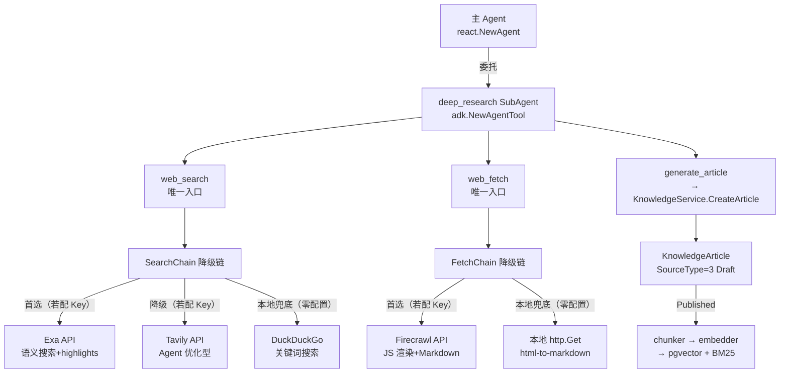
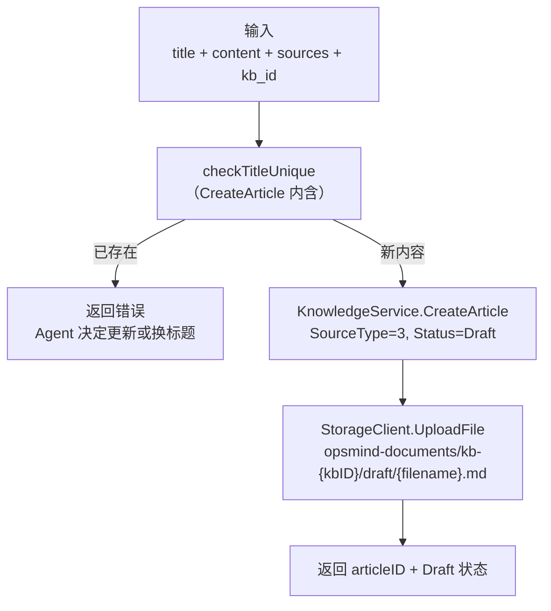

# V1.4 — 深度搜索工具（技术方案）

## 1. 架构

### 1.1 工具链与 SubAgent 集成



生产者（deep_research SubAgent）与交付渠道（V1.3 Gateway）解耦：SubAgent 的 tool_call/tool_result/reasoning 事件通过 `adk.NewAgentTool` 透传到主 Agent 的事件流，复用现有 SSE 渲染。

### 1.2 调研来源映射

| 来源                              | 机制                                                                 | 借鉴点                                                                                                        |
| --------------------------------- | -------------------------------------------------------------------- | ------------------------------------------------------------------------------------------------------------- |
| DeepResearchAgent                 | PlanDecision 规划器+执行器分离；DDGSSearch 零配置 DuckDuckGo 兜底    | SubAgent 委托 + DuckDuckGo 本地兜底；`reference/DeepResearchAgent/src/tool/default_tools/search/`           |
| open_deep_research                | LangChain 官方深度研究，默认 Tavily API                              | API key 模式（非自托管）；`reference/open_deep_research/README.md`                                          |
| Gemini-Search                     | grounding metadata 提取 sources（uri + title + snippet）             | frontmatter sources 格式；`reference/Gemini-Search/server/routes.ts`                                        |
| SurfSense                         | build_note_document 将 markdown 包装为知识库文档 → 自动 chunk+embed | generate_article → KnowledgeArticle 写入模式；`reference/SurfSense/surfsense_mcp/note_ingestion.py`        |
| 12-factor-agents                  | Factor 10 小而聚焦 agent（≤20 步）；Factor 4 工具=结构化输出        | deep_research SubAgent 聚焦单一职责；`reference/12-factor-agents/content/factor-10-small-focused-agents.md` |
| Exa vs Tavily benchmark           | Exa 效果全面领先（People R@1 75.5% vs 40.5%）                        | Exa 作为降级链首选；`exa.ai/versus/tavily`                                                                  |
| engineering-skills/research skill | 6 步调研流程 + 对抗性验证 + 结论优先骨架 + 源优先级                  | deep_research 系统提示词 8 条原则（§4.2）；`reference/engineering-skills-research/SKILL.md`                |
| V1.3 SubAgent 模式                | `adk.NewChatModelAgent` + `adk.NewAgentTool`，事件透传           | deep_research SubAgent 注册；`server/internal/agent/agent.go`                                               |

## 2. 搜索 Adapter（`infra/adapter/search_client.go`）

### 2.1 接口定义

```go
// SearchClient 搜索后端抽象（Exa / Tavily / DuckDuckGo 实现同一接口）。
type SearchClient interface {
    Search(ctx context.Context, query string, maxResults int) ([]SearchResult, error)
}

type SearchResult struct {
    Title    string `json:"title"`
    URL      string `json:"url"`
    Snippet  string `json:"snippet"`
    Engine   string `json:"engine,omitempty"` // 来源引擎
}

// FetchClient 页面提取抽象（Firecrawl API / 本地 http.Get 实现）。
type FetchClient interface {
    Fetch(ctx context.Context, url string) (markdown string, meta FetchMeta, err error)
}

type FetchMeta struct {
    Title       string `json:"title"`
    Description string `json:"description"`
}
```

### 2.2 降级选择器

`web_search` / `web_fetch` 不直接依赖某个后端，而是通过降级链按优先级尝试，首个成功则返回：

```go
// SearchChain 搜索降级链：Exa → Tavily → DuckDuckGo（本地兜底）。
type SearchChain struct {
    backends []SearchClient
}

func (c *SearchChain) Search(ctx context.Context, query string, maxResults int) ([]SearchResult, error) {
    var lastErr error
    for _, backend := range c.backends {
        results, err := backend.Search(ctx, query, maxResults)
        if err == nil {
            return results, nil
        }
        lastErr = err // 降级到下一个后端
    }
    return nil, fmt.Errorf("所有搜索后端不可用，最后错误: %w", lastErr)
}

// FetchChain 提取降级链：Firecrawl API → 本地 http.Get 兜底。
type FetchChain struct {
    backends []FetchClient
}
```

后端顺序由 main.go 接线时决定：配置了 key 的加入降级链，本地兜底始终在末尾。Agent 不感知后端差异。

### 2.3 Exa 实现（降级链首选，需 API Key）

```go
// ExaClient 语义搜索客户端（效果最佳，highlights 10x token 效率）。
type ExaClient struct {
    apiKey  string
    baseURL string  // https://api.exa.ai
}

// Search POST /search { query, type: "auto", contents: { highlights: true }, numResults }
```

### 2.4 Tavily 实现（降级，需 API Key）

```go
// TavilyClient Agent 优化型搜索客户端（open_deep_research / gpt-researcher 默认后端）。
type TavilyClient struct {
    apiKey  string
    baseURL string  // https://api.tavily.com
}

// Search POST /search { query, max_results, include_answer: true }
// 返回重排分块 + LLM 答案
```

### 2.5 DuckDuckGo 实现（本地兜底，零配置）

```go
// DuckDuckGoClient 零配置搜索兜底（无需 API Key，无需 Docker）。
// 参考 DeepResearchAgent 的 DDGSSearch（reference/DeepResearchAgent/src/tool/default_tools/search/）。
type DuckDuckGoClient struct {
    httpClient *http.Client
}

// Search GET https://html.duckduckgo.com/html/?q={query}
// 解析 HTML 结果页（无 JSON API，解析 <a class="result__a"> 标题 + URL + snippet）
```

### 2.6 Firecrawl API 实现（页面提取主力，需 API Key）

```go
// FirecrawlClient 页面提取客户端（URL → 干净 Markdown，JS 渲染，96% 网页覆盖）。
type FirecrawlClient struct {
    apiKey  string
    baseURL string  // https://api.firecrawl.dev
}

// Fetch POST /v2/scrape { url, formats: ["markdown"] }
// 解析响应: { data: { markdown, metadata: { title, description } } }
```

### 2.7 本地 Fetch 兜底（零配置）

```go
// LocalFetchClient 本地页面提取兜底（无 JS 渲染，简单页面可用）。
// Go 标准库 net/http + golang.org/x/net/html 转 Markdown。
type LocalFetchClient struct {
    httpClient *http.Client
}

// Fetch GET {url} → 读取 HTML → 去 script/style → 提取 title + 正文 → 转 Markdown
// 不支持 JS 渲染页面（SPA），但静态页面足够兜底
```

### 2.8 复用现有 HTTP 辅助

Exa/Tavily/Firecrawl 客户端复用 `adapter/llm_client.go` 的 `doHTTPRequest` + `retryableError`（HTTP 429/503 指数退避重试，`defaultMaxRetries=3`，`retryBaseDelay=500ms`）。DuckDuckGo/LocalFetch 用标准库 `net/http` 直接请求。

## 3. Agent 工具（`agent/tools/`）

### 3.1 工具实现

新建 3 个工具文件，实现 Eino `InvokableTool` 接口（`Info` + `InvokableRun`）：

| 工具                 | 文件                    | 依赖注入                                                       |
| -------------------- | ----------------------- | -------------------------------------------------------------- |
| `web_search`       | `web_search.go`       | `SearchChain`（Exa→Tavily→DuckDuckGo 降级）                   |
| `web_fetch`        | `web_fetch.go`        | `FetchChain`（Firecrawl API→本地兜底）                                   |
| `generate_article` | `generate_article.go` | `ArticleWriter` 接口（避免 Agent 依赖完整 KnowledgeService） |

`web_search` 是搜索的唯一入口——Agent 只看到 `web_search` 工具，不感知 Exa/Tavily/DuckDuckGo 后端差异，降级在 `SearchChain` 内部完成。

### 3.2 工具 schema（最小化模式）

```go
// web_search Info — 最小参数防 LLM 误用
&schema.ToolInfo{
    Name: "web_search",
    Desc: "Search the web for current information. Use short keyword queries, max 3 queries.",
    ParamsOneOf: schema.NewParamsOneOfByParams(map[string]*schema.ParameterInfo{
        "query":       {Type: schema.String, Desc: "Short keyword query (<1500 chars)", Required: true},
        "max_results": {Type: schema.Integer, Desc: "Max results (default 5)", Required: false},
    }),
}
```

### 3.3 ToolFactory 扩展

```go
// ToolFactory 新增 searchChain / fetchChain / articleWriter 字段
type ToolFactory struct {
    workDir       string
    toolTimeout   time.Duration
    maxBytes      int64
    searchChain   adapter.SearchChain   // V1.4 新增（Exa → Tavily → DuckDuckGo）
    fetchChain    adapter.FetchChain     // V1.4 新增（Firecrawl API → 本地兜底）
    articleWriter ArticleWriter          // V1.4 新增
}

// BuildDeepResearchTools 返回深度搜索工具集（供 deep_research SubAgent）。
func (f *ToolFactory) BuildDeepResearchTools() []tool.BaseTool {
    return []tool.BaseTool{
        NewWebSearchTool(f.searchChain, f.toolTimeout),
        NewWebFetchTool(f.fetchChain, f.maxBytes),
        NewGenerateArticleTool(f.articleWriter),
    }
}
```

`searchChain` / `fetchChain` 在 main.go 接线时组装（配置了 key 的 API 加入降级链，本地兜底始终在末尾），ToolFactory 不关心降级逻辑。

### 3.4 ArticleWriter 接口

为避免 Agent 工具依赖完整的 `KnowledgeService`（它有几十个方法），定义最小接口：

```go
// ArticleWriter 知识库文章写入接口（供 generate_article 工具）。
type ArticleWriter interface {
    CreateArticle(ctx context.Context, title, content string, sources []string, kbID int64) (articleID int64, err error)
}
```

`KnowledgeService` 实现此接口（或新增 adapter），内部调用 `CreateArticle(SourceType=3)`。

## 4. deep_research SubAgent（`agent/agent.go`）

### 4.1 注册

`buildSubAgentTools` 追加第三个 SubAgent：

```go
// deep_research 子 Agent（网络搜索 + 知识产出）
deepResearchAgent, err := adk.NewChatModelAgent(ctx, &adk.ChatModelAgentConfig{
    Name:        "deep_research",
    Description: "A research assistant that searches the web, fetches pages, and generates knowledge base articles. Use for deep research tasks requiring external information.",
    Instruction: deepResearchInstruction,
    Model:       chatModel,
    ToolsConfig: adk.ToolsConfig{
        ToolsNodeConfig: compose.ToolsNodeConfig{
            Tools: f.toolFactory.BuildDeepResearchTools(),
        },
    },
})
// 追加到返回的 []tool.BaseTool
```

### 4.2 系统提示词 8 条原则

deep_research SubAgent 的 `Instruction` 遵循 8 条原则，源自 engineering-skills/research skill 的调研方法论（`reference/engineering-skills-research/SKILL.md`）：

```go
const deepResearchInstruction = `You are a deep research assistant for IT operations. Search the web, fetch pages, and produce structured Markdown articles for the knowledge base. Follow these principles:

1. 结论先行 — 文章先给答案（TL;DR），不是调研过程。读者读完第一段就知道核心结论，方法/过程在后。
2. 搜索不信片段 — 搜索摘要不是证据。web_search 找到线索后，必须 web_fetch 抓取源页面确认内容，不靠 snippet 下结论。
3. 对抗性验证 — 负面断言（"不存在/未发布/不支持"）必须尝试证否。搜不到 ≠ 不存在；无法证实或证伪的标记 UNVERIFIED。
4. 源优先级 — 官方文档 > GitHub repo > 技术博客 > SEO 文章。不靠搜索排名排序结果；优先权威源，丢弃 SEO listicle 和重复内容。
5. 引用在断言处 — 每个关键论断行内标注来源 [1]，frontmatter sources 维护编号→URL 映射。不是末尾 URL 堆砌。
6. 区分事实与推断 — 明确区分"源说了什么"（事实）和"因此我认为"（推断）。推断标记为推断，不确定的标记 UNVERIFIED。
7. 主线贯穿 — 一句研究主线贯穿全文，每个章节服务主线。不服务主线的发现砍掉，不因为"调研了就写"。
8. 避坑清单 — 文章末尾列出负面发现（"X 有 Y 限制"/"Z 方案不适用于 W 场景"），每条带证据或证否痕迹。不只写正面推荐。

产出格式：generate_article 写入知识库时，正文用行内引用 [1][2]，frontmatter sources 含 url+title+accessed。文章默认 Draft 状态，人工审核后 Published 进 RAG。`
```

| 原则             | 来源                              | 防止的失败                                  |
| ---------------- | --------------------------------- | ------------------------------------------- |
| 1 结论先行       | report-spine.md §1 TL;DR         | 结论埋在末尾，读者要自己拼凑                |
| 2 搜索不信片段   | SKILL.md Step 3                   | 搜索摘要断章取义，未读原文下结论            |
| 3 对抗性验证     | SKILL.md Step 4                   | "没找到"当"不存在"，照搬二级源"截至X月"时点 |
| 4 源优先级       | general-mode.md Source strategy   | 靠搜索排名/SEO 文章排序，忽略官方文档       |
| 5 引用在断言处   | report-spine.md Format discipline | 末尾 URL 堆砌，正文无引用无法追溯           |
| 6 区分事实与推断 | SKILL.md Step 4                   | 推断当事实写，不确定当确定写                |
| 7 主线贯穿       | report-spine.md The main thread   | 散文式堆砌，无主线，"调研了就写"            |
| 8 避坑清单       | report-spine.md §8               | 只有正面推荐，无负面发现/限制/坑            |

### 4.3 SSE 事件透传

SubAgent 的 tool_call/tool_result 通过 `adk.NewAgentTool` 自动透传到主 Agent 的 `MessageFuture`，由 `AgentRunner.drainMessageStream` 分发为 `EventToolCall`/`EventToolResult`。**无需修改 runner.go**——`Label` 字段区分工具类型（web_search / web_fetch / generate_article），前端 `ToolCallPart` 按 Label 渲染。

## 5. 知识库输出

### 5.1 generate_article 流程



### 5.2 frontmatter 格式

sources 结构借鉴 Gemini-Search 的 grounding metadata（uri + title + snippet），引用编号→URL 映射维护在 frontmatter：

```markdown
---
title: PostgreSQL 17 新特性调研
source_type: deep_research
sources:
  - url: https://postgresql.org/docs/17/release-17.html
    title: PostgreSQL 17 Release Notes
    accessed: 2026-09-04
  - url: https://wiki.postgresql.org/wiki/PostgreSQL_17
    title: PostgreSQL 17 Wiki
    accessed: 2026-09-04
created: 2026-09-04T10:00:00+08:00
---

# PostgreSQL 17 新特性调研

正文行内引用 [1]，frontmatter sources 维护编号→URL 映射...

[1] logical replication improvements...
```

> frontmatter sources 格式参考 Gemini-Search 的 `groundingChunks`（uri + title + snippet），`reference/Gemini-Search/server/routes.ts`。知识库写入模式参考 SurfSense 的 `build_note_document()`（markdown 包装为知识库文档 → 自动 chunk+embed）。

### 5.3 RAG 衔接

| 状态         | 存储位置                              | 进 RAG |
| ------------ | ------------------------------------- | :----: |
| Draft(1)     | `kb-{kbID}/draft/{filename}.md`     |   否   |
| Published(4) | `kb-{kbID}/published/{filename}.md` |   是   |

Published 时 `moveArticleDir` 将文件从 `draft/` 迁移到 `published/`，触发现有 `chunker → embedder → pgvector + BM25` 索引流程。图片统一存放在 `opsmind-documents/image/` 目录。

## 6. Docker 部署

**零新增 Docker 依赖**。V1.4 全部 API key 模式 + 本地标准库兜底，不新增任何 Docker 服务。

> 调研结论：6 个参考项目中 5 个用 API key 模式（Tavily/Firecrawl/Serper），仅 local-deep-research 用 SearXNG 自托管（隐私卖点非效果）。SearXNG 自托管需 1-2 个容器且效果不如 Exa；Firecrawl 自托管需 6 个容器（API+workers+Playwright+Redis+RabbitMQ+PostgreSQL）。API key 模式效果更佳且零 Docker 依赖。

## 7. 配置

`AppConfig` 新增 `Search SearchConfig` 字段（与 `LLM`/`Embedding`/`Rerank` 平级）：

```go
type SearchConfig struct {
    Exa       ExaConfig       `mapstructure:"exa"`
    Tavily    TavilyConfig    `mapstructure:"tavily"`
    Firecrawl FirecrawlConfig `mapstructure:"firecrawl"`
    MaxResults int            `mapstructure:"max_results"` // 默认 5
    Timeout    time.Duration  `mapstructure:"timeout"`     // 默认 10s
}
type ExaConfig struct {
    APIKey string `mapstructure:"api_key"` // 空=不加入降级链；非空=降级链首选
}
type TavilyConfig struct {
    APIKey string `mapstructure:"api_key"` // 空=不加入降级链；非空=降级链第二
}
type FirecrawlConfig struct {
    APIKey string `mapstructure:"api_key"` // 空=仅用本地兜底；非空=主力提取
}
```

| 环境变量                             | 默认    | 用途                              |
| ------------------------------------ | ------- | --------------------------------- |
| `OPSMIND_SEARCH_EXA_API_KEY`       | （空）  | Exa API Key（主力搜索，效果最佳） |
| `OPSMIND_SEARCH_TAVILY_API_KEY`    | （空）  | Tavily API Key（降级搜索）        |
| `OPSMIND_SEARCH_FIRECRAWL_API_KEY` | （空）  | Firecrawl API Key（主力提取）     |
| `OPSMIND_SEARCH_MAX_RESULTS`       | `5`   | 搜索结果上限                      |
| `OPSMIND_SEARCH_TIMEOUT`           | `10s` | 搜索超时（Exa 15s）               |

> 无任何 API Key 时，web_search 降级到 DuckDuckGo（零配置），web_fetch 降级到本地 http.Get——Agent 仍可用，只是效果降低。

## 8. main.go 接线

```go
// 组装搜索降级链：Exa → Tavily → DuckDuckGo（本地兜底始终在末尾）
var searchBackends []adapter.SearchClient
if cfg.Search.Exa.APIKey != "" {
    searchBackends = append(searchBackends, adapter.NewExaClient(cfg.Search.Exa.APIKey))
}
if cfg.Search.Tavily.APIKey != "" {
    searchBackends = append(searchBackends, adapter.NewTavilyClient(cfg.Search.Tavily.APIKey))
}
searchBackends = append(searchBackends, adapter.NewDuckDuckGoClient()) // 本地兜底
searchChain := adapter.NewSearchChain(searchBackends)

// 组装提取降级链：Firecrawl API → 本地兜底
var fetchBackends []adapter.FetchClient
if cfg.Search.Firecrawl.APIKey != "" {
    fetchBackends = append(fetchBackends, adapter.NewFirecrawlClient(cfg.Search.Firecrawl.APIKey))
}
fetchBackends = append(fetchBackends, adapter.NewLocalFetchClient()) // 本地兜底
fetchChain := adapter.NewFetchChain(fetchBackends)

// ToolFactory 注入搜索依赖
agentToolFactory := tools.NewToolFactory(
    agentWorkDir, agentToolTimeout, agentToolMaxBytes,
    tools.WithSearch(searchChain, fetchChain, knowledgeService),
)
```

`WithSearch` 函数选项模式（与 `KnowledgeService.WithStorage` 一致）。降级链顺序在 main.go 决定，本地兜底始终在末尾保证可用性。

## 9. 验证计划

1. 无 API Key：web_search 降级到 DuckDuckGo → 返回搜索结果；web_fetch 降级到本地 → 返回简单 Markdown
2. 配置 Exa Key：web_search 用 Exa 语义搜索 → 返回 highlights 结果
3. Exa 故障 + 配置 Tavily Key：web_search 自动降级到 Tavily → 返回结果
4. 配置 Firecrawl Key：web_fetch 用 Firecrawl → 返回干净 Markdown（含 JS 渲染页面）
5. Firecrawl 故障：web_fetch 降级到本地 http.Get → 返回简单 Markdown
6. `generate_article` 工具单测：搜索结果 → md 文章写入知识库（Draft + frontmatter + sources）
7. `deep_research` SubAgent 集成：主 Agent 委托"调研 PostgreSQL 17 新特性" → SubAgent 搜索+爬取+产出文章
8. SSE 渲染：web_search/web_fetch 的 tool_call/tool_result 正确渲染为 ToolCallPart
9. RAG 衔接：文章 Published 后 → pgvector + BM25 可检索
10. 零 Docker 依赖验证：V1.4 不新增 Docker 服务，`make dev` 启动后即可用（配 API Key 获得最佳效果）
