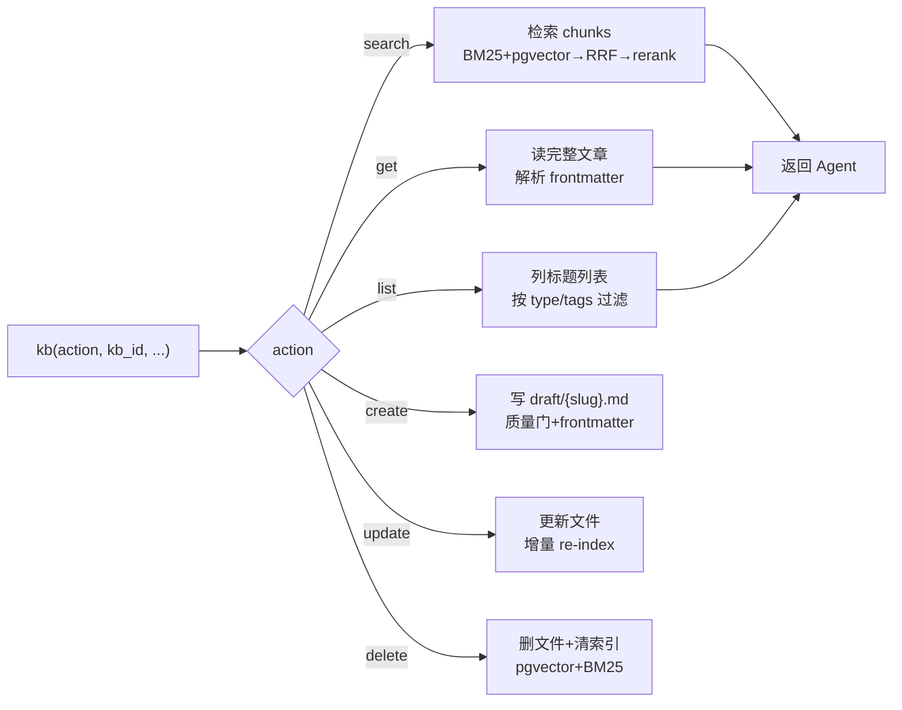
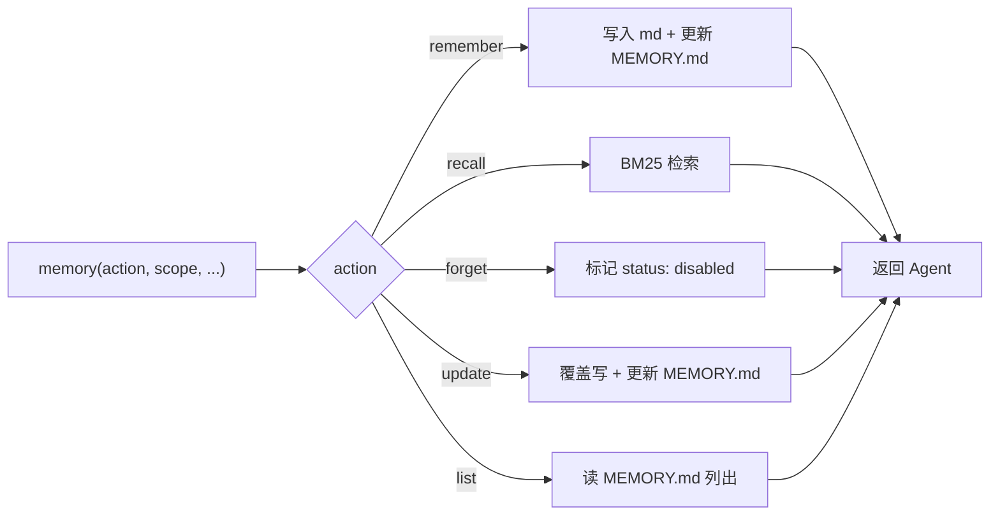
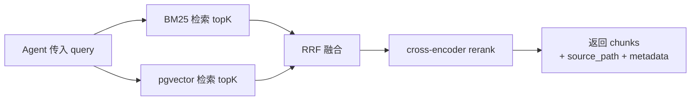
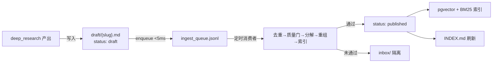

# V1.5 — 记忆系统框架（PRD）

## 1. 背景与目标

### 1.1 现状

V1.3 交付 Agent 基座（自建 ReAct Loop + 9 工具 + SubAgent + SQLite 隔离），V1.4 交付深度搜索工具链（web_search → web_fetch → generate_article → KB Draft，工具数达 12）。但三个断裂阻碍了知识闭环：

- **Agent 无记忆**——每次会话从零开始，跨会话经验不沉淀，同一问题反复检索。
- **KB 对 Agent 只写黑洞**——`generate_article` 能写 KB，但无读取工具；RAG 检索管道 `Pipeline.Execute()` 是死代码（从未在生产路径调用），知识库建好了却不可达。
- **存储 DB 双写**——`KnowledgeArticle.Content`（DB text）与文件路径并存，非文件即真相；文件名用 `article-{ID}.md`，不可人类导航。

### 1.2 目标

搭建统一记忆系统框架——记忆 + RAG + 知识库统一为一个架构。

| OS 类比 | Cognos 对应 | 物理实现 |
|---------|-------------|---------|
| L1 Cache | Agent 上下文窗口 | ReAct Loop 内存 |
| RAM | 会话记忆 | `memory/sessions/{id}/` |
| Disk | 全局记忆 + 知识库 | `memory/global/` + `kb/{kb_slug}/` |
| 页表 | 索引文件 | `MEMORY.md` / `INDEX.md` |
| 页错误 | memory(action=recall) / kb(action=search) | 按需加载到上下文 |
| 分区 | 知识库分库 | `kb/{kb_slug}/` + `memory/global/` |
| 交换 | 上下文压缩 | 三级压缩管线 |

**文件即真相**：MD 文件 = 真相源，pgvector/BM25 = 派生索引（删除索引可从文件全量重建）。

**Agent 工具**：`kb`（文章 CRUD + 检索 + 指定读）+ `memory`（记忆 CRUD + 检索）——`kb(action=search)` 封装纯检索原语（无 query_rewrite/multi_route），修复 KB 只写黑洞。

### 1.3 非目标

- 检索质量优化 Sandwich Reorder / BM25 Enriched / RRF 调参（V1.6）
- Contextual Retrieval（V1.6）
- Agentic RAG——Agent 自主决策检索策略 + Corrective RAG（V2.0）
- GraphRAG——多跳关系查询（V2.0+）

> 调研依据：[`docs/research/unified-memory/`](../research/unified-memory/)　设计文档：[`docs/DESIGN.md`](../DESIGN.md)　综合裁决：[`docs/research/knowledge-framework-synthesis.md`](../research/knowledge-framework-synthesis.md)

## 2. 功能需求

### 2.1 文档组织架构

```
storage/
├── kb/                                    # 知识库（对外资产，审核后可引用）
│   └── {kb_slug}/                         # 知识库分区
│       ├── INDEX.md                        # 页目录（脚本自动重建，禁止手编）
│       ├── log.jsonl                       # 审计日志（append-only）
│       ├── draft/                           # 草稿（未审核，不进 RAG）
│       │   └── {slug}.md
│       └── published/                       # 已发布（进 RAG 索引）
│           └── {slug}.md
│
├── memory/                                # 记忆（Agent 自用，参考 Claude Code）
│   ├── global/                             # 全局记忆（跨会话）
│   │   ├── MEMORY.md                        # 索引（启动加载，≤200 行）
│   │   └── {name}.md
│   └── sessions/                           # 会话记忆（单会话）
│       └── {session_id}/
│           ├── MEMORY.md
│           └── {name}.md
│
└── _index/                                # 派生索引（可重建，gitignored）
    ├── pgvector/                           # 向量索引（从 md 重建）
    ├── bm25/                               # BM25 索引（从 md 重建）
    └── ingest_queue.jsonl                  # 异步处理队列
```

| 维度 | 设计 | 理由 |
|------|------|------|
| kb 文档结构 | `{kb_slug}/{draft|published}/{slug}.md` 扁平 | 扁平存放，分类靠 frontmatter `type`；INDEX.md 按 type 分组渲染 |
| 文件名 | `{kebab-slug}.md`（非 `article-{ID}.md`） | 文件即真相需人类可导航；`article_id` 移入 frontmatter |
| memory 扁平文件 | 参考 Claude Code `~/.claude/memories/` | 可检查、可编辑、无数据库 |
| memory 两个粒度 | `global/`（跨会话）+ `sessions/{id}/`（单会话） | 与系统相关与用户无关 |
| 文件即真相 | MD = 真相源；pgvector/BM25 = 派生索引 | 删除 `_index/` 可从文件重建 |
| MEMORY.md ≤200 行 | 超出则合并旧条目 | 限制上下文膨胀 |
| 图片统一目录 | `image/{hash}.{ext}` | 内容寻址去重，跨 KB 共享（已是现状） |

### 2.2 Agent 工具

两个领域工具，`action` 参数区分 CRUD 操作——工具数少、LLM 决策成本低、同领域操作内聚。

#### `kb` — 知识库文章工具

```
kb(action, kb_id, ...)
```

| action | 必填参数 | 可选参数 | 语义 | RAG |
|--------|---------|---------|------|:---:|
| `search` | `query`, `kb_id` | `limit`(默认5), `type`, `tags` | 检索文章（BM25+pgvector+RRF+rerank，返回 chunks） | ✅ |
| `get` | `kb_id`, `slug`（或 `article_id`） | — | 读完整文章 + frontmatter | — |
| `list` | `kb_id` | `type`, `tags`, `status`(默认published) | 列出文章标题列表（不返回全文） | — |
| `create` | `title`, `content`, `kb_id`, `type` | `tags`, `sources`, `system`, `severity` | 新建 Draft 文章（质量门 + frontmatter 生成） | 否 |
| `update` | `kb_id`, `slug`（或 `article_id`） | `content`, `title`, `tags`, `type` | 更新文章（质量门 + 增量 re-index） | 视变更 |
| `delete` | `kb_id`, `slug`（或 `article_id`） | — | 删文章 + 清理 pgvector/BM25 索引 | — |



#### `memory` — 记忆工具

```
memory(action, scope, ...)
```

| action | 必填参数 | 可选参数 | 语义 | 存储 |
|--------|---------|---------|------|------|
| `remember` | `text`, `scope` | `importance`(1-10), `key` | 写入记忆 | session→`sessions/{id}/`，global→`global/` |
| `recall` | `query`, `scope` | `limit`(默认5) | 检索记忆（BM25） | session/global 纯文本+BM25 |
| `forget` | `scope`, `key` | — | 标记失效（frontmatter `status: disabled`） | 非物理删除 |
| `update` | `scope`, `key`, `text` | — | 更新已有记忆（同 key 覆盖） | 原子写 |
| `list` | `scope` | — | 列出某 scope 所有记忆条目（不检索） | 读 MEMORY.md |



#### 设计原则

| 原则 | 说明 |
|------|------|
| 领域内聚 | 同领域操作内聚到一个工具，`action` 参数区分——LLM 只需识别 2 个工具名 |
| 检索与读取分离 | `kb(action=search)` 是检索语义（返回相关 chunks），`kb(action=get)` 是指定读语义（返回完整文章）——两种认知动作不混同 |
| memory 与 kb 分离 | memory 是 Agent 自用（无审核），kb 是对外资产（审核后进 RAG）——生命周期不同，不合并 |
| KB 管理走 HTTP API | 建/删知识库本身（`kb_create`/`kb_delete`）不做成 Agent 工具——KB 是管理员预设的分区 |
| 现有工具归并 | `generate_article` 并入 `kb(action=create)`；`memory_recall(scope=knowledge)` 并入 `kb(action=search)` |

### 2.3 知识库检索（`kb(action=search)`）

`kb(action=search)` 封装**纯检索原语**：



| 维度 | 设计 | 理由 |
|------|------|------|
| 封装内容 | BM25 + pgvector → RRF → rerank | 复用现有 RAG 引擎检索步骤 |
| 不含 query_rewrite / multi_route | Agent ReAct 自行改写查询、多角度检索 | LLM 即 Agent，工具内嵌套 LLM 调用加延迟、降自主性 |
| 返回值 | chunk text + score + source_path + frontmatter metadata | 支持引用追踪 |
| 死代码修复 | 替代从未投产的 `Pipeline.Execute()` | Pipeline 从未被 main.go 调用，无回退必要 |

`kb(action=search)` 是检索语义（返回相关 chunks），`kb(action=get)` 是指定读语义（返回完整文章）——两者分离，不混同。

### 2.4 上下文压缩（三级管线）

| 级别 | 触发 | 操作 | 有损 | 来源 |
|------|------|------|:---:|------|
| 1. HeadAndTail | 每轮 | 保留首尾，中间省略 | 否 | autogen |
| 2. 去重清理 | token > 70% | 丢弃重复 tool result | 否 | Eino reduction |
| 3. Autocompact | token > 85% | LLM 摘要 | 是 | Eino summarization |

上下文窗口是 L1 cache，不是 RAM——O(n²) 注意力导致窗口越大性能越差。三级管线在 Agent 每步 LLM 调用前对消息历史压缩，控制上下文膨胀。

### 2.5 异步处理管道



| 机制 | 设计 | 理由 |
|------|------|------|
| enqueue <5ms | 只做一次 append 到 jsonl | 不阻塞 Agent |
| lease 机制 | TTL 60s，过期自动接管 | 防并发消费 |
| 崩溃恢复 | processing → pending 自动重置 | 无丢失 |
| 优雅降级 | 嵌入服务不可用时仍写文件，标记 `pending_index` | 文件即真相——索引可后补 |

### 2.6 会话生命周期

| 阶段 | 操作 |
|------|------|
| 启动 | 加载 `global/MEMORY.md` → 注入 L1 上下文（系统拓扑 + 近期经验） |
| 会话中 | 三级压缩 → checkpoint 持久化 → `memory(action=recall)` / `kb(action=search)` 按需检索 |
| 结束 | 扫描 `sessions/{id}/MEMORY.md` → LLM 提取有长期价值内容 → 写入 `global/` → 更新 `MEMORY.md` |
| 暂停 | Thread 序列化到 `sessions/{id}/` |
| 恢复 | 加载 Thread → 继续执行 |

### 2.7 文件即真相迁移

| 阶段 | 版本 | 内容 |
|------|------|------|
| Phase 1 | V1.5 | 文件优先写 → `KnowledgeArticle.Content` 同步缓存 |
| Phase 2 | V1.5 | 读操作走文件，Content 纯缓存回填 |
| Phase 3 | V1.6 | 删除 Content 列，表仅索引 |

双写期设硬截止线：V1.5 交付 Phase 1+2（单发布周期），V1.6 交付 Phase 3。不允许 Phase 1 跨版本拖延——双写期越长分歧 bug 越多。

**文件名迁移**：`article-{articleID}.md` → `{kebab-slug}.md`，`article_id` 移入 frontmatter 保留 DB 关联。

### 2.8 Frontmatter Schema

必填（5）：

```yaml
---
title: PostgreSQL 高 CPU 排障          # 非空，1-255 字符
type: runbook                          # runbook/architecture/sop/postmortem/cve
status: published                      # draft/reviewing/published/disabled
created: 2026-09-04T10:00:00+08:00     # ISO 8601
updated: 2026-09-04T10:00:00+08:00     # ISO 8601
---
```

可选（9）：`tags` / `system` / `severity` / `sources` / `source_type` / `agent_id` / `article_id` / `ai_reviewed` / `review_after`

> `kb(action=create)` 当前（V1.4 `generate_article`）仅生成 4 字段（title/source_type/sources/created），缺 `type`/`status`/`tags`/`updated`——V1.5 补全，否则 INDEX.md 无法按类型分组。完整 schema 验证规则（E001-E008）参见 [`knowledge-organization/04-recommendation.md`](../research/knowledge-organization/04-recommendation.md) §4。

### 2.9 SSE 事件

复用 V1.3 事件类型，无新增：

| 事件 | 来源 | 前端渲染 |
|------|------|---------|
| `tool_call`（kb / memory 工具各 action） | Agent 工具调用 | ToolCallPart 卡片 |
| `tool_result`（检索结果 / 文章内容 / 写入确认） | Agent 工具返回 | 配对到 tool_call |
| `token` | Agent 最终回答 | TextPart |

## 3. 非功能需求

| 维度 | 要求 |
|------|------|
| 降级 | `memory(action=recall)` session/global 失败不阻塞 `kb(action=search)`；嵌入服务不可用时文件仍写入标记 `pending_index` |
| 性能 | `memory(action=recall, scope=session/global)` BM25 <50ms；`kb(action=search)` RAG <500ms |
| 一致性 | 双写期（V1.5 Phase1+2）硬截止，V1.6 Phase3 删 Content 列 |
| 并发 | 文件级 mtime 检查 或 DB `version` 列乐观锁（`KnowledgeArticle` 当前无 CAS，`Ticket` 有 `result_version`） |
| 可重建 | 删除 `_index/` → 从 md 文件全量重建 pgvector + BM25 |
| RBAC | Agent KB 访问范围限定——只能写 `draft/`（非 `published/`）；`generate_article` 当前 `userID=0` 无 per-KB 权限检查 |

## 4. 验收标准

| 验收项 | 标准 |
|--------|------|
| memory(action=remember, scope=session) | 写入 `sessions/{id}/{name}.md` + 更新 `sessions/{id}/MEMORY.md` |
| memory(action=remember, scope=global) | 写入 `global/{name}.md` + 更新 `global/MEMORY.md` |
| memory(action=recall, scope=session) | BM25 检索会话记忆，返回相关条目 |
| memory(action=recall, scope=global) | BM25 检索全局记忆，返回相关条目 |
| memory(action=forget) | 标记 frontmatter `status: disabled`（非物理删除） |
| memory(action=update) | 更新已有记忆（同 key 覆盖）+ 更新 MEMORY.md |
| memory(action=list) | 列出某 scope 所有记忆条目（读 MEMORY.md） |
| kb(action=search) | RAG 检索 KB（BM25+vector+RRF+rerank），返回 chunk + source_path + metadata |
| 死代码修复 | `kb(action=search)` 成功检索——Agent 首次可读 KB |
| kb(action=get) | 按 slug（或 article_id）读完整文章 + 解析 frontmatter |
| kb(action=list) | 按 `kb_id` + type/tags 过滤，返回文章标题列表（不返回全文） |
| kb(action=create) | 新建 Draft 文章 + 完整 frontmatter（含 type/status/tags/updated）+ 质量门 |
| kb(action=update) | 更新文章内容/frontmatter + 增量 re-index（chunk hash 对比） |
| kb(action=delete) | 删文件 + 清理 pgvector/BM25 索引 |
| 三级压缩 | token>70% 触发去重清理；token>85% 触发 autocompact |
| 会话结束提取 | 会话结束 → LLM 提取有价值内容 → 写入 `global/` → 更新 `MEMORY.md` |
| 文件名迁移 | 新文章用 `{slug}.md`；`article_id` 在 frontmatter |
| INDEX.md 自动重建 | `kb(action=create/update/delete)` 后 INDEX.md 按 type 分组刷新 |
| 文件即真相 | 删除 `_index/` → 从 md 文件全量重建 pgvector + BM25 |
| 暂停/恢复 | Thread 序列化到 `sessions/{id}/` → 加载后继续执行 |
