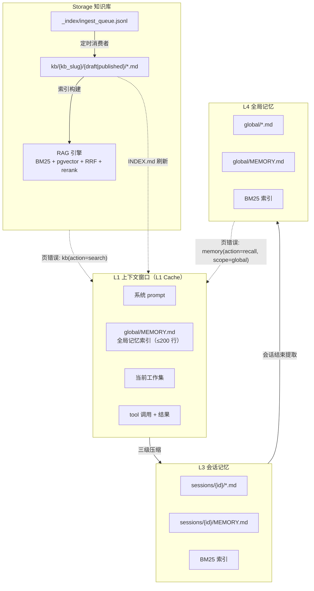
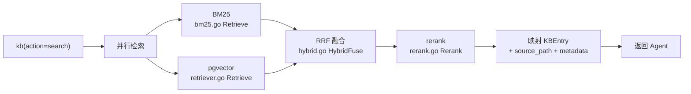
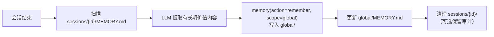

# V1.5 — 记忆系统框架（技术方案）

## 1. 架构

### 1.1 全景图



### 1.2 OS 类比映射

| OS 概念 | OpsMind 对应 | 物理实现 |
|---------|-------------|---------|
| L1 Cache | Agent 上下文窗口 | ReAct Loop 内存（`loop.go` messages） |
| RAM | 会话记忆 | `memory/sessions/{id}/` |
| Disk | 全局记忆 + 知识库 | `memory/global/` + `kb/{kb_slug}/` |
| 页表 | 索引文件 | `MEMORY.md` / `INDEX.md` |
| 页错误 | memory(action=recall) / kb(action=search) | 按需加载到上下文 |
| 分区 | 知识库分库 | `kb/{kb_slug}/` + `memory/global/` |
| 交换 | 上下文压缩 | 三级压缩管线（`compressor.go`） |

上下文窗口是 L1 cache，不是 RAM——O(n²) 注意力导致窗口越大性能越差。

### 1.3 调研来源映射

| 来源 | 机制 | 借鉴点 |
|------|------|--------|
| Claude Code | `~/.claude/memories/` 扁平 md + MEMORY.md | memory 文件式存储范式 |
| crewAI | 统一 Memory class + scope path + 复合评分 | scope 路由设计 |
| autogen | HeadAndTailChatCompletionContext | 三级压缩第一级 |
| Eino SDK | summarization + reduction 中间件 | 压缩中间件参考（自建 Loop 需适配） |
| membox | SQLite queue + lease 机制 | 异步队列消费者 |
| letta | memory-as-tool（core/archival/recall） | `memory` 工具 action 路由设计 |
| Dify | reorder.py + parent-child | 检索质量参考（V1.6） |
| RustyRAG | RRF k=20 + 并行检索 | 检索调参参考（V1.6） |

## 2. 文档组织（`storage/`）

### 2.1 目录布局

```
storage/
├── kb/                                    # 知识库（对外资产，审核后可引用）
│   └── {kb_slug}/
│       ├── INDEX.md                        # 页目录（脚本自动重建）
│       ├── log.jsonl                       # 审计日志（append-only）
│       ├── draft/{slug}.md
│       └── published/{slug}.md
├── memory/
│   ├── global/
│   │   ├── MEMORY.md                       # 索引（启动加载，≤200 行）
│   │   └── {name}.md
│   └── sessions/{session_id}/
│       ├── MEMORY.md
│       └── {name}.md
├── image/{hash}.{ext}                     # 图片全局统一目录（内容寻址去重）
└── _index/                                # 派生索引（可重建，gitignored）
    ├── pgvector/
    ├── bm25/
    └── ingest_queue.jsonl
```

### 2.2 Frontmatter Schema

必填（5）+ 可选（9），验证规则 E001-E008，参见 [`knowledge-organization/04-recommendation.md`](../research/knowledge-organization/04-recommendation.md) §4。

### 2.3 INDEX.md 自动重建

```go
// 重建 kb 目录索引：扫描所有 published/*.md（排除 draft/），按 frontmatter type 分组，按 title 排序。
func RebuildIndex(kbRoot string) error {
    files := scanMarkdownFiles(kbRoot, exclude{"draft/"})
    grouped := groupByType(files)
    content := renderIndexMarkdown(grouped)
    return atomicWrite(filepath.Join(kbRoot, "INDEX.md"), content)
}
```

- 触发：`kb(action=create/update/delete)` 执行后
- 原子写：write-to-temp + rename（防并发读到半写文件）

### 2.4 MEMORY.md 格式

```markdown
# Memory Index

- [pg-cluster-topology](pg-cluster-topology.md) — PG 集群拓扑：3 节点流复制
- [pg-cluster-vacuum-pattern](pg-cluster-vacuum-pattern.md) — vacuum 需定期检查
```

- `global/MEMORY.md`：启动加载注入 L1，≤200 行超出合并旧条目
- `sessions/{id}/MEMORY.md`：会话内索引，结束提取到 global 后清理

### 2.5 文件名规范

`{kebab-case-slug}.md`（如 `postgres-high-cpu.md`），`article_id` 移入 frontmatter `article_id: 42` 保留 DB 关联。当前 `article-{ID}.md` 不可人类导航——文件即真相要求文件名可读。

## 3. Agent 工具（`agent/tools/kb.go` + `memory.go` 新建）

两个领域工具，`action` 参数区分 CRUD——工具数少、LLM 决策成本低、同领域操作内聚。均实现 `agent.SyncTool` 接口（`Call` 阻塞返回，与现有 `generate_article` 一致）。

### 3.1 接口定义

```go
// KBStore 知识库文章存储抽象（文件式 + 质量门 + 索引联动）。
type KBStore interface {
    // Search 检索文章（BM25+pgvector→RRF→rerank，返回 chunks）。
    Search(ctx context.Context, query string, kbID int64, limit int, filter KBFilter) ([]KBEntry, error)
    // Get 按 slug 或 article_id 读完整文章 + frontmatter。
    Get(ctx context.Context, kbID int64, slug string, articleID int64) (*KBArticle, error)
    // List 列出文章标题列表（按 type/tags 过滤，不返回全文）。
    List(ctx context.Context, kbID int64, filter KBFilter) ([]KBListItem, error)
    // Create 新建 Draft 文章（质量门 + frontmatter 生成）。
    Create(ctx context.Context, params KBCreateParams) (slug string, err error)
    // Update 更新文章内容/frontmatter（增量 re-index）。
    Update(ctx context.Context, kbID int64, slug string, articleID int64, fields KBUpdateFields) error
    // Delete 删文章 + 清理 pgvector/BM25 索引。
    Delete(ctx context.Context, kbID int64, slug string, articleID int64) error
}

// MemoryStore 记忆存储抽象（session/global 文件式 + BM25）。
type MemoryStore interface {
    // Remember 写入记忆到 session 或 global。
    Remember(ctx context.Context, text, scope, key string, importance int, sessionID string) (string, error)
    // Recall 检索记忆（BM25）。
    Recall(ctx context.Context, query, scope string, limit int, sessionID string) ([]MemoryEntry, error)
    // Forget 标记失效（frontmatter status: disabled）。
    Forget(ctx context.Context, scope, key string, sessionID string) error
    // Update 更新已有记忆（同 key 覆盖）。
    Update(ctx context.Context, scope, key, text string, sessionID string) error
    // List 列出某 scope 所有记忆条目（读 MEMORY.md）。
    List(ctx context.Context, scope string, sessionID string) ([]MemoryListItem, error)
}

// KBEntry 知识库检索结果（chunk 粒度）。
type KBEntry struct {
    Content  string         // chunk 正文
    Score    float64        // 相关度
    Source   string         // 文件路径（引用追踪）
    Metadata map[string]any // frontmatter 元数据
}

// KBArticle 完整文章（get 返回）。
type KBArticle struct {
    Frontmatter map[string]any // frontmatter 元数据
    Content     string         // Markdown 正文
    FilePath    string         // 文件路径
}

// MemoryEntry 记忆检索结果。
type MemoryEntry struct {
    Content  string
    Score   float64
    Source  string
    Metadata map[string]any
}
```

### 3.2 `kb` 工具实现（`tools/kb.go`）

单个 `SyncTool`，`Call` 内按 `action` 路由：

```go
type KBTool struct{ store KBStore }

func (t *KBTool) Info() *schema.ToolInfo {
    return &schema.ToolInfo{
        Name: "kb",
        Desc: "Knowledge base article operations. action: search (RAG retrieve chunks), get (read full article by slug/id), list (list titles by type/tags), create (new draft + quality gate), update (edit + re-index), delete (remove + cleanup index).",
        ParamsOneOf: schema.NewParamsOneOfByParams(map[string]*schema.ParameterInfo{
            "action":  {Type: schema.String, Desc: "search/get/list/create/update/delete", Required: true},
            "kb_id":   {Type: schema.Integer, Desc: "Target knowledge base ID", Required: true},
            "query":   {Type: schema.String, Desc: "Search query (action=search)"},
            "slug":    {Type: schema.String, Desc: "Article slug (action=get/update/delete)"},
            "article_id": {Type: schema.Integer, Desc: "Article ID (alternative to slug)"},
            "title":   {Type: schema.String, Desc: "Article title (action=create/update)"},
            "content": {Type: schema.String, Desc: "Markdown body (action=create/update)"},
            "type":    {Type: schema.String, Desc: "runbook/architecture/sop/postmortem/cve"},
            "tags":    {Type: schema.Array, Desc: "Tag list"},
            "limit":   {Type: schema.Integer, Desc: "Max results (default 5, action=search/list)"},
        }),
    }
}

func (t *KBTool) Call(ctx context.Context, args string, emit agent.EventSink) (string, error) {
    var p kbParams
    json.Unmarshal([]byte(args), &p)
    switch p.Action {
    case "search": return t.formatSearch(t.store.Search(ctx, p.Query, p.KBID, p.Limit, p.toFilter()))
    case "get":    return t.formatArticle(t.store.Get(ctx, p.KBID, p.Slug, p.ArticleID))
    case "list":   return t.formatList(t.store.List(ctx, p.KBID, p.toFilter()))
    case "create": return t.formatCreate(t.store.Create(ctx, p.toCreateParams()))
    case "update": return t.formatUpdate(t.store.Update(ctx, p.KBID, p.Slug, p.ArticleID, p.toUpdateFields()))
    case "delete": return t.formatDelete(t.store.Delete(ctx, p.KBID, p.Slug, p.ArticleID))
    }
    return "", fmt.Errorf("unknown action: %s", p.Action)
}
```

### 3.3 `memory` 工具实现（`tools/memory.go`）

结构与 `kb` 对称——单个 `SyncTool`，`action` 路由：

```go
type MemoryTool struct{ store MemoryStore }

func (t *MemoryTool) Info() *schema.ToolInfo {
    return &schema.ToolInfo{
        Name: "memory",
        Desc: "Agent memory operations. action: remember (write), recall (BM25 search), forget (mark disabled), update (overwrite by key), list (list all entries). scope: session (current), global (cross-session).",
        ParamsOneOf: schema.NewParamsOneOfByParams(map[string]*schema.ParameterInfo{
            "action":  {Type: schema.String, Desc: "remember/recall/forget/update/list", Required: true},
            "scope":   {Type: schema.String, Desc: "session/global", Required: true},
            "text":    {Type: schema.String, Desc: "Memory text (action=remember/update)"},
            "query":   {Type: schema.String, Desc: "Search query (action=recall)"},
            "key":     {Type: schema.String, Desc: "Memory key (action=forget/update)"},
            "importance": {Type: schema.Integer, Desc: "1-10 (action=remember)"},
            "limit":   {Type: schema.Integer, Desc: "Max results (default 5, action=recall)"},
        }),
    }
}
```

| action | 实现 |
|--------|------|
| remember | `session`→`sessions/{id}/{key}.md`，`global`→`global/{key}.md` + 更新 MEMORY.md |
| recall | `session`/`global` BM25 检索（复用 `BM25Retriever`，scope=knowledge 已移出至 `kb`） |
| forget | 标记 frontmatter `status: disabled`，检索时过滤 |
| update | 同 key 覆盖写 + 更新 MEMORY.md |
| list | 读 MEMORY.md 列出全部条目 |

### 3.4 build.go 注册

```go
// Deps 新增 KBStore + MemoryStore 字段
type Deps struct {
    // ... 现有字段
    KBStore     KBStore       // 替代原 ArticleWriter
    MemoryStore MemoryStore
}

func Build(deps Deps) []agent.Tool {
    tools := []agent.Tool{ /* 8 OS 工具 */ }
    if deps.SearchChain != nil { tools = append(tools, NewWebSearchTool(...)) }
    if deps.FetchChain != nil { tools = append(tools, NewWebFetchTool(...)) }
    if deps.KBStore != nil { tools = append(tools, NewKBTool(deps.KBStore)) }       // 替代 generate_article
    if deps.MemoryStore != nil { tools = append(tools, NewMemoryTool(deps.MemoryStore)) }
    return tools
}
```

> `generate_article` 工具废弃，能力并入 `kb(action=create)`。`ArticleWriter` 接口由 `KBStore` 替代（超集——KBStore 含 Create 但也有 Search/Get/List/Update/Delete）。

## 4. 知识库检索（`kb(action=search)`）

### 4.1 纯检索原语封装

`KBStore.Search()` 封装现有 RAG 引擎检索步骤：

```go
type KBSearchBackend struct {
    vectorRetriever *rag.VectorRetriever
    bm25Retriever   *rag.BM25Retriever
    reranker        adapter.Reranker
}

func (s *KBSearchBackend) Search(ctx context.Context, query string, kbID int64, limit int, filter KBFilter) ([]KBEntry, error) {
    // 1. 并行检索：BM25 + pgvector
    vecResults, _ := s.vectorRetriever.Retrieve(ctx, query, kbID, limit)
    bm25Results, _ := s.bm25Retriever.Retrieve(ctx, query, kbID, limit)
    // 2. RRF 融合
    fused := rag.HybridFuse(vecResults, bm25Results, limit)
    // 3. cross-encoder rerank
    reranked := rag.Rerank(ctx, query, fused, s.reranker)
    // 4. 映射为 KBEntry（含 source_path + metadata）
    return toKBEntries(reranked), nil
}
```

### 4.2 复用与废弃

| 文件 | 处置 | 说明 |
|------|------|------|
| `hybrid.go` `rrfFusion.HybridFuse()` | **复用** | RRF 融合，k 值 V1.6 改 30 |
| `bm25.go` `BM25Retriever.Retrieve()` | **复用** | BM25 检索 |
| `rerank.go` `Rerank()` | **复用** | cross-encoder 精排 |
| `retriever.go` `VectorRetriever.Retrieve()` | **复用** | pgvector 检索 |
| `pipeline.go` `retrieveMultiRoute()` | **复用**（移入工具） | 多路检索均值 |
| `pipeline.go` `computeConfidenceScores()` | **复用**（移入工具） | 分层置信度 |
| `query_rewrite.go` `QueryRewrite()` | **废弃** | Agent ReAct 自行改写 |
| `multi_route.go` `MultiRoute()` | **废弃** | Agent ReAct 自行多路 |
| `pipeline.go` `Pipeline.Execute()` | **废弃** | 线性编排由 Agent Loop 替代 |

### 4.3 检索数据流



### 4.4 与死代码的关系

`Pipeline.Execute()` 从未投产（`main.go:242` 注释"不参与 Agent 生成路径"，仅 `test/rag/pipeline_test.go` 5 处调用）。检索步骤（hybrid/bm25/rerank）直接复用，LLM 步骤（query_rewrite/multi_route）移到 Agent ReAct 循环——Agent 自然能改写查询、多角度检索，无需工具内嵌套 LLM 调用。

## 5. 上下文压缩（`agent/compressor.go` 新建）

### 5.1 当前架构现状

`loop.go` 是自建 ReAct 循环，直接用 `openai.ChatModel`，**不走 Eino agent 中间件链**。三级压缩作为消息预处理步骤集成到 Loop——在 `drainModelStream` 调用前对 `messages` 压缩。

### 5.2 三级管线

```go
// Compressor 三级上下文压缩——每步 LLM 调用前对 messages 压缩。
type Compressor struct {
    tokenCounter  TokenCounter
    llmClient     rag.LLMClient    // autocompact 用
    headTailRatio float64           // 默认 0.2（首尾各 10%）
    dedupThresh   float64           // 默认 0.70
    compactThresh float64           // 默认 0.85
}

func (c *Compressor) Compress(ctx context.Context, messages []*schema.Message) []*schema.Message {
    ratio := c.tokenRatio(messages)
    // 级别 1: HeadAndTail（每轮，无损）
    messages = c.headAndTail(messages)
    // 级别 2: 去重清理（token > 70%，无损）
    if ratio > c.dedupThresh {
        messages = c.dedupToolResults(messages)
    }
    // 级别 3: Autocompact（token > 85%，有损）
    if ratio > c.compactThresh {
        messages = c.autocompact(ctx, messages)
    }
    return messages
}
```

| 级别 | 操作 | 有损 | 实现 |
|------|------|:---:|------|
| 1. HeadAndTail | 保留首尾，中间省略 | 否 | 保留系统消息 + 最近 N 轮完整，中间 tool_result 截断为摘要行 |
| 2. 去重清理 | 丢弃重复 tool result | 否 | content hash 比对，保留首次出现 |
| 3. Autocompact | LLM 摘要历史 | 是 | 将早期消息批量送 LLM 摘要，替换为单条 system 消息 |

### 5.3 集成到 Loop

`loop.go` `Run()` 在每步 `drainModelStream` 前调用 `Compressor.Compress`：

```go
// loop.go Run() 循环内，drainModelStream 调用前
if l.compressor != nil {
    messages = l.compressor.Compress(ctx, messages)
}
msg, err := l.drainModelStream(ctx, messages, emit)
```

## 6. 异步处理管道（`rag/ingest_queue.go` 新建）

### 6.1 ingest_queue.jsonl 格式

```json
{"article_id":42,"kb_id":1,"file_path":"kb/ops/draft/postgres-high-cpu.md","ts":"2026-09-04T10:00:00+08:00","status":"pending"}
```

### 6.2 定时消费者

```go
// IngestConsumer 定时消费 ingest_queue.jsonl。
type IngestConsumer struct {
    queuePath  string
    processor  *rag.Processor
    leaseTTL   time.Duration    // 默认 60s
    pollInterval time.Duration  // 默认 5s
}

func (c *IngestConsumer) Start(ctx context.Context) {
    ticker := time.NewTicker(c.pollInterval)
    for {
        select {
        case <-ctx.Done():
            return
        case <-ticker.C:
            c.processPending(ctx)
        }
    }
}
```

| 机制 | 实现 |
|------|------|
| lease 防并发 | 消费前写 `status: processing` + `lease_at: now`；TTL 60s 过期自动重置为 pending |
| 崩溃恢复 | 启动时扫描 `status: processing` 且 `lease_at` 过期 → 重置为 pending |
| 优雅降级 | 嵌入服务不可用时仍写文件，标记 `pending_index`（文件即真相——索引可后补） |

### 6.3 消费步骤

去重（content hash 比对）→ 质量门（内容长度/结构检查）→ 分解（chunker）→ 重组 → 索引（embedder + pgvector + BM25）→ INDEX.md 刷新。

### 6.4 复用现有 Processor

现有 `rag/processor.go` `processTask()` 已实现 resolveContent → chunk → 增量 diff → embed → ReplaceVectors。IngestConsumer 组装 `ProcessTask` 提交给现有 Processor，不重写处理逻辑。

## 7. 会话生命周期

### 7.1 启动

```go
// 会话启动时加载全局记忆索引
memoryIndex := loadMemoryIndex("storage/memory/global/MEMORY.md")
// 注入 L1 上下文（prepend 到 instruction 或首条 system message）
instruction = baseInstruction + "\n\n## 全局记忆\n" + memoryIndex
```

### 7.2 会话中

每步：三级压缩 → `memory(action=recall)` / `kb(action=search)` 按需检索 → checkpoint 持久化（复用 V1.3 SQLite CheckPointStore）。

### 7.3 会话结束提取



### 7.4 暂停/恢复

复用 V1.3 SQLite Thread 序列化——pause 持久化 Thread 到 `sessions/{id}/`，resume 加载继续。V1.5 迁移 Thread 存储从 SQLite 到文件式（统一存储层）。

## 8. 文件即真相迁移

### 8.1 当前状态

| 维度 | 现状 | 目标 |
|------|------|------|
| 真相源 | `KnowledgeArticle.Content`（DB text） | `{slug}.md` 文件 |
| 文件名 | `article-{articleID}.md` | `{kebab-slug}.md` |
| 文件路径 | `MinioPath` 字段 | `FilePath` 字段 |
| 读取 | DB 为主 | 文件为主，Content 缓存 |
| 写入 | DB + 文件双写 | 文件优先，DB 同步 |

### 8.2 Phase 1：文件优先写

[`service.go`](../../server/internal/domain/knowledge/service.go) 写入路径改为文件优先：

```go
// articleFile 文件名从 article-{ID} 改为 slug
func articleFile(kbSlug, slug string, published bool) string {
    status := "draft"
    if published { status = "published" }
    return fmt.Sprintf("kb/%s/%s/%s.md", kbSlug, status, slug)
}
```

`CreateArticle` / `Publish` / `UpdateArticle` 先写文件，再同步 Content 到 DB。

### 8.3 Phase 2：读走文件

读取路径（Web handler 展示、Processor 解析）改为文件优先，Content 作缓存回填（文件读失败时 fallback 到 Content）。

### 8.4 文件名迁移

`articleFile()`（`service.go:55-61`）从 `article-%d.md` 改为 `{slug}.md`。`article_id` 移入 frontmatter 保留 DB 关联。`KnowledgeArticle` 新增 `FilePath` 字段（或复用 `MinioPath` 字段名，语义改为指向 `.md` 文件）。

### 8.5 数据迁移脚本

遍历 `KnowledgeArticle` → 从 `MinioPath` 读旧文件 → 按 slug 规则写入新路径 → 更新 FilePath。脚本可重入（按 articleID 幂等）。

### 8.6 兼容性

- 现有手动创建 / 文档上传流程不中断（内部实现切换，API 不变）
- `generate_article` 工具废弃，能力并入 `kb(action=create)`；`formatArticle` 补全 frontmatter
- 现有 `article-{ID}.md` 文件由迁移脚本处理

## 9. Chunker 框架正确性修复

### 9.1 问题

[`chunker.go`](../../server/internal/rag/chunker.go) `normalizeText()`（line 190-215）在分块前：

| 行 | 操作 | 破坏 |
|----|------|------|
| 193-195 | `\n\n\n+` → `\n\n` | 压缩多级标题间空行 |
| 197-203 | `strings.Fields(line)` 压缩行内空白 | 代码块缩进被摧毁 |
| 206-213 | 全角 CJK 标点 → 半角 | BM25 中文标点精确匹配失效 |

文件即真相的真相源是结构化 Markdown，但分块器在入口摧毁了结构。

### 9.2 修复

Markdown-aware 分块：按标题边界（`#`/`##`/`###`）切分，保留父标题上下文 prepend 到每个 chunk：

```go
// MarkdownChunker 按 Markdown 结构分块——标题边界切分 + 父标题上下文。
type MarkdownChunker struct {
    ChunkSize    int
    ChunkOverlap int
}

func (c *MarkdownChunker) Split(text string) []string {
    sections := splitByHeadings(text)  // 按 # / ## / ### 切分
    var chunks []string
    for _, sec := range sections {
        // prepend 父标题路径作为上下文
        contextualized := sec.ParentHeadings + "\n" + sec.Content
        // 超长 section 递归按段落/句子切分
        chunks = append(chunks, c.splitIfTooLong(contextualized)...)
    }
    return chunks
}
```

### 9.3 与 V1.6 的边界

| 版本 | 关注 | 内容 |
|------|------|------|
| V1.5 | 结构正确性 | Markdown-aware 分块（不破坏源结构） |
| V1.6 | 大小质量 | Token-based sizing（rune → token） |

V1.5 修复结构破坏（框架正确性），V1.6 优化大小测量（检索质量）。两者独立。

## 10. 配置

`AppConfig` 新增 `Memory` 配置（与 `LLM`/`Embedding`/`Search` 平级）：

```go
type MemoryConfig struct {
    StorageRoot     string        `mapstructure:"storage_root"`     // 默认 storage/
    MemoryMaxLines  int           `mapstructure:"memory_max_lines"` // 默认 200
    CompressDedup   float64       `mapstructure:"compress_dedup"`   // 默认 0.70
    CompressCompact float64       `mapstructure:"compress_compact"` // 默认 0.85
    IngestPollInterval time.Duration `mapstructure:"ingest_poll_interval"` // 默认 5s
    IngestLeaseTTL  time.Duration `mapstructure:"ingest_lease_ttl"` // 默认 60s
}
```

| 环境变量 | 默认 | 用途 |
|----------|------|------|
| `OPSMIND_MEMORY_STORAGE_ROOT` | `storage/` | 记忆+知识库存储根目录 |
| `OPSMIND_MEMORY_MAX_LINES` | `200` | MEMORY.md 最大行数 |
| `OPSMIND_MEMORY_COMPRESS_DEDUP` | `0.70` | 去重清理触发阈值 |
| `OPSMIND_MEMORY_COMPRESS_COMPACT` | `0.85` | Autocompact 触发阈值 |
| `OPSMIND_MEMORY_INGEST_POLL_INTERVAL` | `5s` | 异步队列轮询间隔 |
| `OPSMIND_MEMORY_INGEST_LEASE_TTL` | `60s` | 消费 lease TTL |

## 11. main.go 接线

```go
// 1. 记忆存储组装（文件式 + BM25）
fileMemoryStore := memory.NewFileMemoryStore(cfg.Memory.StorageRoot, bm25Retriever)

// 2. 知识库存储组装（复用 RAG 引擎检索步骤 + 文件式 CRUD）
kbStore := tools.NewKBStoreImpl(
    knowledgeService,                  // 复用现有 CreateArticle/Publish/UpdateArticle
    vectorRetriever, bm25Retriever, reranker,  // 检索后端
    cfg.Memory.StorageRoot,
)

// 3. 上下文压缩器
compressor := agent.NewCompressor(tokenCounter, llmClient, 0.70, 0.85)

// 4. 异步处理消费者
ingestConsumer := rag.NewIngestConsumer(
    filepath.Join(cfg.Memory.StorageRoot, "_index/ingest_queue.jsonl"),
    processor, cfg.Memory.IngestLeaseTTL, cfg.Memory.IngestPollInterval,
)
go ingestConsumer.Start(ctx)

// 5. Agent 工具注册（kb + memory 条件注册，替代 generate_article）
agentTools := tools.Build(tools.Deps{
    // ... 现有依赖（SearchChain/FetchChain 保留）
    KBStore:     kbStore,         // 替代 ArticleWriter
    MemoryStore: fileMemoryStore,
})

// 6. Loop 注入压缩器
loop := agent.NewLoop(modelGetter, registry, taskRegistry, maxStep, maxDispatch, instruction, agent.WithCompressor(compressor))

// 7. 删除 NewPipeline 注释（main.go:242），Pipeline 正式废弃
```

## 12. 验证计划

1. `memory(action=remember, scope=session)` → 写入 `sessions/{id}/{name}.md` + MEMORY.md 更新
2. `memory(action=remember, scope=global)` → 写入 `global/{name}.md` + MEMORY.md 更新
3. `memory(action=recall, scope=session)` → BM25 检索会话记忆，返回相关条目
4. `memory(action=recall, scope=global)` → BM25 检索全局记忆，返回相关条目
5. `memory(action=forget)` → frontmatter `status: disabled`，检索时过滤
6. `memory(action=update)` → 同 key 覆盖写 + 更新 MEMORY.md
7. `memory(action=list)` → 读 MEMORY.md 列出全部条目
8. `kb(action=search)` → RAG 检索 KB（BM25+vector+RRF+rerank），返回 chunk + source_path
9. 死代码修复验证：`kb(action=search)` 成功——Agent 首次可读 KB
10. `kb(action=get)` → 按 slug（或 article_id）读完整文章 + frontmatter
11. `kb(action=list)` → 按 kb_id + type/tags 过滤，返回标题列表
12. `kb(action=create)` → 新建 Draft + 完整 frontmatter（含 type/status/tags/updated）+ 质量门
13. `kb(action=update)` → 更新内容/frontmatter + 增量 re-index（chunk hash 对比）
14. `kb(action=delete)` → 删文件 + 清理 pgvector/BM25 索引
15. 三级压缩：构造 >70% token 消息历史 → 触发去重；>85% → 触发 autocompact
16. 会话结束提取：结束会话 → LLM 提取 → 写入 global/ → 更新 MEMORY.md
17. 文件名迁移：新建文章用 `{slug}.md`；`article_id` 在 frontmatter
18. Frontmatter 完整：`kb(action=create)` 产出含 `type`/`status`/`tags`/`updated`
19. INDEX.md 自动重建：`kb(action=create/update/delete)` 后 INDEX.md 按 type 分组刷新
20. 文件即真相：删除 `_index/` → 从 md 文件全量重建 pgvector + BM25
21. 暂停/恢复：Thread 序列化到 `sessions/{id}/` → 加载后继续执行
22. 异步管道：deep_research 产出 → ingest_queue → 定时消费 → 索引入库
