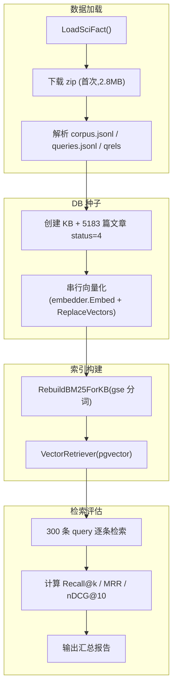

# RAG 检索 Benchmark — 脚本流水线

> 基于 BEIR SciFact 全量数据集,评估 Cognik 检索管道(向量 + BM25 + RRF 混合)的检索质量。

---

## 1. 概述

### 能拿它满足什么需求

量化评估检索系统的召回率和排序质量。回答"检索准不准"这个问题的客观数据,而非凭感觉。用 BEIR 标准数据集 + 标准指标(Recall@k / MRR / nDCG@10),结果可与公开基准横向对比。

| 维度 | 说明 |
|------|------|
| 评估对象 | 向量检索(DashScope) + BM25(gse) + RRF 混合融合 |
| 数据集 | BEIR SciFact 官方(5183 文档 + 300 test 查询 + 339 条相关性标注) |
| 指标 | Recall@5, Recall@10, MRR, nDCG@10(二值相关性) |
| 依赖 | PostgreSQL + pgvector(cognik_test DB)+ DashScope embedding(.env) |

### 核心术语

| 术语 | 通俗解释 |
|------|---------|
| BEIR | 信息检索评估基准,含 18 个异构数据集,是检索器评估的事实标准 |
| SciFact | BEIR 子集,科学文献事实核查,5183 篇 + 300 查询 |
| Recall@k | 前 k 条结果中,相关文档的覆盖率(召回率) |
| MRR | 首个相关结果的倒数排名(1=第一即正确,0.5=第二位) |
| nDCG@10 | 前 10 条的排序质量,考虑位置折扣和分级相关性 |
| RRF | 倒数排名融合,按排名位置合并多路检索结果 |

---

## 2. 目录结构

```
server/benchmark/
├── README.md                  # 本文档(脚本流水线说明)
└── scifact/
    ├── dataset.go             # BEIR SciFact 下载 + 解析
    ├── metrics.go             # Recall@k / MRR / nDCG@10 纯函数
    └── benchmark_test.go       # 全量评估测试(种子→向量化→检索→报告)
```

---

## 3. 流水线流程



### 3.1 数据加载(dataset.go)

- 首次运行从 BEIR 官方下载 SciFact zip,缓存到 `benchmark/.cache/scifact/`(git-ignored)
- 解析三类文件:
  - `corpus.jsonl` — 5183 篇文档(`_id` / `title` / `text`)
  - `queries.jsonl` — 1109 条查询,过滤出 300 条 test 查询(有 qrels 标注的)
  - `qrels/test.tsv` — 339 条相关性标注(query-id → corpus-id → score)

### 3.2 DB 种子(benchmark_test.go Phase 3-4)

- `AutoMigrate(db, 1536)` 创建 halfvec(1536) 列 + HNSW 索引
- 插入 5183 篇 `knowledge_articles`(status=4 Published)
- 串行向量化:每篇 `chunker.Split` → `embedder.Embed`(batch=20) → `store.ReplaceVectors`

### 3.3 索引构建(benchmark_test.go Phase 5)

- `RebuildBM25ForKB`:从 pgvector 读 chunks + 构建 gse 倒排索引
- `VectorRetriever`:封装 embedder + pgvector store,查询时 query→embedding→cosine 检索

### 3.4 检索评估(benchmark_test.go Phase 6-7)

每条 query 执行三路检索:
- 向量路:`VectorRetriever.RetrieveFiltered` → `[]RetrievalResult`(含 ArticleID)
- BM25 路:`BM25Retriever.RetrieveFiltered` → `[]RetrievalResult`
- 混合路:`rag.HybridFuse(vec, bm25, 10)` → RRF 融合

指标计算(ground truth: docID → articleID 映射):
- `RecallAtK(retrieved, relevant, k)` — 前 k 条覆盖率
- `ReciprocalRank(retrieved, relevant)` — 首个相关排名
- `NDCGAtK(retrieved, relevant, k)` — 排序质量

---

## 4. 运行方式

### 4.1 前置依赖

```bash
# 1. PostgreSQL + pgvector(cognik_test DB)
make dev-db                    # 启动 Docker PostgreSQL
docker exec cognik-postgres psql -U cognik -c "CREATE DATABASE cognik_test OWNER cognik"

# 2. .env 含 DashScope embedding 配置
# COGNIK_EMBEDDING_BASE_URL / COGNIK_EMBEDDING_API_KEY / COGNIK_EMBEDDING_MODEL
```

### 4.2 运行

```bash
cd server && go test ./benchmark/scifact/... -v -tags=integration -run Benchmark -p 1 -timeout 1800s
```

- `-tags=integration`:集成测试(需真实 DB)
- `-p 1`:串行(避免 DB 竞争)
- `-timeout 1800s`:5183 篇向量化约 17 分钟

### 4.3 缓存

首次运行自动下载 SciFact 到 `benchmark/.cache/scifact/`(2.8MB,git-ignored)。后续运行复用,不重复下载。

---

## 5. 评估结果

### 5.1 全量 SciFact(N=300 queries, 5183 docs)

```
Stage       Rec@5   Rec@10      MRR  nDCG@10
----------------------------------------
vector   0.6834   0.7568    0.5810  0.6172
bm25     0.7119   0.7723    0.6331  0.6630
hybrid   0.7552   0.8298    0.6319  0.6754
```

### 5.2 关键发现

| 发现 | 说明 |
|------|------|
| 混合检索全面最优 | Recall@10 = 0.830,优于向量(0.757)和 BM25(0.772) |
| BM25 略优于向量 | 科学文献场景关键词精确匹配强;DashScope 通用嵌入非领域专用 |
| RRF 融合有效 | 两路互补,Recall@10 提升 6 个百分点(0.772→0.830) |
| nDCG 与官方持平 | 混合 nDCG@10 = 0.675,接近 BEIR 官方 BM25 基线 ~0.678 |
| 向量化耗时 | 5183 篇串行约 17 分钟(DashScope API,无并发) |

### 5.3 与 BEIR 官方对比

| 基线 | nDCG@10 | 来源 |
|------|---------|------|
| BEIR 官方 BM25 | 0.678 | BEIR 论文(Thakur et al. 2021) |
| Cognik BM25 | 0.663 | 本测试(gse + Okapi k1=1.5/b=0.75) |
| Cognik 混合 | 0.675 | 本测试(BM25 + DashScope 向量 + RRF k=30) |

差异分析:Cognik BM25 略低于官方(0.663 vs 0.678),可能因 gse 分词器对英文学术文本不如 BM25 原生实现。混合检索补齐了这一差距。

---

## 6. 扩展

新增 benchmark(如 HotpotQA / FEVER / MS MARCO):在 `benchmark/` 下新建子目录,复用 `scifact/metrics.go` 的指标函数,实现 `dataset.go`(下载+解析)+ `benchmark_test.go`(评估)。架构对称,互不干扰。

---

## 7. 索引

### 7.1 关键函数

- `LoadSciFact()` — 下载 + 解析 SciFact 数据集
- `RecallAtK` / `ReciprocalRank` / `NDCGAtK` — 检索质量指标
- `rag.HybridFuse` — RRF 融合
- `rag.VectorRetriever.RetrieveFiltered` — 向量检索
- `rag.BM25Retriever.RetrieveFiltered` — BM25 检索
- `knowledge.RebuildBM25ForKB` — BM25 索引构建
- `adapter.PgvectorStore.ReplaceVectors` — 向量写入(含 embedding)

### 7.2 关联文档

- [TECH.md](../docs/TECH.md) §2.2 RAG 引擎、§4.2 pgvector 配置
- [retrieval-crag-flow.md](../docs/FLOW/chat/retrieval-crag-flow.md) — 检索管道 + CRAG 评估
